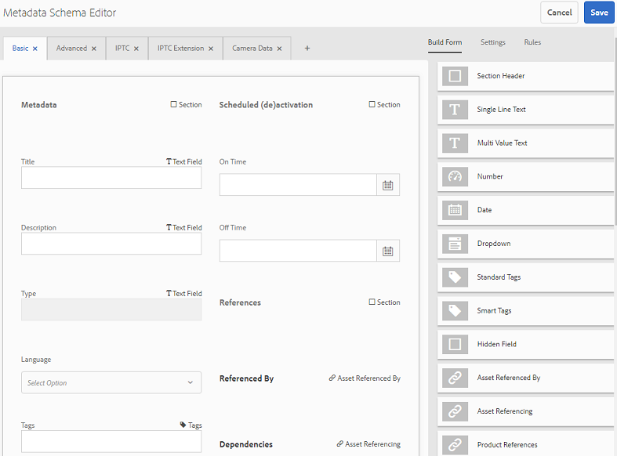

# 브랜드 포털에 사전 설정, 스키마 및 패싯 게시 {#publish-presets-schema-and-facets-to-brand-portal}

아티클은 AEM 작성자 인스턴스에서 브랜드 포털로 이미지 사전 설정, 메타데이터 스키마 및 사용자 지정 검색 패싯을 게시합니다. 게시 기능을 사용하면 조직은 이미지 사전 설정, 메타데이터 스키마 및 AEM 작성자 인스턴스에서 생성/수정된 검색 패싯을 재사용하여 중복 작업을 줄일 수 있습니다.

>[!NOTE]
>
>AEM 작성자 인스턴스에서 브랜드 포털에 이미지 사전 설정, 메타데이터 스키마 및 검색 패싯을 게시하는 기능은 AEM 6.2 SP1-CFP7 및 AEM 6.3 SP 1-CFP 1(6.3.1.1) 이상 버전에서 사용할 수 있습니다.

## 브랜드 포털에 이미지 사전 설정 게시 {#publish-image-presets-to-brand-portal}

이미지 사전 설정은 이미지 전달 시 이미지에 적용되는 크기 및 서식 지정 명령 세트입니다. Brand Portal에서 이미지 사전 설정을 만들고 수정할 수 있습니다. 또는 AEM 작성자 인스턴스가 다이내믹 미디어 모드에서 실행 중인 경우 사용자는 AEM Author에서 사전 설정을 만들어 AEM Assets 브랜드 포털에 게시하고 브랜드 포털에서 동일한 사전 설정을 다시 만들지 않아도 됩니다.\
사전 설정이 만들어지면 자산 세부 정보 변환 레일 및 다운로드 대화 상자에 동적 표현물로 나열됩니다.

>[!NOTE]
>
>AEM 작성자 인스턴스가 다이내믹 미디어 [!UICONTROL 모드에서] 실행되고 있지 않은 경우(고객은 Dynamic Media를 구매하지 [!UICONTROL 않음)] 자산의 피라미드형TIFF 변환은 업로드 시 생성되지 않습니다. 이미지 사전 설정 또는 다이내믹 표현물은 [!UICONTROL 자산의 피라미드형] TIFF에서 작동하므로 [!UICONTROL AEM 작성자 인스턴스에서] Pyramid TIFF를 사용할 수 없는 경우 브랜드 포털에서도 사용할 수 없습니다. 이로 인해 자산 세부 사항 페이지 및 다운로드 대화 상자의 변환 레일에는 동적 변환이 없습니다.

브랜드 포털에 이미지 사전 설정을 게시하려면:

1. AEM 작성자 인스턴스에서 AEM 로고를 탭/클릭하여 글로벌 탐색 콘솔에 액세스하고 도구 아이콘을 탭/클릭하고 자산 **[!UICONTROL &gt; 이미지 사전 설정으로]** 이동합니다 ****.
1. 이미지 사전 설정 목록에서 이미지 사전 설정 또는 여러 이미지 사전 설정을 선택하고 브랜드 포털에 **[!UICONTROL 게시를 클릭/탭합니다]**.

>[!NOTE]
>
>사용자가 브랜드 포털에 **[!UICONTROL 게시를 클릭하면]** 이미지 사전 설정이 게시 대기 중입니다. 사용자는 복제 에이전트의 로그를 모니터링하여 게시를 성공했는지 확인하는 것이 좋습니다.

브랜드 포털에서 이미지 사전 설정을 게시 취소하려면:

1. AEM 작성자 인스턴스에서 AEM 로고를 탭/클릭하여 글로벌 탐색 콘솔에 액세스하고 도구 아이콘을 탭/클릭하고 **[!UICONTROL 자산]** &gt; 이미지 **[!UICONTROL 사전 설정으로 이동합니다]**.
1. 이미지 사전 설정을 선택하고 **[!UICONTROL 맨 위에 있는]** 옵션에서 브랜드 포털에서 제거를 선택합니다.

## 브랜드 포털에 메타데이터 스키마 게시 {#publish-metadata-schema-to-brand-portal}

메타데이터 스키마는 자산/컬렉션의 속성 페이지에 표시되는 레이아웃 및 속성에 대해 설명합니다.

 

사용자가 AEM 작성자 인스턴스에서 기본 스키마를 편집하고 브랜드 포털에서 기본 스키마와 동일한 스키마를 사용하려는 경우 메타데이터 스키마 양식을 브랜드 포털에 게시할 수 있습니다. 이러한 시나리오에서, 브랜드 포털의 기본 스키마는 AEM 작성자 인스턴스에서 게시된 기본 스키마로 인해 오버레이됩니다.

사용자가 AEM 작성자 인스턴스에서 사용자 정의 스키마를 만든 경우, 동일한 사용자 정의 스키마를 다시 만들지 않고 사용자 정의 스키마를 브랜드 포털에 게시할 수 있습니다. 그러면 사용자는 이 사용자 정의 스키마를 브랜드 포털의 모든 폴더/컬렉션에 적용할 수 있습니다.

>[!NOTE]
>
>기본 스키마가 AEM 인스턴스에서 잠겨있는 경우(편집되지 않은 경우) 브랜드 포털에 게시할 수 없습니다.

>[!NOTE]
>
>폴더에 AEM 작성자 인스턴스에 적용된 스키마가 있는 경우 AEM 작성자 및 브랜드 포털의 자산 속성 페이지에서 일관성을 유지하려면 동일한 스키마가 브랜드 포털에도 있어야 합니다.

AEM 작성자 인스턴스에서 브랜드 포털에 메타데이터 스키마를 게시하려면 다음을 수행합니다.

1. AEM 작성자 인스턴스에서 AEM 로고를 탭/클릭하여 글로벌 탐색 콘솔에 액세스하고 도구 아이콘을 탭/클릭하고 자산 &gt; 메타데이터 스키마로 **[!UICONTROL 이동합니다]**.
1. 메타데이터 스키마를 선택하고 **[!UICONTROL 맨 위에 있는]** 옵션에서 브랜드 포털에 게시를 선택합니다.

>[!NOTE]
>
>사용자가 브랜드 포털에 **[!UICONTROL 게시를 클릭하면]**&#x200B;메타데이터 스키마가 게시 대기 중입니다. 사용자는 복제 에이전트의 로그를 모니터링하여 게시를 성공했는지 확인하는 것이 좋습니다.

브랜드 포털에서 메타데이터 스키마 게시를 취소하려면 다음을 수행하십시오.

1. AEM 작성자 인스턴스에서 AEM 로고를 탭/클릭하여 글로벌 탐색 콘솔에 액세스하고 도구 아이콘을 탭/클릭하고 자산 &gt; 메타데이터 스키마로 **[!UICONTROL 이동합니다]**.
1. 메타데이터 스키마를 선택하고 **[!UICONTROL 맨 위에 있는]** 옵션에서 브랜드 포털에서 제거를 선택합니다.

## 브랜드 포털에 검색 패싯 게시 {#publish-search-facets-to-brand-portal}

검색 양식은 브랜드 포털의 사용자에게 [패싯된 검색](../using/brand-portal-search-facets.md) 기능을 제공합니다. 검색 패싯은 브랜드 포털에서 검색하기 위해 더 세부적으로 분할됩니다. 검색 양식에 추가된 [모든](https://helpx.adobe.com/experience-manager/6-5/assets/using/search-facets.html#AddingaPredicate) 조건자를 검색 필터에서 검색 패싯으로 사용할 수 있습니다.

AEM 작성자 인스턴스의 사용자 지정 검색 양식 **[!UICONTROL 자산]** 관리 검색 레일을 사용하려는 경우 브랜드 포털에서 동일한 양식을 다시 만드는 대신 AEM 작성자 인스턴스에서 브랜드 포털에 사용자 지정된 검색 양식을 게시할 수 있습니다.

>[!NOTE]
>
>AEM Assets **[!UICONTROL 에서 잠긴]** 검색 양식 자산 관리 검색 레일은 편집하지 않는 한 브랜드 포털에 게시할 수 없습니다. 편집해서 브랜드 포털에 게시하면 이 검색 양식이 브랜드 포털의 검색 양식을 덮어씁니다.

AEM 작성자 인스턴스에서 편집된 검색 패싯을 브랜드 포털에 게시하려면:

1. AEM 로고를 탭/클릭한 다음 도구 &gt; **[!UICONTROL 일반]** **[!UICONTROL &gt;]** 양식 **[!UICONTROL 검색으로]**&#x200B;이동합니다.
1. 편집된 검색 양식을 선택하고 브랜드 포털에 **[!UICONTROL 게시를 선택합니다]**.

   >[!NOTE]
   >
   >사용자가 브랜드 포털에 **[!UICONTROL 게시를 클릭하면]**&#x200B;검색 패싯이 게시 대기됩니다. 사용자는 복제 에이전트의 로그를 모니터링하여 게시를 성공했는지 확인하는 것이 좋습니다.

브랜드 포털에서 검색 양식을 게시 취소하려면:

1. AEM 작성자 인스턴스에서 AEM 로고를 탭/클릭하여 글로벌 탐색 콘솔에 액세스하고 도구 아이콘을 탭/클릭하고 일반 &gt; 양식 **[!UICONTROL 검색으로 이동합니다]**.
1. 검색 양식을 선택하고 **[!UICONTROL 맨 위에 있는 옵션에서]** 브랜드 포털에서 제거를 선택합니다.

>[!NOTE]
>
>브랜드 **[!UICONTROL 포털에서 게시 취소]** 작업은 브랜드 포털의 기본 검색 양식을 그대로 유지한 채 게시 전에 사용된 마지막 검색 양식으로 복원하지 않습니다.

### 제한 사항 {#limitations}

1. 브랜드 포털의 검색 필터에 적용할 수 없는 검색 조건자는 거의 없습니다. 이러한 검색 조건자가 AEM 작성자 인스턴스에서 브랜드 포털까지 검색 양식의 일부로 게시되면 필터링됩니다. 따라서 사용자는 브랜드 포털에서 게시된 양식에서 예측 횟수를 더 적게 봅니다. 브랜드 포털의 필터에 적용할 수 있는 [검색 조건자를 참조하십시오](../using/brand-portal-search-facets.md#list-of-search-predicates).

1. 옵션 [!UICONTROL 조건자의]경우 사용자가 AEM 작성자 인스턴스에서 사용자 지정 경로를 사용하여 옵션을 읽는 경우 브랜드 포털에서 작동하지 않습니다. 이러한 추가 경로 및 옵션은 검색 양식이 있는 브랜드 포털에 게시되지 않습니다. 이 경우, 사용자는 옵션 설명 **[!UICONTROL 내의 옵션]** 추가에서 수동 **[!UICONTROL 옵션을 선택하여]** 브랜드 **[!UICONTROL 포털에서 이러한]** 옵션을 수동으로 추가할 수 있습니다.

