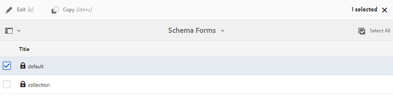

# 브랜드 포털에 사전 설정, 스키마 및 패싯 게시 {#publish-presets-schema-and-facets-to-brand-portal}

아티클은 AEM 작성자 인스턴스에서 브랜드 포털에 이미지 사전 설정, 메타데이터 스키마 및 사용자 지정 검색 패싯을 게시하는 데 적용됩니다. 게시 기능을 사용하면 조직에서 AEM 작성자 인스턴스에서 생성/수정한 이미지 사전 설정, 메타데이터 스키마 및 검색 패싯을 재사용하여 중복 작업을 줄일 수 있습니다.

>[!NOTE]
>
>AEM 작성자 인스턴스에서 브랜드 포털에 이미지 사전 설정, 메타데이터 스키마 및 검색 패싯을 게시하는 기능은 AEM 6.2 SP 1-CFP 7 및 AEM 6.3 SP 1-CFP 1 (6.3.1.1) 이상입니다.

## 브랜드 포털에 이미지 사전 설정 게시 {#publish-image-presets-to-brand-portal}

이미지 사전 설정은 이미지 전달 시 이미지에 적용되는 크기 및 서식 지정 명령 세트입니다. 브랜드 포털에서 이미지 사전 설정을 만들고 수정할 수 있습니다. 또는 AEM 작성자 인스턴스가 다이내믹 미디어 모드에서 실행 중인 경우 사용자는 AEM 작성자에서 사전 설정을 만들어 AEM Assets 브랜드 포털에 게시할 수 있으며 브랜드 포털에서 동일한 사전 설정을 다시 만들지 않아도 됩니다.\
사전 설정이 만들어지면 자산 세부 사항 변환 레일에서 다이내믹 표현으로 표시되며 대화 상자가 다운로드됩니다.

>[!NOTE]
>
>AEM 작성자 인스턴스가 [!UICONTROL 다이내믹 미디어 모드에서] 실행되지 않는 경우 (고객이 다이내믹 미디어를 구매하지 않은 경우), 자산의 [!UICONTROL 피라미드 TIFF] 변환이 업로드 시 생성되지 않습니다. 이미지 사전 설정이나 동적 표현물은 자산의 [!UICONTROL 피라미드 TIFF] 에서 작동하므로, AEM 작성자 인스턴스에서 [!UICONTROL 피라미드형 TIFF] 를 사용할 수 없는 경우 브랜드 포털에서 사용할 수 없습니다. 따라서 [에셋 세부 사항] 페이지의 표현물 레일에 동적 표현물이 없으며 대화 상자가 다운로드되지 않습니다.

브랜드 포털에 이미지 사전 설정을 게시하려면:

1. AEM 작성자 인스턴스에서 AEM 로고를 탭/클릭하여 전역 탐색 콘솔에 액세스하고 도구 아이콘을 탭/클릭하고 **[!UICONTROL 자산]** &gt; **[!UICONTROL 이미지 사전 설정으로 이동합니다]**.
2. 이미지 사전 설정 목록에서 이미지 사전 설정 또는 여러 이미지 사전 설정을 선택하고 브랜드 포털에 **[!UICONTROL 게시를 클릭/]**&#x200B;탭합니다.

>[!NOTE]
>
>사용자가 브랜드 포털에 **[!UICONTROL 게시를 클릭하면]** 이미지 사전 설정이 게시 대기열에 추가됩니다. 사용자는 게시가 성공했는지 확인하려면 복제 에이전트의 로그를 모니터링해야 합니다.

브랜드 포털에서 이미지 사전 설정을 게시 취소하려면:

1. AEM 작성자 인스턴스에서 AEM 로고를 탭/클릭하여 전역 탐색 콘솔에 액세스하고 **[!UICONTROL 도구]** 아이콘을 탭/클릭하고 **[!UICONTROL 자산 &gt; 이미지 사전 설정으로 이동합니다]**.
2. 이미지 사전 설정을 선택하고 **[!UICONTROL 맨 위에 있는 옵션에서 [브랜드 포털]** 제거] 를 선택합니다.

## 브랜드 포털에 메타데이터 스키마 게시 {#publish-metadata-schema-to-brand-portal}

메타데이터 스키마는 자산/컬렉션의 속성 페이지에 표시되는 레이아웃 및 속성을 설명합니다.

 

사용자가 AEM 작성자 인스턴스에서 기본 스키마를 편집한 경우 브랜드 포털에서 기본 스키마와 동일한 스키마를 사용하려는 경우 메타데이터 스키마 양식을 브랜드 포털에 게시할 수 있습니다. 이러한 시나리오에서 브랜드 포털의 기본 스키마는 AEM 작성자 인스턴스에서 게시된 기본 스키마에 의해 과도하게 적용됩니다.

사용자가 AEM 작성자 인스턴스에 사용자 지정 스키마를 생성한 경우, 거기에서 동일한 사용자 지정 스키마를 다시 만들지 않고 브랜드 포털에 사용자 지정 스키마를 게시할 수 있습니다. 그러면 사용자는 브랜드 포털에서 이 사용자 지정 스키마를 모든 폴더/컬렉션에 적용할 수 있습니다.

>[!NOTE]
>
>기본 스키마는 AEM 인스턴스에서 잠겨 있는 경우 (편집되지 않은 경우) 브랜드 포털에 게시할 수 없습니다.

>[!NOTE]
>
>폴더에 AEM 작성자 인스턴스에 스키마가 적용되어 있는 경우, AEM 작성자 및 브랜드 포털의 자산 속성 페이지에서 일관성을 유지하기 위해 브랜드 포털에 동일한 스키마가 있어야 합니다.

메타데이터 스키마를 AEM 작성자 인스턴스에서 브랜드 포털에 게시하려면:

1. AEM 작성자 인스턴스에서 AEM 로고를 탭/클릭하여 전역 탐색 콘솔에 액세스하고 도구 아이콘을 탭/클릭하고 자산 &gt; 메타데이터 스키마로 **[!UICONTROL 이동합니다]**.
2. 메타데이터 스키마를 선택하고 **[!UICONTROL 맨 위에 있는 옵션에서 [브랜드 포털에]** 게시] 를 선택합니다.

>[!NOTE]
>
>사용자가 브랜드 포털에 ****&#x200B;게시를 클릭하면 메타데이터 스키마가 게시 대기열에 추가됩니다. 사용자는 게시가 성공했는지 확인하려면 복제 에이전트의 로그를 모니터링해야 합니다.

브랜드 포털에서 메타데이터 스키마의 게시를 취소하려면:

1. AEM 작성자 인스턴스에서 AEM 로고를 탭/클릭하여 전역 탐색 콘솔에 액세스하고 도구 아이콘을 탭/클릭하고 자산 &gt; 메타데이터 스키마로 **[!UICONTROL 이동합니다]**.
2. 메타데이터 스키마를 선택하고 **[!UICONTROL 맨 위에 있는 옵션에서 [브랜드 포털]** 제거] 를 선택합니다.

## 검색 패싯을 브랜드 포털에 게시 {#publish-search-facets-to-brand-portal}

검색 양식은 브랜드 포털에서 사용자에게 [패싯 검색](../using/brand-portal-search-facets.md) 기능을 제공합니다. 검색 패싯은 브랜드 포털에서 검색할 수 있는 세부적인 기능을 제공합니다. 검색 [양식에 추가된](https://helpx.adobe.com/experience-manager/6-5/assets/using/search-facets.html#AddingaPredicate) 모든 예측은 검색 필터에서 검색 패싯으로 사용할 수 있습니다.

AEM 작성자 인스턴스에서 사용자 지정 검색 양식 **[!UICONTROL 에셋 관리 검색 레일을]** 사용하려는 경우 브랜드 포털에서 동일한 양식을 다시 만들지 않고 AEM 작성자 인스턴스에서 브랜드 포털에 사용자 지정된 검색 양식을 게시할 수 있습니다.

>[!NOTE]
>
>AEM 자산에서 잠긴 검색 양식 **[!UICONTROL 자산 관리 검색 레일은]** 편집되지 않는 한 브랜드 포털에 게시할 수 없습니다. 브랜드 포털에 게시되어 게시되면 브랜드 포털에서 검색 양식이 무시됩니다.

편집된 검색 패싯을 AEM 작성자 인스턴스에서 브랜드 포털에 게시하려면 다음을 수행하십시오.

1. AEM 로고를 탭/클릭하고 **[!UICONTROL 도구]** &gt; **[!UICONTROL 일반]** &gt; **[!UICONTROL 검색 양식으로 이동합니다]**.
2. 편집된 검색 양식을 선택하고 브랜드 포털에 **[!UICONTROL 게시를]**&#x200B;선택합니다.

   >[!NOTE]
   >
   >사용자가 브랜드 포털에 ****&#x200B;게시를 클릭하면 검색 패싯이 게시 대기열에 추가됩니다. 사용자는 게시가 성공했는지 확인하려면 복제 에이전트의 로그를 모니터링해야 합니다.

브랜드 포털에서 검색 양식을 게시 취소하려면 다음을 수행하십시오.

1. AEM 작성자 인스턴스에서 AEM 로고를 탭/클릭하여 전역 탐색 콘솔에 액세스하고 도구 아이콘을 탭/클릭하고 **[!UICONTROL 일반 &gt; 검색 양식으로 이동합니다]**.
2. 검색 양식을 선택하고 맨 위에 **[!UICONTROL 있는 옵션에서 [브랜드 포털]** 제거] 를 선택합니다.

>[!NOTE]
>
>브랜드 포털에서 **[!UICONTROL 게시 취소]** 동작은 브랜드 포털에 기본 검색 양식을 그대로 두고 게시하기 전에 사용된 마지막 검색 양식으로 복원하지 않습니다.

### 제한 사항 {#limitations}

1. 일부 검색 예측은 브랜드 포털의 검색 필터에 적용되지 않습니다. 이러한 검색 어설션이 AEM 작성자 인스턴스에서 브랜드 포털에 검색 양식의 일부로 게시되면 필터링됩니다. 따라서 사용자는 브랜드 포털에서 게시된 양식의 예측자 수를 줄일 수 있습니다. 브랜드 포털에서 필터에 적용되는 [검색 설명을 참조하십시오](../using/brand-portal-search-facets.md#list-of-search-predicates).

2. [!UICONTROL 옵션 설명]기능의 경우 사용자가 AEM 작성자 인스턴스의 옵션을 읽도록 사용자 정의 경로를 사용하는 경우 브랜드 포털에서 작동하지 않습니다. 이러한 추가 경로 및 옵션은 검색 양식이 있는 브랜드 포털에 게시되지 않습니다. 이 경우, 옵션 설명 내의 추가 옵션에서 **[!UICONTROL 수동]** **[!UICONTROL 옵션을 선택하여]** **[!UICONTROL 브랜드 포털에서]** 이러한 옵션을 수동으로 추가할 수 있습니다.

