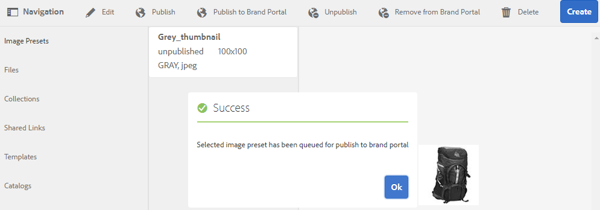

# 사전 설정, 스키마 및 패싯을 Brand Portal에 게시 {#publish-presets-schema-and-facets-to-brand-portal}

아티클은 AEM 작성자 인스턴스에서 브랜드 포털로 게시 이미지 사전 설정, 메타데이터 스키마 및 사용자 지정 검색 패싯에 대해 설명합니다. 게시 기능을 사용하면 조직이 AEM 작성자 인스턴스에서 생성/수정된 이미지 사전 설정, 메타데이터 스키마 및 검색 패싯을 재사용하여 중복 작업을 줄일 수 있습니다.

>[!NOTE]
>
>AEM 작성자 인스턴스에서 브랜드 포털로 이미지 사전 설정, 메타데이터 스키마 및 검색 패싯을 게시하는 기능은 AEM 6.2 SP1-CFP7 및 AEM 6.3 SP 1-CFP 1(6.3.1.1)부터 사용할 수 있습니다.

## 브랜드 포털에 이미지 사전 설정 게시{#publish-image-presets-to-brand-portal}

이미지 사전 설정은 이미지 배달 시 이미지에 적용되는 크기 및 서식 지정 명령 세트입니다. 브랜드 포털에서 이미지 사전 설정을 만들고 수정할 수 있습니다. 또는 AEM 작성자 인스턴스가 다이내믹 미디어 모드에서 실행 중인 경우 사용자는 AEM Author에서 사전 설정을 만들어 AEM Assets 브랜드 포털에 게시하고 브랜드 포털에서 동일한 사전 설정을 다시 만들지 않아도 됩니다.\
사전 설정이 만들어지면 자산 세부 정보 변환 레일 및 다운로드 대화 상자에 동적 표현물로 나열됩니다.

>[!NOTE]
>
>AEM 작성자 인스턴스가 **[!UICONTROL Dynamic Media Mode]**(고객이 Dynamic Media를 구매하지 않은 경우)에서 실행되고 있지 않으면 업로드 시 자산의 **[!UICONTROL Pyramid TIFF]** 변환이 생성되지 않습니다. 이미지 사전 설정 또는 동적 표현물은 자산의 **[!UICONTROL Pyramid TIFF]**&#x200B;에서 작동하므로, **[!UICONTROL Pyramid TIFF]**&#x200B;를 AEM 작성자 인스턴스에서 사용할 수 없는 경우 브랜드 포털에서도 사용할 수 없습니다. 이로 인해 자산 세부 사항 페이지 및 다운로드 대화 상자의 변환 레일에 동적 변환이 없습니다.

브랜드 포털에 이미지 사전 설정을 게시하려면:

1. AEM 작성자 인스턴스에서 AEM 로고를 탭/클릭하여 글로벌 탐색 콘솔에 액세스하고 도구 아이콘을 탭/클릭하고 **[!UICONTROL 자산 > 이미지 사전 설정]**&#x200B;으로 이동합니다.
1. 이미지 사전 설정 목록에서 이미지 사전 설정 또는 여러 이미지 사전 설정을 선택하고 **[!UICONTROL 브랜드 포털에 게시]**&#x200B;를 클릭/탭합니다.

>[!NOTE]
>
>사용자가 **[!UICONTROL 브랜드 포털에 게시]**&#x200B;를 클릭하면 이미지 사전 설정이 게시 대기 중입니다. 사용자는 복제 에이전트의 로그를 모니터링하여 게시를 성공했는지 확인하는 것이 좋습니다.

브랜드 포털에서 이미지 사전 설정을 게시 취소하려면:

1. AEM 작성자 인스턴스에서 AEM 로고를 탭/클릭하여 글로벌 탐색 콘솔에 액세스하고 **[!UICONTROL 도구]** 아이콘을 탭/클릭하고 **[!UICONTROL 자산 > 이미지 사전 설정]**&#x200B;으로 이동합니다.
1. 이미지 사전 설정을 선택하고 맨 위에 있는 옵션에서 **[!UICONTROL 브랜드 포털에서 제거]**&#x200B;를 선택합니다.

## 메타데이터 스키마를 브랜드 포털 {#publish-metadata-schema-to-brand-portal}에 게시

메타데이터 스키마는 자산/컬렉션의 속성 페이지에 표시되는 레이아웃 및 속성을 설명합니다.

 

사용자가 AEM 작성자 인스턴스에서 기본 스키마를 편집하고 브랜드 포털에서 기본 스키마와 동일한 스키마를 사용하려는 경우 메타데이터 스키마 양식을 브랜드 포털에 게시하기만 하면 됩니다. 이러한 시나리오에서 브랜드 포털의 기본 스키마는 AEM 작성자 인스턴스에서 게시된 기본 스키마로 인해 오버레이됩니다.

사용자가 AEM 작성자 인스턴스에서 사용자 정의 스키마를 만든 경우 해당 사이트에서 동일한 사용자 정의 스키마를 다시 만드는 대신 사용자 정의 스키마를 브랜드 포털에 게시할 수 있습니다. 그러면 사용자가 이 사용자 정의 스키마를 브랜드 포털의 모든 폴더/컬렉션에 적용할 수 있습니다.

>[!NOTE]
>
>기본 스키마는 AEM 인스턴스에서 잠겨 있는 경우(편집되지 않은 경우) 브랜드 포털에 게시할 수 없습니다.

>[!NOTE]
>
>폴더에 AEM 작성자 인스턴스에 적용된 스키마가 있는 경우 AEM 작성자 및 브랜드 포털의 자산 속성 페이지에서 일관성을 유지하려면 동일한 스키마가 브랜드 포털에도 있어야 합니다.

AEM 작성자 인스턴스의 메타데이터 스키마를 브랜드 포털에 게시하려면:

1. AEM 작성자 인스턴스에서 AEM 로고를 탭/클릭하여 글로벌 탐색 콘솔에 액세스하고 도구 아이콘을 탭/클릭하고 **[!UICONTROL 자산 > 메타데이터 스키마]**&#x200B;로 이동합니다.
1. 메타데이터 스키마를 선택하고 맨 위에 있는 옵션에서 **[!UICONTROL 브랜드 포털에 게시]**&#x200B;를 선택합니다.

>[!NOTE]
>
>사용자가 **[!UICONTROL 브랜드 포털에 게시]**&#x200B;를 클릭하면 메타데이터 스키마가 게시 대기 중입니다. 사용자는 복제 에이전트의 로그를 모니터링하여 게시를 성공했는지 확인하는 것이 좋습니다.

브랜드 포털에서 메타데이터 스키마 게시를 취소하려면 다음을 수행하십시오.

1. AEM 작성자 인스턴스에서 AEM 로고를 탭/클릭하여 글로벌 탐색 콘솔에 액세스하고 도구 아이콘을 탭/클릭하고 **[!UICONTROL 자산 > 메타데이터 스키마]**&#x200B;로 이동합니다.
1. 메타데이터 스키마를 선택하고 맨 위에 있는 옵션에서 **[!UICONTROL 브랜드 포털에서 제거]**&#x200B;를 선택합니다.

## 검색 패싯을 브랜드 포털 {#publish-search-facets-to-brand-portal}에 게시

검색 양식은 브랜드 포털의 사용자에게 [면 검색](../using/brand-portal-search-facets.md)의 기능을 제공합니다. 검색 패싯은 브랜드 포털에서 검색하기 위한 보다 세부적으로 분할됩니다. 사용자가 검색 필터의 검색 패싯으로 검색 양식에 추가된 [의 모든 예측 기능을 사용할 수 있습니다.](https://helpx.adobe.com/experience-manager/6-5/assets/using/search-facets.html#AddingaPredicate)

AEM 작성자 인스턴스의 사용자 지정 검색 양식 **[!UICONTROL 자산 관리 검색 레일]**&#x200B;을 사용하려는 경우 브랜드 포털에서 동일한 양식을 다시 만드는 대신 AEM 작성자 인스턴스의 사용자 지정 검색 양식을 브랜드 포털로 게시할 수 있습니다.

>[!NOTE]
>
>AEM Assets의 잠긴 검색 양식 **[!UICONTROL 자산 관리 검색 레일]**&#x200B;은(는) 편집되지 않으면 브랜드 포털에 게시할 수 없습니다. 편집해서 브랜드 포털에 게시하면 이 검색 양식이 브랜드 포털의 검색 양식을 덮어씁니다.

편집된 검색 패싯을 AEM 작성자 인스턴스에서 브랜드 포털에 게시하려면:

1. AEM 로고를 탭/클릭한 다음 **[!UICONTROL 도구 > 일반 > Forms 검색]**&#x200B;으로 이동합니다.
1. 편집된 검색 양식을 선택하고 **[!UICONTROL 브랜드 포털에 게시]**&#x200B;를 선택합니다.

   >[!NOTE]
   >
   >사용자가 **[!UICONTROL 브랜드 포털에 게시]**&#x200B;를 클릭하면 검색 패싯이 게시 대기 중입니다. 사용자는 복제 에이전트의 로그를 모니터링하여 게시를 성공했는지 확인하는 것이 좋습니다.

브랜드 포털에서 검색 양식을 게시 취소하려면 다음을 수행하십시오.

1. AEM 작성자 인스턴스에서 AEM 로고를 탭/클릭하여 글로벌 탐색 콘솔에 액세스하고 도구 아이콘을 탭/클릭하고 **[!UICONTROL 일반 > Forms 검색]**&#x200B;으로 이동합니다.
1. 검색 양식을 선택하고 맨 위에 있는 옵션에서 **[!UICONTROL 브랜드 포털에서 제거]**&#x200B;를 선택합니다.

>[!NOTE]
>
>**[!UICONTROL 브랜드 포털에서 게시 취소]** 동작은 브랜드 포털의 기본 검색 양식을 그대로 유지하며 게시 전에 사용한 마지막 검색 양식으로 복원하지 않습니다.

### 제한 사항 {#limitations}

1. 브랜드 포털의 검색 필터에 적용할 수 없는 검색 예측자는 거의 없습니다. 이러한 검색 예측이 AEM 작성자 인스턴스에서 브랜드 포털로 검색 양식의 일부로 게시되면 필터링됩니다. 따라서 사용자는 브랜드 포털에서 게시된 양식에서 예측 가능한 사람 수를 더 적게 볼 수 있습니다. 브랜드 포털](../using/brand-portal-search-facets.md#list-of-search-predicates)의 필터에 적용할 수 있는 [검색 예측자를 참조하십시오.

1. [!UICONTROL 옵션 설명]의 경우, 사용자가 사용자 지정 경로를 사용하여 AEM 작성자 인스턴스의 옵션을 읽는 경우 브랜드 포털에서는 작동하지 않습니다. 이러한 추가 경로 및 옵션은 검색 양식과 함께 브랜드 포털에 게시되지 않습니다. 이 경우 사용자는 **[!UICONTROL 옵션 설명]**&#x200B;에 있는 **[!UICONTROL 옵션 추가]**&#x200B;에서 **[!UICONTROL 수동]** 옵션을 선택하여 브랜드 포털에서 이러한 옵션을 수동으로 추가할 수 있습니다.

