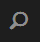

# AEM Assets 브랜드 포털의 새로운 기능 {#what-s-new-in-aem-assets-brand-portal}

AEM (Adobe Experience Manager) 자산 브랜드 포털을 사용하면 승인된 크리에이티브 자산을 모든 장치에서 외부 및 내부 비즈니스 사용자에게 쉽게 획득, 제어 및 안전하게 배포할 수 있습니다. 에셋 공유 효율성을 높이고, 에셋 시장 출시 시간을 단축하며, 비규정 준수 및 권한 없는 액세스의 위험을 줄일 수 있습니다. Adobe는 전반적인 브랜드 포털 경험을 개선하기 위해 노력하고 있습니다. 새로운 기능과 향상된 기능을 미리 만나보세요.

## 6.4.4에서 변경된 사항 {#what-is-changing-in}

브랜드 포털 6.4.4 릴리스는 텍스트 검색과 주요 고객 요청의 개선에 중점을 둡니다. 최신 [브랜드 포털 릴리스 정보를 참조하십시오](brand-portal-release-notes.md).

### 향상된 검색 기능 {#search-enhancements}

브랜드 포털 6.4.4 버전에서는 필터링 창의 속성 설명 부분 텍스트 검색 기능을 지원합니다. 부분 텍스트 검색을 허용하려면 검색 양식의 속성 설명기에서 **부분 검색을** 활성화해야 합니다.

부분 텍스트 검색 및 와일드카드 검색에 대한 자세한 내용을 살펴보십시오.

#### 부분 구문 검색 {#partial-phrase-search}

이제 필터링 창에서 검색된 구절의 부분 (단어 또는 두 개) 만 지정하여 자산을 검색할 수 있습니다.

**사용 사례**
부분 구문 검색은 검색어에서 발생하는 단어의 조합이 정확히 조합되지 않은 경우에 유용합니다.

예를 들어 브랜드 포털의 검색 양식에서 자산 제목에서 부분 검색에 속성 설명을 사용하는 경우 **Camp를** 지정하면 Camp 라는 단어가 포함된 모든 자산이 제목 구문으로 반환됩니다.

#### 와일드카드 검색 {#wildcard-search}

브랜드 포털에서 검색 쿼리의 별표 (*) 를 검색한 구문에서 단어의 일부와 함께 사용할 수 있습니다.

**사용 사례**
검색 구문에서 발생하는 단어를 정확히 모를 경우 와일드카드 검색을 사용하여 검색 쿼리의 간격을 채울 수 있습니다.

예를 들어 **, CLIMB *** 를 지정하면 브랜드 포털의 검색 양식에서 자산 제목에서 부분 검색에 속성 설명을 사용하는 경우 문자가 **제목 구문으로 올라가** 있는 모든 자산이 제목 구문으로 표시됩니다.

유사하게, 다음을 지정합니다.

* *** CLIMB는** 문자가 문자로 끝나는 모든 자산을 제목 구문에서 **오름차순으로** 반환합니다.

* *** CLIMB *** 는 문자가 제목 구문에서 **등장 문자가** 포함된 모든 자산을 반환합니다.

>[!NOTE]
>
>**부분 검색** 확인란을 선택할 때 대/소문자를 **무시하면 기본적으로 선택됩니다** .

## 6.4.3의 변경된 사항 {#what-changed-in}

브랜드 포털 6.4.3 릴리스는 브랜드 포털 액세스 URL에서 임차인 ID 외에도 대체 별칭을 제공하는 조직, 새로운 폴더 계층 구성, 향상된 비디오 지원, AEM 작성자 인스턴스에서 브랜드 포털에 대한 예약된 게시, 향상된 운영 기능— 고객 요청에 대한 정보를 제공합니다.

### 관리자가 아닌 사용자를 위한 폴더 계층 구조 탐색

이제 관리자는 로그인할 때 관리자가 아닌 사용자 (편집자, 뷰어 및 게스트 사용자) 에게 폴더가 표시되는 방식을 구성할 수 있습니다. [폴더 계층](../using/brand-portal-general-configuration.md) 구성은 관리 도구 패널에서 **일반 설정에**&#x200B;추가됩니다. 구성이 다음과 같은 경우:

* **활성화된**&#x200B;경우 루트 폴더에서 시작하여 폴더 트리가 비관리 사용자에게 표시됩니다. 따라서 관리자와 유사한 탐색 환경을 부여합니다.
* **비활성화하면**&#x200B;공유 폴더만 랜딩 페이지에 표시됩니다.

**사용 사례**

폴더 [계층](../using/brand-portal-general-configuration.md) 기능 활성화 (활성화된 경우) 기능을 사용하면 여러 계층에서 공유된 동일한 이름의 폴더를 구별할 수 있습니다. 로그인하면 이제 관리자가 아닌 사용자가 공유 폴더의 가상 상위 (및 상위) 폴더를 볼 수 있습니다.
 

공유 폴더는 가상 폴더의 각 디렉토리 내에서 구성됩니다. 이러한 가상 폴더는 잠금 아이콘으로 인식할 수 있습니다.

가상 폴더의 기본 썸네일은 첫 번째 공유 폴더의 썸네일 이미지입니다.

### 특정 폴더 계층 또는 경로에서 검색

**경로 브라우저** 설명서는 특정 디렉토리에서 자산을 검색할 수 있도록 검색 양식에 도입되었습니다. 경로 브라우저에 대한 검색 안내서의 기본 검색 경로는 */content/dam/mac/ &lt; 임차인 ID &gt;/이며*&#x200B;기본 검색 양식을 편집하여 구성할 수 있습니다.

* 관리 사용자는 경로 브라우저를 사용하여 브랜드 포털의 폴더 디렉토리로 이동할 수 있습니다.
* 관리자가 아닌 사용자는 경로 브라우저를 사용하여 폴더 (및 상위 폴더로 이동) 만 탐색하고 공유할 수 있습니다.
예를 들어 */content/dam/mac/ &lt; 임차인 ID &gt;/foldera/folderb/folderc* 는 관리자가 아닌 사용자와 공유됩니다. 사용자는 경로 브라우저를 사용하여 folderc 내에서 자산을 검색할 수 있습니다. 이 사용자는 Folderb 및 foldera (사용자와 공유되는 folderc의 조상이기 때문에) 로 탐색할 수도 있습니다.

**사용 사례**

이제 루트 폴더에서 시작하는 대신 탐색한 특정 폴더 내에서 자산 검색을 제한할 수 있습니다.

이러한 폴더 아래의 검색은 사용자와 공유된 자산에서만 결과를 반환합니다.

### 다이내믹 미디어 비디오 표현물 지원

AEM 작성자 인스턴스가 다이내믹 미디어 하이브리드 모드에 있는 사용자는 원본 비디오 파일 외에 다이내믹 미디어 표현물을 미리 보고 다운로드할 수 있습니다.

특정 임차인 계정에서 다이내믹 미디어 표현물의 미리 보기 및 다운로드를 허용하려면 관리자는 관리 도구 패널의 비디오 구성에서 **Dynamic Media 구성을 가져오려면 Dynamic Media 구성** (DM-Gateway **URL)** 및 등록 ID를 지정해야 합니다.

**사용 사례**
다이내믹 미디어 비디오는 다음에서 미리 볼 수 있습니다.

* 자산 세부 사항 페이지
* 자산의 카드 보기
* 링크 공유 미리 보기 페이지

다이내믹 미디어 비디오 인코딩은 다음에서 다운로드할 수 있습니다.

* 브랜드 포털
* 공유 링크

### 브랜드 포털에 예약된 게시

자산 (및 폴더) 게시 워크플로우는 [AEM (6.4.2.0)](https://helpx.adobe.com/experience-manager/6-4/release-notes/sp-release-notes.html#main-pars_header_9658011) 작성자 인스턴스에서 브랜드 포털에 나중으로 예약할 수 있습니다.

마찬가지로, 게시된 자산은 브랜드 포털 워크플로우에서 게시 취소 예약을 예약하여 나중 날짜에 포털에서 제거될 수 있습니다.

### URL에서 구성 가능한 테넌트 별칭

조직은 URL에 대체 접두사가 있으면 포털 URL를 사용자 정의할 수 있습니다. 기존 포털 URL에서 임차인 이름에 대한 별칭을 얻으려면 Adobe 지원 팀에 문의해야 합니다.

전체 URL 이 아닌 브랜드 포털 URL의 접두만 사용자 정의할 수 있습니다.\
예를 들어, 기존 도메인 **geomettrix.brand-portal.adobe.com** 이 있는 조직은 요청 시 **geomettrixinc.brand-portal.adobe.com** 를 만들 수 있습니다.

하지만 AEM 작성자 인스턴스는 임차인 ID URL만 있고 임차인 별칭 (대체) URL 이 있으면 [사용할](https://helpx.adobe.com/experience-manager/6-5/assets/using/brand-portal-configuring-integration.html) 수 없습니다.

**사용 사례**
조직은 Adobe에서 제공한 URL를 고수하지 않고 사용자 정의 URL를 받아서 브랜드 요구 사항을 충족할 수 있습니다.

### 향상된 다운로드 경험

이 릴리스에서는 다음과 같이 감소된 클릭 수와 경고를 통해 간소화된 다운로드 경험을 제공합니다.

* 원래 자산이 아닌 표현물만 다운로드하도록 선택.
* 원본 변환에 대한 액세스가 제한되는 경우 에셋 다운로드.

## 6.4.2의 변경된 사항 {#what-changed-in-1}

브랜드 포털 6.4.2 릴리스는 조직의 에셋 배포 요구를 충족할 수 있는 다양한 기능을 제공하므로 고객의 액세스 및 최적화된 다운로드를 통해 최적의 경험을 통해 전세계적으로 배포된 많은 사용자에게 접근할 수 있습니다. 또한 브랜드 포털은 관리자, 새롭게 추가된 보고서 및 고객의 요청에 대한 새로운 구성을 통해 조직에 대한 탁월한 제어를 제공합니다.

### 게스트 액세스

AEM 브랜드 포털을 통해 손님은 포털에 액세스할 수 있습니다. 손님 사용자는 포털에 입장하기 위해 자격 증명을 필요로 하지 않으며 모든 공개 폴더 및 컬렉션에 액세스하고 다운로드할 수 있습니다. 손님 사용자는 Lightbox (비공개 컬렉션) 에 자산을 추가하고 이를 다운로드할 수 있습니다. 관리자는 관리자가 설정한 스마트 태그 검색 및 검색 예측을 볼 수도 있습니다. 손님 세션에서는 사용자가 컬렉션과 저장한 검색을 만들거나 추가로 공유하거나, 폴더 및 컬렉션 설정을 액세스하고, 자산을 링크로 공유할 수 없습니다.

조직에서 여러 동시 손님 세션이 허용되며, 이는 조직당 총 사용자 할당량 중 10%로 제한됩니다.

손님 세션은 2 시간 동안 활성 상태로 유지됩니다. 따라서 Lightbox의 상태는 세션 시작 시간에서 2 시간까지 유지됩니다. 2 시간 후 손님 세션을 다시 시작해야 라이트박스 상태가 손실됩니다.

### 다운로드 가속화

브랜드 포털 사용자는 IBM Aspera Connect 기반의 빠른 다운로드를 통해 최대 25 배 빠르게 빠르게 다운로드하여 전 세계 위치에 상관없이 원활한 다운로드 경험을 즐길 수 있습니다. 브랜드 포털 또는 공유 링크에서 에셋을 보다 빠르게 다운로드하려면 조직에서 다운로드 가속이 제공되는 경우 사용자가 다운로드 대화 상자에서 다운로드 가속 **활성화** 옵션을 선택해야 합니다.

IBM Aspera 기반 가속화된 다운로드를 사용할 수 있도록 하기 위해 관리자는 **관리 도구 패널의 일반 설정에서 다운로드 가속** 옵션 [(기본적으로](brand-portal-general-configuration.md#allow-download-acceleration) 비활성화되어 있음) 를 활성화합니다. 브랜드 포털 및 공유 링크에서 에셋 파일을 다운로드하는 사전 요구 사항 및 문제 해결 절차에 대한 자세한 내용은 [브랜드 포털에서 다운로드 시간을 단축하기 위한 가이드를 참조하십시오](../using/accelerated-download.md#main-pars-header).

### 사용자 로그인 보고서

사용자 로그인을 추적하기 위한 새 보고서가 도입되었습니다. **사용자 로그인** 보고서는 조직이 위임 관리자 및 브랜드 포털의 다른 사용자에 대한 검사를 감사하고 유지할 수 있도록 하는 데 유용합니다.

보고서는 보고서 생성 시간까지 브랜드 포털 6.4.2 Deployment에서 각 사용자의 표시 이름, 이메일 ID, 페르소나와 (관리자, 뷰어, 편집기, 손님), 그룹, 마지막 로그인, 활동 상태 및 로그인 수를 기록합니다. 관리자는 보고서를. csv로 내보낼 수 있습니다. 다른 보고서와 함께, 사용자 로그인 보고서를 통해 조직은 승인된 브랜드 리소스와의 사용자 상호 작용을 보다 자세히 모니터링하여 회사 규정 준수 감사소에 대한 준수를 보장할 수 있습니다.

### 원본 변환에 액세스

관리자는 사용자 액세스 권한을 원본 이미지 파일 (.jpeg. tiff. png, bmp. gif. pjpeg, x-portable-anymap, x-portable-bitmap, x-portable-graymap, x-portable-pixmap, x-rgb, x-xbitmap, x-xpixmap, x-icon, image/photoshop, image/x-photoshop. psd, image/vnd. adobe. photoshop 등 브랜드 포털 또는 공유 링크에서 다운로드하는 저해상도 변환에 액세스할 수 있습니다. 이 액세스는 관리 도구 패널의 [사용자 역할] 페이지에서 [그룹 수준] 탭의 [사용자 그룹 수준] 에서 제어할 수 있습니다.

* 기본적으로 모든 사용자는 원본 변환에 대한 액세스가 활성화되어 있으므로 원본 변환을 다운로드할 수 있습니다.
* 관리자가 사용자 그룹이 원본 변환에 액세스하지 못하도록 하려면 해당 확인란을 선택 취소해야 합니다.
* 사용자가 여러 그룹의 구성원인 경우 그룹 중 하나만 제한 사항이 있는 경우 해당 사용자에게 제한이 적용됩니다.
* 제한 사항은 제한된 그룹의 구성원인 경우에도 관리자에게는 적용되지 않습니다.
* 링크를 공유하는 사용자 그룹의 권한은 공유 링크를 사용하여 자산을 다운로드하는 사용자에게 적용됩니다.

### 카드 및 목록 보기의 폴더 계층 구조 경로

카드 보기에서 폴더 카드가 이제 관리자가 아닌 사용자 (편집자, 뷰어 및 손님 사용자) 에게 폴더 계층 정보를 표시합니다. 이 기능을 사용하면 상위 계층 구조와 관련하여 사용자가 폴더 위치를 알 수 있습니다.

폴더 계층 정보는 다른 폴더 계층 구조에서 공유되는 다른 폴더와 유사한 이름의 폴더를 구별하는 데 특히 유용합니다. 관리자가 아닌 사용자가 공유된 자산의 폴더 구조를 모를 경우 비슷한 이름의 자산 /folders 이 혼동스러운 것처럼 보입니다.

* 각 카드에 표시된 경로가 카드 크기에 맞게 잘립니다. 그러나 잘린 패스 위로 마우스를 가져가면 전체 경로를 도구 설명으로 볼 수 있습니다.

목록 보기는 모든 브랜드 포털 사용자에게 열에 있는 자산의 폴더 경로를 보여줍니다.

### 자산 속성을 볼 수 있는 개요 옵션

브랜드 포털에서는 관리자가 아닌 사용자 (편집자, 뷰어, 게스트 사용자) 에게 선택한 자산/폴더의 자산 속성을 볼 수 있는 개요 옵션을 제공합니다. 개요 옵션이 표시됩니다.

1. 자산/폴더를 선택하는 상단의 도구 모음에서
2. 를 선택합니다.

자산/폴더를 선택하는 동안 개요 옵션을 선택하면 사용자는 자산 작성의 제목, 경로 및 시간을 볼 수 있습니다. 반면에, 자산 세부 사항 페이지 선택 개요 옵션을 사용하면 자산의 메타데이터를 볼 수 있습니다.

## 새로운 구성

관리자가 특정 임차인에 대해 다음 기능을 활성화하거나 비활성화할 수 있도록 6 개의 새 구성이 추가되었습니다.

* 게스트 액세스 허용
* 사용자가 브랜드 포털에 대한 액세스 요청 가능
* 관리자가 브랜드 포털에서 에셋 삭제 허용
* 공개 컬렉션 만들기 허용
* 공개 스마트 컬렉션 만들기 허용
* 다운로드 가속화 허용

위의 구성은 관리 도구 패널의 액세스 및 일반 설정에서 사용할 수 있습니다.

### Adobe. IO 호스트 UI를 사용하여 oAuth 통합 구성

브랜드 포털 6.4.2 버전에서는 Adobe. IO [https://legacy-oauth.cloud.adobe.io/](https://legacy-oauth.cloud.adobe.io/) 인터페이스를 사용하여 AWT 애플리케이션을 만들고 AEM Assets 와의 통합을 통해 브랜드 포털과 AEM Assets 통합을 허용합니다. 이전에는 OAuth 통합을 구성하기 위한 UI가 https://marketing.adobe.com/developer/에서 호스팅되었습니다. 브랜드 포털에 자산 및 컬렉션을 게시할 수 있는 브랜드 포털과 AEM 자산 통합에 대한 자세한 내용은 브랜드 포털과 AEM 자산 통합 [구성을 참조하십시오](https://helpx.adobe.com/in/experience-manager/6-4/assets/using/brand-portal-configuring-integration.html).

## 향상된 검색 기능

관리자는 대/소문자를 무시했는지 확인하는 업데이트된 속성 설명을 사용하여 속성이 대소문자를 구분하지 않도록 지정할 수 있습니다. 이 옵션은 속성 설명 및 다중 값 속성 설명에 사용할 수 있습니다.\
하지만 대/소문자를 구분하지 않는 검색은 속성 설명 기본 검색보다 상대적으로 느립니다. 검색 필터에서 대소문자를 구분하지 않는 예측이 너무 많으면 검색이 느려질 수 있습니다. 따라서 비대소문자 구분 검색을 사용하는 것이 좋습니다.

## 6.4.1에서 변경된 내용 {#what-changed-in-2}

브랜드 포털 6.4.1는 다양한 새로운 기능과 검색, 검색 및 성능 향상 기능과 같은 중요한 개선 사항을 포함하여 고객 경험을 충족하는 플랫폼 업그레이드 릴리스입니다.

### 향상된 검색 기능

* 새 컨텐츠 트리 레일을 사용하여 자산 계층 구조를 빠르게 탐색합니다.

* (p) 속성 페이지로 _이동_ , _(e)_ 편집용, (Ctrl + C) 복사 작업의 새로운 키보드 _단축키가_ 추가되었습니다.
* 대량의 에셋을 검색하기 위한 카드 및 목록 보기에서 스크롤, 지연 로딩 환경이 개선되었습니다.
* 보기 설정에 따라 크기가 다른 카드에 대한 지원을 제공하는 향상된 카드 보기.

* 이제 카드 보기에 날짜 레이블 위에 마우스를 놓을 때 날짜/타임스탬프가 표시됩니다.

* 자산의 세부 사항 **페이지로 이동할 수 있는 자산** 스냅숏에 세부 사항이 포함된 향상된 열 보기.

* 이제 목록 보기에는 로케일, 자산 유형, 차원, 크기, 등급 및 게시 정보 외에도 기본적으로 첫 번째 열에 자산의 파일 이름이 표시됩니다. 새 **보기 설정을** 사용하여 목록 보기에 표시할 세부 사항의 양을 구성할 수 있습니다.

* 새로운 탐색 단추를 사용하여 자산 간을 이동하고 자산 카운트를 볼 수 있는 기능을 사용하여 자산 세부 사항 경험을 개선했습니다.

* AEM에서 업로드한 오디오 파일을 자산의 세부 사항 페이지에서 미리 보는 새로운 기능입니다.
* 새 관련 자산 기능은 자산 속성에서 제공됩니다. AEM에서 다른 소스/파생된 에셋과 관련이 있고 브랜드 포털에 게시된 에셋은 브랜드 포털에서 관련 에셋에 대한 링크를 포함하여 브랜드 포털에서 그대로 유지됩니다.
* 일반 사용자 만들기에서 비관리 사용자를 제한하는 새 구성이 도입되었습니다. 조직은 Adobe 지원 팀과 협력하여 특정 계정에서 이 기능을 구성할 수 있습니다.

### 향상된 검색 기능

* 검색 쿼리를 다시 실행하지 않고 검색 항목으로 이동한 후 검색 결과에서 동일한 위치로 돌아오기 위해 도입된 기능입니다.
* 새 검색 결과 수가 검색 결과 수를 표시하도록 카운트되었습니다.
* 이전 이미지, 문서, 멀티미디어 옵션과 비교하여.jpg. png 및. psd와 같은 세분화된 MIME 유형을 기반으로 검색 결과를 필터링하는 기능이 포함된 파일 유형 검색 필터를 개선했습니다.
* 이전 시간 슬라이더 기능 대신 정확한 타임스탬프를 사용하여 컬렉션에 대한 검색 필터를 향상시켰습니다.
* 공개 또는 비공개인 컬렉션을 검색하기 위해 새로운 액세스 유형 필터가 도입되었습니다.

### 다운로드 최적화

* ZIP 파일을 작성하지 않고도 하나의 대용량 파일을 직접 다운로드하여 속도 및 처리량을 향상시킬 수 있습니다.
* 링크 공유 기능에 대한 zip 다운로드 제한이 1 GB에서 5 GB까지 증가했습니다.

* 사용자는 이제 브랜드 포털에서 또는 공유 링크 기능을 통해 에셋을 다운로드하는 동안 사용자 정의 및 원본 파일만 다운로드하도록 선택할 수 있고 기본 변환을 방지할 수 있습니다.

### 향상된 성능

* 에셋 다운로드 속도 최대 100% 향상
* 에셋에 대한 검색 응답 최대 40% 향상
* 검색 성능을 최대 40%까지 향상시킬 수 있습니다.

****&#x200B;참고: 향상된 기능은 랩에서 수행된 테스트에 따른 것입니다.

### 향상된 보고 기능

**도입된 링크 공유 링크**&#x200B;공유 링크에 대한 정보를 제공하기 위해 새 보고서가 추가되었습니다. 링크 공유 보고서는 지정된 기간 내의 조직 내 내부 및 외부 사용자와 공유한 자산에 대한 모든 URL를 나열합니다. 또한 링크가 공유되었을 때, 누가 언제, 언제 만료되었는지 알려줍니다.

**액세스 권한 보고서**
사용 보고서에 대한 시작 지점이 이제 다른 보고서와 통합되었으며 이제 자산 보고서 콘솔에서 볼 수 있습니다. 자산 보고서 콘솔을 표시하려면 관리 **도구 패널에서 보고서** 만들기/관리로 이동합니다.

**브랜드 포털의 보고**
보고 인터페이스를 사용하여 사용자 경험을 향상시킬 수 있는 기능이 더욱 직관화되고 조직에 대한 제어가 더욱 향상되었습니다. 관리자는 이제 다양한 보고서를 작성하는 것과는 별개로, 생성된 보고서를 다시 방문하고, 이러한 보고서가 브랜드 포털에 저장되므로, 보고서를 다운로드 또는 삭제할 수 있습니다.

만들어진 각 보고서는 기본 열을 추가하거나 제거하여 사용자 지정할 수 있습니다. 또한 다운로드, 만료 및 게시 보고서에 사용자 정의 열을 추가하여 세부기간을 제어할 수 있습니다.

### 향상된 관리 도구

사전 입력 및 검색 기능이 있는 메타데이터, 검색 및 보고서에 대한 관리 도구에서 관리 환경을 단순화하는 속성 피커를 개선했습니다.

### 기타 개선 사항

* AEM 6.3.2.1 및 6.4의 브랜드 포털에 게시된 자산은 AEM Assets 브랜드 포털 복제 대화 상자에서 공개 폴더 게시 확인란을 표시하여 브랜드 포털의 일반 사용자가 공개적으로 사용할 수 있습니다.

* 브랜드 포털 알림 영역에서 브랜드 포털에 대한 액세스를 요청한 경우, 관리자는 브랜드 포털 알림 영역에서 알림과는 별도로 알림을 받습니다.

## 6.3.2의 변경된 사항 {#what-changed-in-3}

브랜드 포털 6.3.2 에는 주요 고객 요청과 전반적인 성능 향상을 위한 새로운 기능과 향상된 기능이 포함되어 있습니다.

### 브랜드 포털에 대한 액세스 요청 {#request-access-to-brand-portal}

이제 사용자는 새로운**** 를 사용하여 브랜드 포털에 대한 액세스를 요청할 수 있습니다.** 브랜드 포털의 로그인 화면에서 이용 가능한 액세스 기능을 이용할 수 있습니다.

사용자가 Adobe ID를 가지고 있는지 또는 Adobe ID를 만들어야 하는지에 따라 사용자는 해당 작업 과정을 따라 요청을 제출할 수 있습니다. 브랜드 포털 제품 관리자는 알림 영역에서 이러한 요청을 받고 Adobe Admin Console를 통해 액세스 권한을 부여합니다.

자세한 내용은 브랜드 포털에 대한 액세스 [권한 요청을 참조하십시오](../using/brand-portal.md#requestaccesstobrandportal).

### 다운로드한 자산 보고서의 개선 사항 {#enhancement-in-the-assets-downloaded-report}

다운로드한 자산 보고서에는 이제 지정된 날짜와 시간 범위 내의 사용자별 자산 다운로드 수가 포함됩니다. 사용자는 이 보고서를. csv 형식으로 다운로드하고 라이선스가 부여된 에셋에 대한 총 다운로드 수와 같은 데이터를 컴파일할 수 있습니다.

자세한 내용은 추가 보고서 [만들기 및 관리에서 3 단계와 6 단계를 참조하십시오](../using/brand-portal-reports.md#createandmanageadditionalreports).

### 브랜드 포털 유지 관리 알림 {#brand-portal-maintenance-notification}

이제 브랜드 포털에 예정된 유지 관리 활동 며칠 전에 알림 배너가 표시됩니다. 샘플 알림:

자세한 내용은 [브랜드 포털 유지 관리 알림을](https://helpx.adobe.com/experience-manager/brand-portal/using/brand-portal.html#BrandPortalmaintenancenotification)참조하십시오.

### 링크 공유 기능을 사용하여 공유되는 라이센스 자산에 대한 개선 사항 {#enhancement-for-licensed-assets-shared-using-the-link-share-feature}

링크 공유 기능을 사용하여 라이센스 자산을 다운로드하는 동안 해당 자산에 대한 사용권 계약에 동의하라는 메시지가 표시됩니다.

자세한 내용은 에셋 공유에서 [12 단계를 참조하십시오](../using/brand-portal-link-share.md#shareassetsasalink).

### 사용자 피커 개선 사항 {#user-picker-enhancement}

이제 대규모 사용자층을 가진 고객의 요구 사항을 충족하기 위해 사용자 피커 성능이 향상되었습니다.

### Experience Cloud 브랜딩 변경 사항 {#experience-cloud-branding-changes}

브랜드 포털은 새로운 Adobe Experience Cloud 브랜딩을 준수합니다.

## 6.3.1의 변경된 사항 {#what-changed-in-4}

브랜드 포털 6.3.1 에는 AEM와 브랜드 포털을 연결할 수 있는 새로운 기능과 향상된 기능이 포함되어 있습니다.

### 업그레이드된 유저 인터페이스 {#upgraded-user-interface}

AEM와 브랜드 포털 사용자 경험을 맞추기 위해 Adobe는 Coral 3 유저 인터페이스로 전환하고 있습니다. 이러한 변화는 탐색 및 외양을 포함하여 전반적인 유용성을 향상시킵니다.

#### 향상된 탐색 환경 {#enhanced-navigational-experience}

* 새로운 Adobe 로고를 통해 관리 툴에 신속하게 액세스:

* 오버레이를 통한 제품 탐색:

* 상위 폴더로 빠른 탐색:

* 필요한 컨텐츠 및 툴로 빠른 검색 및 탐색:

### 향상된 검색 환경 {#enhanced-browsing-experience}

* 중첩된 폴더를 탐색하기 위한 새 열 보기:

 

* 폴더의 자산 목록에서 맨 위에 업로드된 최신 자산이 표시됩니다.

### 향상된 검색 환경 {#enhanced-search-experience}

* 새로운 Omni 검색 기능을 사용하면 검색 키워드를 입력하면 자동 제안을 통해 관련 컨텐츠, 기능 또는 태그에 신속하게 액세스할 수 있습니다. 옴니 검색은 모든 검색 기능에서 사용할 수 있습니다.

* 또한 검색 필터를 OMNI 검색에 추가하여 검색 범위를 좁히고 검색 속도를 높일 수 있습니다.

* 새로운 자산 등급 기반 검색을 사용하면 AEM 자산에서 게시된 경우 등급이 있는 자산을 검색할 수 있습니다.
* 새로운 다중 값 검색 기능은 AND 연산자를 사용하여 여러 키워드를 수락하여 자산을 보다 빠르게 검색합니다.
* 새로운 검색 증폭 기능을 사용하면 검색 결과의 상단에 특정 자산이 표시되도록 검색 연관성을 향상시킬 수 있습니다.
* 새로운 경로 기반 검색 기능을 사용하면 중첩 폴더 경로를 제공하여 해당 폴더에서 자산을 검색할 수 있습니다.

#### 새로운 기능 스마트 태그 기반의 검색 {#new-smart-tags-based-search}

스마트 태그가 있는 이미지가 AEM Assets에서 브랜드 포털에 게시된 경우 스마트 태그 이름을 검색 키워드로 사용하여 브랜드 포털에서 이러한 이미지를 검색할 수 있습니다. 이 기능은 파일에만 사용할 수 있습니다.

### 다운로드 환경 향상 {#enhanced-downloading-experience}

중첩 폴더를 다운로드한 후 원래 폴더 계층 구조를 보존할 수 있습니다. 중첩된 폴더 내의 자산은 별도의 폴더가 아닌 하나의 폴더에서 다운로드할 수 있습니다.

### 향상된 성능 {#improved-performance}

검색, 검색 및 다운로드 기능이 향상됨에 따라 브랜드 포털 성능이 크게 향상되었습니다.

### 자산을 위한 새로운 디지털 권한 관리 {#new-digital-rights-management-for-assets}

관리자는 자산을 공유하기 전에 자산의 만료 날짜 및 시간을 설정할 수 있습니다. 자산이 만료되면 뷰어와 편집자는 볼 수 있지만 다운로드할 수는 없습니다. 자산이 만료되면 관리자는 알림을 받게 됩니다.

### 향상된 에셋 정렬 {#enhanced-asset-sorting}

목록 보기의 폴더에서 자산 정렬은 더 이상 첫 번째 페이지에 표시되는 자산 수로 제한되지 않습니다. 폴더의 모든 자산은 모두 첫 번째 페이지에 나열되는지 여부에 관계없이 정렬됩니다.

### 향상된 보고 기능 {#reporting-capabilities}

관리자는 다운로드, 만료, 게시됨 등 세 가지 유형의 보고서를 만들고 관리할 수 있습니다. 보고서에서 열을 구성하고 보고서를 CSV 형식으로 내보낼 수도 있습니다.

### 추가 메타데이터 {#additional-metadata}

브랜드 포털 6.3.1는 AEM Assets 6.3와 유사한 추가 메타데이터를 도입했습니다. 스키마 편집기 양식을 사용하여 자산 속성 페이지에 표시되어야 하는 메타데이터를 제어할 수 있습니다. 자산 메타데이터는 외부 링크 공유 사용자에게 표시되지 않으며, 링크 공유 URL를 사용하여 자산을 미리 보고 다운로드할 수만 있습니다.

### 관리자를 위한 추가 기능 {#additional-capabilities-for-administrators}

* 로그인 화면 바탕 화면에 대한 사용자 정의 설정을 완료하기 전에 관리자는 변경 사항을 미리 볼 수 있습니다.

* 관리자가 새 사용자를 추가하면 브랜드 포털에 추가되는 초대를 수락하지 않고 자동으로 추가됩니다.

### AEM Assets 6.3의 새 게시 기능 {#new-publishing-capabilities-in-aem-assets}

* AEM 관리자는 2017 년 4 분기에 제공될 AEM 6.3 SP 1-CFP 1 (6.3.1.1) 를 사용하여 AEM Assets의 메타데이터 스키마를 브랜드 포털에 게시할 수 있습니다.

* AEM 관리자는 AEM 6.2 SP 1-CFP 7 및 AEM 6.3 SP 1-CFP 1 (6.3.1.1) 를 사용하여 AEM Assets의 모든 태그를 브랜드 포털에 게시할 수 있습니다.

* AEM 자산에서는 스마트 태그를 포함한 태그를 포함하는 자산과 컬렉션을 게시할 수 있습니다. 그런 다음 이러한 태그를 브랜드 포털에서 검색 키워드로 사용하여 이러한 자산 또는 컬렉션을 검색할 수 있습니다.

## Frequently asked questions {#frequently-asked-questions}

**qus. 기존에 만든 에셋, 기능 또는 구성을 이용하지 못합니까?****ans.** 기존의 모든 기능 및 구성은 그대로 유지됩니다. 최종 사용자에게는 영향을 받지 않으며 콘텐츠는 그대로 유지됩니다.

**que. 브랜드 포털의 새로운 버전으로 전환해야 하는 시기는 언제입니까?****ans.** 브랜드 포털 6.4.4는 2019 년 2 월에 제작되었습니다. 다음 브랜드 포털 버전은 2019 년 3 분기에 출시될 예정입니다.

>[!NOTE]
>
>릴리스 일정은 잠정적이며 변경될 수 있습니다. 업데이트된 릴리스 일정은 Adobe 계정 관리자 또는 고객 지원에 문의하십시오.

**que. 사용자에게 영향을 줍니까?****ans.** 이 변경 사항은 브랜드 포털 내에서만 제공되므로 최종 사용자에게는 아무런 영향을 주지 않습니다.

**que. 제 부분에 필요한 조치가 있습니까?****ans.** 관리자가 요구하는 작업은 없습니다. 새 브랜드 포털에 액세스하려면 설명서를 참조하여 모든 약어 및 휘어진 항목을 확인하십시오.

**que. 질문이 있는 경우 어디로 문의해야 합니까?****ans.** Adobe 계정 관리자 또는 고객 지원에 문의하십시오.
