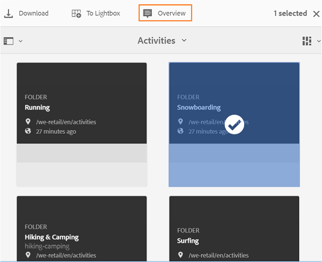

# Experience Manager Assets Brand Portal의 새로운 기능 {#what-s-new-in-aem-assets-brand-portal}

Adobe Experience Manager Assets Brand Portal을 사용하면 승인된 크리에이티브 자산을 외부 관련자와 내부 비즈니스 사용자가 간편하게 구매하고 제어하고 장치 간에 안전하게 배포할 수 있습니다. 자산 공유의 효율성을 향상시키고, 자산 출시 시기를 앞당길 수 있으며, 규정 미준수 및 무단 액세스의 위험을 줄일 수 있습니다. Adobe은 전반적인 Brand Portal 경험을 개선하기 위해 노력하고 있습니다. 새로운 기능과 향상된 기능을 간단히 살펴보겠습니다.

## 2023.10.0의 변경 사항 {#what-changed-in-October-2023}

Brand Portal 2023.10.0은 중요한 문제에 대한 수정 사항이 포함된 내부 릴리스입니다. 최신 항목 보기 [Brand Portal 릴리스 노트](brand-portal-release-notes.md).

## 2023.08.0의 변경 사항 {#what-changed-in-August-2023}

Brand Portal 2023.08.0은 중요한 문제에 대한 수정 사항이 포함된 내부 릴리스입니다. 최신 항목 보기 [Brand Portal 릴리스 노트](brand-portal-release-notes.md).

## 2023.05.0의 변경 사항 {#what-changed-in-May-2023}

Brand Portal 2023.05.0은 중요한 문제에 대한 수정 사항이 포함된 내부 릴리스입니다. 최신 항목 보기 [Brand Portal 릴리스 노트](brand-portal-release-notes.md).

## 2023.02.0의 변경 사항 {#what-changed-in-February-2023}

Brand Portal 2023.02.0은 중요한 문제에 대한 수정 사항이 포함된 내부 릴리스입니다. 최신 항목 보기 [Brand Portal 릴리스 노트](brand-portal-release-notes.md).

## 2022.10.0의 변경 사항 {#what-changed-in-October-2022}

Brand Portal 2022.10.0은 중요한 문제에 대한 수정 사항이 포함된 내부 릴리스입니다. 최신 항목 보기 [Brand Portal 릴리스 노트](brand-portal-release-notes.md).

## 2022.08.0의 변경 사항 {#what-changed-in-August-2022}

Brand Portal 2022.08.0은 중요한 문제에 대한 수정 사항이 포함된 내부 릴리스입니다. 최신 항목 보기 [Brand Portal 릴리스 노트](brand-portal-release-notes.md).

## 2022.05.0의 변경 사항 {#what-changed-in-May-2022}

Brand Portal은 이제 12시간마다 자동 작업을 실행하여 AEM에 게시된 모든 Brand Portal 에셋을 삭제합니다. 따라서 폴더 크기를 임계값 제한 이하로 유지하기 위해 기여도 폴더에 에셋을 수동으로 삭제할 필요가 없습니다. 를 사용하여 자동으로 실행된 삭제 작업의 상태를 모니터링할 수도 있습니다. **[!UICONTROL 도구]** > **[!UICONTROL 자산 기여 상태]** > **[!UICONTROL 삭제 보고서]** Brand Portal의 옵션입니다. 작업 보고서는 다음 세부 정보를 제공합니다.

* 작업 시작 시간
* 작업 종료 시간
* 작업 상태
* 작업에 포함된 총 자산
* 작업에서 삭제된 총 자산
* 작업 실행의 결과로 사용할 수 있는 총 저장소

추가 드릴다운하여 삭제 작업에 포함된 각 에셋의 세부 정보를 볼 수도 있습니다. 자산 제목, 크기, 작성자, 삭제 상태 및 삭제 시간 등 세부 정보가 보고서에 포함됩니다.

또한 Brand Portal 2022.05.0에는 중요한 문제에 대한 수정 사항이 포함되어 있습니다. 최신 항목 보기 [Brand Portal 릴리스 노트](brand-portal-release-notes.md).

## 2022.02.0의 변경 사항 {#what-changed-in-Feb-2022}

Brand Portal 2022.02.0은 중요한 문제에 대한 수정 사항이 포함된 내부 릴리스입니다. 최신 항목 보기 [Brand Portal 릴리스 노트](brand-portal-release-notes.md).

## 2021.10.0의 변경 사항 {#what-changed-in-october-2021}

Brand Portal 2021.10.0은 중요한 문제에 대한 수정 사항이 포함된 내부 릴리스입니다. 최신 항목 보기 [Brand Portal 릴리스 노트](brand-portal-release-notes.md).

## 2021.08.0의 변경 사항 {#what-changed-in-august-2021}

Brand Portal 2021.08.0은 기업이 자산을 더 잘 제어할 수 있도록 기업 및 팀 고객을 위한 비즈니스 프로필을 도입하는 내부 릴리스입니다. 이제 사용자는 새 조직과 마이그레이션된 조직에 대한 조직별 권한 을 갖습니다. 마이그레이션하는 동안 기존의 모든 Adobe ID 계정이 Business ID로 마이그레이션됩니다.

* 마이그레이션되면 모든 신규 및 기존 조직에 대한 Business ID입니다.
* Business ID에는 도메인 청구 또는 SSO 설정과 같은 특정 설정이 필요하지 않습니다.
* gmail.com 또는 outlook.com과 같은 공개 이메일 도메인을 포함하여 이메일 주소를 사용하여 사용자를 추가할 수 있습니다.

**Brand Portal 사용자에게 미치는 영향**

마이그레이션은 기존 데이터 세트, 자산, 사용자 또는 설정에 영향을 주지 않습니다. 마이그레이션 중에 발생하는 유일한 내부 변경 사항은 비즈니스 프로필에 대한 기존 조직의 권한 부여입니다.

>[!NOTE]
>
>비즈니스 프로필은 현재 2021년 8월 16일 이후에 생성된 새 조직에 적용할 수 있습니다.
>
>조직이 마이그레이션되기 전까지 Adobe ID, Enterprise ID 또는 Federated ID 유형을 계속 사용하여 조직에 액세스할 수 있습니다.

### 참조 문서 {#reference-articles}

* [Adobe 프로필 소개](https://helpx.adobe.com/enterprise/kb/introducing-adobe-profiles.html)

* [Adobe 프로필 관리](https://helpx.adobe.com/enterprise/using/manage-adobe-profiles.html)

* [사용자 및 관리자의 로그인 경험으로 업데이트](https://helpx.adobe.com/enterprise/using/storage-for-business.html#new-admin-sign-in-exp)

* [마이그레이션 중 로그인 제한](https://helpx.adobe.com/enterprise/kb/account-temporarily-unavailable.html)

* [Admin Console에서 사용자 관리](https://helpx.adobe.com/enterprise/using/manage-users-individually.html)

* [기업 사용자를 위한 제품 프로필 관리](https://helpx.adobe.com/enterprise/using/manage-product-profiles.html#assign-users)

* [도메인 트러스트](https://helpx.adobe.com/enterprise/admin-guide.html/enterprise/using/set-up-identity.ug.html#directory-trusting)

<!--   
### Add new users to T2E organization   {#add-users-to-T2E-org}

On adding a new user in Admin Console for a new or migrated T2E organization, the user will have to perform an additional step **Join Team** to get entitled to the T2E organization. 

The user is entitled only if the user chooses to **Join Team**, otherwise the user won't get access to the selected T2E organization in Brand Portal. 

>[!NOTE]
>
>The workflow is not applicable to the existing Brand Portal users.

### Additional screen while navigating to Admin Console   {#navigate-to-admin-console}

The administrators will have to perform an additional step of selecting the T2E organization while navigating from Brand Portal to Admin Console. The workflow applies on the new and migrated T2E organizations.   

Selection of the T2E organization is a one-time activity and is not required everytime the administrator navigates from Brand Portal to Admin Console.

1. Log in to a T2E organization in Brand Portal as administrator.
1. Go to **[!UICONTROL Tools]** > **[!UICONTROL Users]** > **[!UICONTROL Management]** and click on the link **[!UICONTROL Launch Admin Console]**. 

   Or, go to **[!UICONTROL Unified Shell]** > **[!UICONTROL Administration]** and click on the link **[!UICONTROL Launch Admin Console]**. 
1. Search the T2E organization to login to Admin Console.

   

### Restriction during migration of an organization   {#login-restriction}

When an organization is undergoing T2E migration, the users of that organization will not be able to login to Brand Portal. The following error message appears on the screen. However, the migration won't impact the active user session until the token expires. 

Once the migration is complete, the users can login to Brand Portal. The users will receive an email notification containing the entitlement changes. If the users are entitled to more than one organization, they will have to select the organization at the time of login. 
-->

<!--
For a new or migrated T2E orgnization, the users will have an organization specific entitlement. A user can have multiple entitlements with the same email id for different T2E organizations. 
-->

## 2021.06.0의 변경 사항 {#what-changed-in-june-2021}

Brand Portal 2021.06.0은 중요한 문제에 대한 수정 사항이 포함된 내부 릴리스입니다. 최신 항목 보기 [Brand Portal 릴리스 노트](brand-portal-release-notes.md).

## 2021.02.0의 변경 사항 {#what-changed-in-feb-2021}

Brand Portal 2021.02.0은 AEM Assets as a Cloud Service에서 Brand Portal 활성화 워크플로를 가져오고, AEM Assets as a Cloud Service에서 에셋 소싱 기능을 용이하게 하고, 에셋 다운로드 경험을 개선하고, 중요한 수정 사항을 포함하는 개선 릴리스입니다. 또한 관리자는 테넌트 수준에서 폴더, 컬렉션 및 에셋의 대량 다운로드의 기본 다운로드 동작을 구성할 수 있습니다. 더 Brand Portal **[!UICONTROL 사용 보고서]** 또한 활성 Brand Portal 사용자를 반영하도록 수정되었습니다.

### AEM Assets as a Cloud Service에서 Brand Portal 활성화 {#bp-automation-on-cloud-service}

이제 AEM Assets as a Cloud Service에 사전 구성된 Brand Portal 인스턴스가 제공됩니다. Cloud Manager 사용자는 AEM Assets as a Cloud Service 인스턴스에서 Brand Portal을 활성화할 수 있습니다.

이전에는 AEM Assets as a Cloud Service이 Adobe Developer 콘솔을 사용하여 Brand Portal으로 수동으로 구성되었습니다.

Cloud Manager 사용자는 백엔드에서 필요한 구성을 만들고 AEM Assets as a Cloud Service 인스턴스와 동일한 IMS 조직에서 Brand Portal을 활성화하는 활성화 워크플로우를 트리거합니다.

AEM Assets as a Cloud Service 인스턴스에서 Brand Portal을 활성화하려면 다음을 수행하십시오.

1. Adobe Cloud Manager에 로그인하고 다음으로 이동 **[!UICONTROL 환경]**.
1. 목록에서 환경을 하나씩 선택합니다. Brand Portal과 연관된 환경을 찾으면 **[!UICONTROL Brand Portal 활성화]** 활성화 워크플로를 시작하는 단추입니다.
1. Brand Portal 테넌트가 활성화되면 상태가 활성화됨으로 변경됩니다.

다음을 참조하십시오 [AEM Assets as a Cloud Service에서 Brand Portal 활성화](https://experienceleague.adobe.com/docs/experience-manager-cloud-service/assets/brand-portal/configure-aem-assets-with-brand-portal.html).

### AEM Assets의 에셋 소싱 as a Cloud Service {#asset-sourcing-on-cloud-service}

이제 AEM Assets에서 에셋 소싱 기능을 as a Cloud Service으로 사용할 수 있습니다. 이 기능은 기본적으로 모든 클라우드 서비스 사용자에 대해 활성화됩니다. 허용된 Brand Portal 사용자는 새 자산을 기여 폴더에 업로드하고 기여 폴더를 Brand Portal에서 AEM Assets as a Cloud Service 인스턴스로 게시하여 자산 소싱에 기여할 수 있습니다. 관리자는 Brand Portal 사용자의 기여도를 검토하고 승인하여 다른 Brand Portal 사용자에게 추가로 배포할 수 있습니다.

이전에는 AEM Assets(온프레미스 및 관리 서비스)에서만 에셋 소싱을 사용할 수 있었습니다.

다음을 참조하십시오 [Brand Portal의 에셋 소싱](https://experienceleague.adobe.com/docs/experience-manager-brand-portal/using/asset-sourcing-in-brand-portal/brand-portal-asset-sourcing.html).

### 에셋 다운로드 {#asset-download-setting}

기존 **[!UICONTROL 다운로드 설정]**, Brand Portal 관리자는 이제 다음을 구성할 수 있습니다. **[!UICONTROL 에셋 다운로드]** 설정. 이 설정을 통해 관리자는 테넌트 수준에서 폴더, 컬렉션 및 에셋의 대량 다운로드(20개 이상의 에셋)의 기본 다운로드 동작을 제어할 수 있습니다.

<!--
Earlier, all the asset renditions were directly downloaded in a zip folder in case of folder, collection, and bulk download of assets. As the **[!UICONTROL Download]** dialog is skipped for folders or collections, there was no mechanism to control the downloading behaviour of the assets. Due to this, the users were finding it difficut to search for a particular asset rendition from a folder containing huge bunch of downloaded renditions. 
-->

이전에는 모든 에셋 렌디션이 zip 폴더에 직접 다운로드되었습니다. 다음 **[!UICONTROL 다운로드]** 폴더 및 컬렉션에 대한 대화 상자를 건너뛰었고 에셋의 다운로드 동작을 제어할 방법이 없어 많은 다운로드에서 특정 렌디션을 검색하기 어려웠습니다.

**[!UICONTROL 에셋 다운로드]** 이제 에서는 폴더, 컬렉션 또는 에셋의 대량 다운로드를 다운로드하는 동안 각 에셋에 대해 별도의 폴더를 만드는 옵션을 제공합니다.

다음과 같은 경우 **[!UICONTROL 에셋 다운로드]** 설정이 비활성화되면 공유 링크를 사용하여 에셋을 다운로드하는 경우를 제외하고 폴더 또는 컬렉션이 동일한 폴더 아래에 모든 에셋 렌디션이 들어 있는 zip 폴더로 다운로드됩니다.

관리자로 Brand Portal 테넌트에 로그인하고 다음 위치로 이동합니다. **[!UICONTROL 도구]** > **[!UICONTROL 다운로드]**. 관리자는 **[!UICONTROL 에셋 다운로드]** 을 설정하여 폴더, 컬렉션 및 에셋의 대량 다운로드를 다운로드하는 동안 각 에셋에 대해 별도의 폴더를 생성합니다.

다음을 참조하십시오 [Brand Portal에서 에셋 다운로드](https://experienceleague.adobe.com/docs/experience-manager-brand-portal/using/download/brand-portal-download-assets.html).
<!--
### Download using Share link {#download-using-share-link}

The default behavior of downloading the assets using share link is now independent of the **[!UICONTROL Download Settings]**. A separate folder is created for each asset while downloading the assets using share link. 
-->

### 사용 보고서 {#usage-report}

더 Brand Portal **[!UICONTROL 사용 보고서]** 활성 Brand Portal 사용자만 반영하도록 수정되었습니다. Admin Console의 제품 프로필에 할당되지 않은 Brand Portal 사용자는 비활성 사용자로 간주되며 에 반영되지 않습니다. **[!UICONTROL 사용 보고서]**.

이전에는 활성 사용자와 비활성 사용자가 모두 사용 보고서에 표시되었습니다.

## 2020.10.0의 변경 사항 {#what-changed-in-oct-2020}

Brand Portal 2020.10.0은 자산 다운로드 경험을 단순화하는 데 중점을 둔 개선 릴리스이며, 중요한 수정 사항이 포함되어 있습니다. 개선 사항에는 에셋 다운로드를 위한 새롭고 개선된 워크플로, 렌디션을 제외하는 추가 옵션, 직접 다운로드 등이 포함됩니다. **[!UICONTROL 표현물]** 패널, 특정 사용자 그룹의 액세스 및 다운로드 권한을 허용하는 구성, 모든 Brand Portal 페이지에서 파일, 컬렉션 및 공유 링크를 쉽게 탐색할 수 있습니다. 최신 항목 보기 [Brand Portal 릴리스 노트](brand-portal-release-notes.md).

### 간소화된 다운로드 환경 {#download-dialog}

이전, **[!UICONTROL 다운로드]** 대화 상자에 각 에셋에 대한 개별 폴더 만들기, 이메일 에셋, 원본 에셋 선택, 사용자 지정 렌디션, 동적 렌디션, 시스템 렌디션 제외 및 다운로드 가속화 사용 등의 여러 옵션이 표시되었지만, 다운로드용으로 에셋 또는 폴더를 여러 개 선택한 경우 비기술적 또는 신규 사용자에게 특별히 모호했습니다. 또한, 모든 에셋 렌디션을 보거나 특정 사용자 지정 또는 동적 렌디션을 제외할 수 없습니다.

새로운 **[!UICONTROL 다운로드]** 대화 상자는 에셋 선택 및 필터링 프로세스를 일반화하므로 Brand Portal 사용자가 에셋 렌디션을 다운로드하는 동안 효과적인 결정을 쉽게 내릴 수 있습니다. 이 목록에는 선택한 모든 에셋과 해당 렌디션이 [**[!UICONTROL 다운로드]**](brand-portal-download-assets.md) 구성 및 **[!UICONTROL 다운로드]** 설정.

>[!NOTE]
>
>이제 모든 사용자가 다음을 보유함 **[!UICONTROL 빠른 다운로드]** 기본적으로 활성화되고 IBM Aspera Connect 3.9.9(`https://www.ibm.com/docs/en/aspera-connect/3.9.9`)를 설치한 다음 Brand Portal에서 자산을 다운로드합니다.

<!--
If any of the **[!UICONTROL Custom Rendition]** or **[!UICONTROL System Rendition]** is enabled in the [**[!UICONTROL Download]**](brand-portal-download-assets.md) configuration and **[!UICONTROL Download]** settings are enabled for the group users, the new **[!UICONTROL Download]** dialog appears with all the renditions of the selected assets or folders containing assets in a list view. 
-->

다음에서 **[!UICONTROL 다운로드]** 대화 상자에서 다음과 같은 작업을 수행할 수 있습니다.

* 다운로드 목록에서 사용 가능한 모든 에셋 렌디션을 표시합니다.
* 다운로드에 필요하지 않은 자산의 렌디션을 제외합니다.
* 한 번의 클릭으로 유사한 모든 에셋 유형에 동일한 렌디션 세트를 적용합니다.
* 서로 다른 에셋 유형에 대해 서로 다른 렌디션 세트를 적용합니다.
* 각 자산에 대해 별도의 폴더 만들기.
* 선택한 에셋 및 해당 렌디션을 다운로드합니다.

다운로드 워크플로우는 독립 실행형 에셋, 여러 에셋, 에셋이 포함된 폴더, 라이선스가 있는 에셋 또는 라이선스가 없는 에셋, 공유 링크를 사용한 에셋 다운로드에 대해 일정하게 유지됩니다. 다음을 참조하십시오 [Brand Portal에서 에셋을 다운로드하는 단계](https://experienceleague.adobe.com/docs/experience-manager-brand-portal/using/download/brand-portal-download-assets.html).

### 빠른 탐색  {#quick-navigation}

이전에는 볼 수 있었습니다. **[!UICONTROL 파일]**, **[!UICONTROL 컬렉션]**, 및 **[!UICONTROL 공유 링크]** 은 숨겨져 있으며 사용자가 다른 보기로 전환하려고 할 때마다 여러 번 클릭해야 합니다.

Brand Portal 2020.10.0에서 사용자는 **[!UICONTROL 파일]**, **[!UICONTROL 컬렉션]**, 및 **[!UICONTROL 공유 링크]** 모든 Brand Portal 페이지에서 빠른 탐색 링크를 사용하여 한 번의 클릭으로 빠르게 탐색할 수 있습니다.

### 향상된 렌디션 패널 {#rendition-panel}

이전에는 에서 원본 에셋과 해당 렌디션만 볼 수 있었습니다. **[!UICONTROL 표현물]** 다음 중 하나가 있는 경우 패널 **[!UICONTROL 사용자 지정 렌디션]** 또는 **[!UICONTROL 시스템 렌디션]** 이(가) 다음에서 활성화되었습니다. **[!UICONTROL 다운로드]** 구성. 또한, 필요하지 않은 특정 사용자 지정 또는 동적 변환을 제외하기 위한 필터가 없으므로 사용자는 모든 에셋 변환을 다운로드해야 했습니다.

<!--
Earlier, if any of the custom or system renditions was enabled in the **[!UICONTROL Download]** settings, an additional **[!UICONTROL Download]** dialog appeared on clicking the **[!UICONTROL Download]** button wherein the user had to manually select the set of renditions (original asset, custom renditions, dynamic renditions) to download.
There was no filter to exclude specific custom or dynamic renditions which were not required for download.
-->

Brand Portal 2020.10.0에서 사용자는 특정 렌디션을 제외하고 직접 사용할 수 있습니다 [렌디션 패널에서 선택한 렌디션 다운로드](brand-portal-download-assets.md#download-assets-from-asset-details-page) 를 열지 않고도 에셋 세부 사항 페이지에서 **[!UICONTROL 다운로드]** 대화 상자.

<!-- 
In Brand Portal 2020.10.0, direct download and exclude renditions features are introduced in the **[!UICONTROL Renditions]** panel on the asset details page. All the renditions (original asset, custom renditions, dynamic renditions) under the rendition panel are now associated with a check box and are enabled by default. 

The user can clear the check boxes to exclude the renditions which are not required for download. And can click on the **[!UICONTROL Download]** button in the **[!UICONTROL Renditions]** panel to directly download the selected set of renditions in a zip folder without having to open the **[!UICONTROL Download]** dialog.
-->

### 다운로드 설정 구성 {#download-permissions}

기존 **[!UICONTROL 다운로드]** 구성 Brand Portal 관리자는 에셋 세부 정보 페이지에서 원본 에셋과 그 렌디션을 보고(또는) 다운로드하도록 여러 사용자 그룹에 대한 설정을 구성할 수도 있습니다.

관리자로 Brand Portal 테넌트에 로그인하고 다음 위치로 이동합니다. **[!UICONTROL 도구]** > **[!UICONTROL 사용자]**.

다음에서 **[!UICONTROL 사용자 역할]** 페이지, 다음으로 이동 **[!UICONTROL 그룹]** 사용자 그룹에 대한 보기 및(또는) 다운로드 설정을 구성하는 탭입니다.

이전에는 그룹 사용자가 원본 에셋을 다운로드하지 못하도록 제한하는 데만 설정을 사용할 수 있었습니다.

다음 **[!UICONTROL 그룹]** 의 탭 **[!UICONTROL 사용자 역할]** 관리자는 이 페이지에서 보기 및 다운로드 설정을 구성할 수 있습니다.

* 둘 다인 경우 **[!UICONTROL 원본 다운로드]** 및 **[!UICONTROL 렌디션 다운로드]** 설정이 켜지면 선택한 그룹의 사용자가 원본 에셋과 렌디션을 보고 다운로드할 수 있습니다.
* 두 설정이 모두 꺼져 있으면 원래 에셋만 볼 수 있습니다. 에셋 렌디션은 에셋 세부 정보 페이지에서 사용자에게 표시되지 않습니다.
* If only **[!UICONTROL 원본 다운로드]** 설정이 켜지면 사용자는 에셋 세부 정보 페이지에서 원본 에셋만 보고 다운로드할 수 있습니다.
* If only **[!UICONTROL 렌디션 다운로드]** 설정이 켜지면 사용자는 원본 에셋을 볼 수 있지만 다운로드할 수는 없습니다. 그러나 사용자는 에셋 렌디션을 보고 다운로드할 수 있습니다.

다음을 참조하십시오 [에셋 다운로드 구성](https://experienceleague.adobe.com/docs/experience-manager-brand-portal/using/download/brand-portal-download-assets.html#configure-download-permissions).

>[!NOTE]
>
>사용자가 여러 그룹에 추가되고 이러한 그룹 중 하나에 제한이 있는 경우 해당 제한이 사용자에게 적용됩니다.

<!--
>Restrictions to access the original asset and their renditions do not apply to administrators even if they are members of restricted groups.
 >
 >The users can always download assets and their renditions from the repository using a `curl` request even if the download configurations are turned-off.
 >
-->

## 6.4.7의 변경 사항 {#what-changed-in-647}

Brand Portal 6.4.7 릴리스는 Document Viewer를 도입하고 에셋 다운로드 경험을 개선하며 중요한 수정 사항을 포함합니다. 최신 항목 보기 [Brand Portal 릴리스 노트](brand-portal-release-notes.md).

<!--
Brand Portal 6.4.7 release brings in the Document Viewer, leverages the Brand Portal administrators to configure asset download, and centers top customer requests. See latest [Brand Portal Release Notes](brand-portal-release-notes.md).
-->

### 문서 뷰어 {#doc-viewer}

문서 뷰어는 PDF 보기 경험을 향상시킵니다. Brand Portal에서 PDF 파일을 보는 동안 Adobe Document Cloud과 유사한 경험을 제공합니다.

이전에는 PDF 파일을 보는 데 제한된 옵션을 사용할 수 있었습니다.

이제 Brand Portal 사용자는 문서 뷰어를 사용하여 페이지 보기, 책갈피 보기, 페이지 내 텍스트 검색, 확대, 축소, 이전 및 다음 페이지로 이동, 페이지로 전환, 창에 맞추기, 화면에 맞추기, 도구 모음 숨기기 또는 숨기기 취소 옵션을 사용할 수 있습니다.

>[!NOTE]
>
>다른 문서 형식에 대한 보기 경험은 변경되지 않습니다.

### 경험 다운로드 {#download-configurations}

에셋 다운로드 프로세스가 개선되어 사용자 환경이 간소화되었습니다. [Brand Portal에서 에셋 다운로드](brand-portal-download-assets.md).

Brand Portal에서 에셋을 다운로드하는 기존 워크플로우는 다음이 불가피합니다.  **[!UICONTROL 다운로드]** 여러 다운로드 옵션이 있는 대화 상자를 선택하여 선택할 수 있습니다.

Brand Portal 6.4.7에서 Brand Portal 관리자는 에셋을 구성할 수 있습니다  **[!UICONTROL 다운로드]** 설정. 사용 가능한 구성은 다음과 같습니다.

* **[!UICONTROL 빠른 다운로드]**
* **[!UICONTROL 사용자 지정 표현물]**
* **[!UICONTROL 시스템 표현물]**

Brand Portal 관리자는 모든 조합을 활성화하여 에셋 다운로드를 구성할 수 있습니다.

<!--In Brand Portal 6.4.7, fast download, custom renditions, and system renditions are the three configurations available.-->

* 둘 다인 경우 **[!UICONTROL 사용자 지정 표현물]** 및 **[!UICONTROL 시스템 표현물]** 구성이 꺼져 있으면 추가 대화 상자 없이 에셋의 원본 렌디션이 다운로드되므로 Brand Portal 사용자의 다운로드 경험이 간소화됩니다.

* 다음 중 하나라도 **[!UICONTROL 사용자 지정 렌디션]** 또는 **[!UICONTROL 시스템 렌디션]** 이(가) 활성화되어 있으면 **[!UICONTROL 다운로드]** 대화 상자가 나타나고 에셋 표현물과 함께 원본 에셋이 다운로드됩니다. 활성화 중  **[!UICONTROL 빠른 다운로드]** 구성을 통해 다운로드 프로세스 속도가 빨라집니다.

구성에 따라 다운로드 워크플로우는 독립 실행형 에셋, 여러 에셋, 에셋이 포함된 폴더, 라이선스가 있는 에셋 또는 라이선스가 없는 에셋, 공유 링크를 사용한 에셋 다운로드에 대해 일정하게 유지됩니다.

## 6.4.6의 변경 사항 {#what-changed-in-646}

Brand Portal 6.4.6에서 AEM Assets과 Brand Portal 간의 인증 채널이 변경되었습니다. Brand Portal은 이제 AEM Assets as a Cloud Service, AEM Assets 6.3 이상에서 지원됩니다. AEM Assets 6.3 이상에서는 이전에 Brand Portal이 기존 OAuth 게이트웨이를 통해 클래식 UI에 구성되었으며, 이 게이트웨이는 인증을 위해 IMS 액세스 토큰을 가져오는 데 JWT 토큰 교환을 사용합니다. 이제 AEM Assets은 Adobe Developer 테넌트의 인증을 위해 IMS 토큰을 조달하는 Brand Portal 콘솔을 통해 Brand Portal으로 구성됩니다.

<!-- The steps to configure integration are different depending on your AEM version, and whether you are configuring for the first-time, or upgrading the existing integration:
-->

<!--
  
   | **AEM Version** |**New Integration** |**Upgrade Integration** |
|---|---|---|
| **AEM 6.5** |[Create new integration](../using/brand-portal-configure-integration-65.md) |[Upgrade existing integration](../using/brand-portal-configure-integration-65.md#upgrade-integration-65) | 
| **AEM 6.4** |[Create new integration](../using/brand-portal-configure-integration-64.md) |[Upgrade existing integration](../using/brand-portal-configure-integration-64.md#upgrade-integration-64) | 
| **AEM 6.3** |[Create new integration](../using/brand-portal-configure-integration-63.md) |[Upgrade existing integration](../using/brand-portal-configure-integration-63.md#upgrade-integration-63) | 
| **AEM 6.2** | | 

   -->

Brand Portal에서 AEM Assets을 구성하는 단계는 AEM 버전과 처음 구성하는 것인지 아니면 기존 구성을 업그레이드하는 것인지에 따라 다릅니다.

<!--| **AEM Version** |**New Configuration** |**Upgrade Configuration** |
|---|---|---|
| **AEM 6.5 (6.5.4.0 and above)** |[Create configuration](../using/brand-portal-configure-integration-65.md) |[Upgrade configuration](../using/brand-portal-configure-integration-65.md#upgrade-integration-65) | 
| **AEM 6.4 (6.4.8.0 and above)** |[Create configuration](../using/brand-portal-configure-integration-64.md) |[Upgrade configuration](../using/brand-portal-configure-integration-64.md#upgrade-integration-64) | 
| **AEM 6.3 (6.3.3.8 and above)** |[Create configuration](../using/brand-portal-configure-integration-63.md) |[Upgrade configuration](../using/brand-portal-configure-integration-63.md#upgrade-integration-63) | 

-->

<!-- AEM Assets configuration with Brand Portal on Adobe I/O is supported on:
* AEM 6.5.4.0 and above
* AEM 6.4.8.0 and above
* AEM 6.3.3.8 and above -->

| **AEM 버전** | **새 구성** | **구성 업그레이드** |
|---|---|---|
| **AEM Assets as a Cloud Service** | [구성 만들기](https://experienceleague.adobe.com/docs/experience-manager-cloud-service/assets/brand-portal/configure-aem-assets-with-brand-portal.html) | - |
| **AEM 6.5(6.5.4.0 이상)** | [구성 만들기](https://experienceleague.adobe.com/docs/experience-manager-65/assets/brandportal/configure-aem-assets-with-brand-portal.html) | [구성 업그레이드](https://experienceleague.adobe.com/docs/experience-manager-65/assets/brandportal/configure-aem-assets-with-brand-portal.html#upgrade-integration-65) |

>[!NOTE]
>
>AEM 인스턴스를 최신 서비스 팩으로 업데이트하는 것이 좋습니다.

최신 항목 보기 [Brand Portal 릴리스 노트](brand-portal-release-notes.md).

다음을 참조하십시오 [BRAND PORTAL FAQ](brand-portal-faqs.md).

## 6.4.5의 변경 사항 {#what-changed-in-645}

Brand Portal 6.4.5는 작성자 환경에 액세스하지 않아도 콘텐츠를 Brand Portal에 업로드하고 AEM Assets에 게시할 수 있는 기능을 Brand Portal 사용자(외부 에이전시/팀)에게 제공하는 데 중점을 둔 기능 릴리스입니다. 이 기능은 라고 합니다. **[Brand Portal의 에셋 소싱](brand-portal-asset-sourcing.md)**: 사용자가 자산을 기여하고 전 세계에 배포된 다른 Brand Portal 사용자와 공유할 수 있는 양방향 메커니즘을 제공하여 고객 경험을 향상시킵니다.

### Brand Portal의 에셋 소싱 {#asset-sourcing-in-bp}

에셋 소싱을 사용하면 AEM 사용자(관리자/관리자가 아닌 사용자)가 추가 항목으로 폴더를 만들 수 있습니다 **자산 기여** Brand Portal 사용자가 만든 새 폴더를 에셋 제출에 대해 열도록 하는 속성입니다. 새로 만든 폴더 내에 NEW 및 SHARED라는 두 개의 추가 하위 폴더를 만드는 워크플로를 자동으로 트리거합니다 **기여도** 폴더를 삭제합니다.

그런 다음 AEM 사용자는 기여도 폴더에 추가해야 하는 에셋 유형에 대한 간단한 개요를 업로드하고 기본 에셋을 다음에 업로드하여 요구 사항을 정의합니다. **공유됨** Brand Portal 사용자에게 필요한 참조 정보가 있는지 확인하기 위한 폴더입니다. 그런 다음 관리자는 활성 Brand Portal 사용자에게 새로 만든 폴더를 게시하기 전에 기여 폴더에 대한 액세스 권한을 부여할 수 있습니다 **기여도** 폴더를 Brand Portal에 추가합니다.

사용자가 의 콘텐츠 추가를 완료하면 **새로 만들기** 폴더를 만든 후 기여도 폴더를 다시 AEM 작성자 환경에 게시할 수 있습니다. 가져오기를 완료하고 AEM Assets 내에 새로 게시된 콘텐츠를 반영하는 데 몇 분 정도 걸릴 수 있습니다.

또한 기존의 모든 기능은 변경되지 않습니다. Brand Portal 사용자는 기여 폴더 및 기타 허용된 폴더에서 에셋을 보고, 검색하고, 다운로드할 수 있습니다. 또한 관리자는 기여 폴더를 공유하고, 속성을 수정하고, 컬렉션을 통해 에셋을 추가할 수 있습니다.

>[!NOTE]
>
>Brand Portal의 에셋 소싱은 AEM 6.5.2.0 이상에서 지원됩니다.
>
>이 기능은 이전 버전인 AEM 6.3 및 AEM 6.4에서 지원되지 않습니다.

### 기여 폴더에 자산 업로드 {#upload-assets-in-bp}

적절한 권한이 있는 Brand Portal 사용자는 개별 에셋 또는 여러 에셋이 포함된 폴더(.zip 파일)를 기여도 폴더에 업로드할 수 있습니다. 사용자는 여러 에셋을 에셋 기여 폴더에 업로드할 수 있습니다. 단, 한 번에 하나의 폴더만 만들 수 있습니다.

Brand Portal 사용자는 에셋만 업로드할 수 있습니다. **새로 만들기** 하위 폴더. 다음 **공유됨** 폴더는 요구 사항 및 기준 에셋 배포를 위한 것입니다.

### 기여 폴더를 AEM Assets에 게시 {#publish-assets-to-aem}

업로드가 완료되면 **새로 만들기** 그런 다음 Brand Portal 사용자는 기여도 폴더를 다시 AEM에 게시할 수 있습니다. AEM Assets에서 게시된 콘텐츠/에셋을 가져오고 반영하는 데 몇 분 정도 걸릴 수 있습니다. 다음을 참조하십시오 [기여 폴더를 AEM Assets에 게시](brand-portal-publish-contribution-folder-to-aem-assets.md).

## 6.4.4의 변경 사항 {#what-changed-in-644}

Brand Portal 6.4.4 릴리스는 텍스트 검색 및 주요 고객 요청에 대한 개선 사항에 중점을 둡니다. 최신 항목 보기 [Brand Portal 릴리스 노트](brand-portal-release-notes.md).

### 검색 개선 사항

Brand Portal 6.4.4 이상에서는 필터링 창의 속성 술어에 대한 부분 텍스트 검색을 지원합니다. 부분 텍스트 검색을 허용하려면 다음을 활성화해야 합니다 **부분 검색** ( 검색 양식의 속성 설명)에서 찾을 수 있습니다.

부분 텍스트 검색 및 와일드카드 검색에 대한 자세한 내용은 계속 읽으십시오.

#### 부분 구문 검색 {#partial-phrase-search}

이제 필터링 창에서 검색한 구문의 한 부분(한 단어 또는 두 단어)만 지정하여 자산을 검색할 수 있습니다.

**사용 사례**
부분 구문 검색은 검색된 구문에서 발생하는 정확한 단어 조합을 모를 때 유용합니다.

예를 들어, Brand Portal의 검색 양식에서 에셋 제목에서의 부분 검색을 위해 속성 조건자를 사용하는 경우 해당 용어를 지정합니다 **캠프** 제목 구문에 camp라는 단어가 포함된 모든 자산을 반환합니다.

#### 와일드카드 검색 {#wildcard-search}

Brand Portal에서는 별표(&#42;검색 쿼리에서 검색 구문에 있는 단어의 일부와 함께 사용됩니다.

**사용 사례. 검색된 구문에서 발생하는 정확한 단어를 모를 경우 와일드카드 검색을 사용하여 검색 쿼리의 간격을 채울 수 있습니다.

예를 들어 **상승&#42;** 문자로 시작하는 단어가 포함된 모든 에셋을 반환합니다. **상승** 제목란: Brand Portal의 검색 양식에서 자산 제목에 대한 부분 검색을 위해 속성 설명 을 사용하는 경우

마찬가지로, 다음을 지정합니다.

* **&#42;상승** 문자로 끝나는 단어가 있는 모든 에셋 반환 **상승** 제목 구문에.

* **&#42;상승&#42;** 문자를 구성하는 단어가 포함된 모든 자산 반환 **상승** 제목 구문에.

>[!NOTE]
>
>선택 시 **부분 검색** 확인란, **대소문자 무시** 기본적으로 가 선택되어 있습니다.

## 6.4.3의 변경 사항 {#what-changed-in}

Brand Portal 6.4.3 릴리스는 — 조직에게 Brand Portal 액세스 URL의 테넌트 ID 외에도 대체 별칭을 제공하고, 새로운 폴더 계층 구조 구성, 비디오 지원 개선 사항, AEM 작성자 인스턴스에서 Brand Portal으로 예약된 게시, 운영 개선 사항 및 고객 요청에 대한 사항을 제공하는 데 중점을 둡니다.

### 관리자가 아닌 사용자를 위한 폴더 계층 구조 탐색

이제 관리자는 로그인 시 관리자가 아닌 사용자(편집자, 뷰어 및 게스트 사용자)에게 폴더를 표시하는 방법을 구성할 수 있습니다. [폴더 계층 구조 활성화](../using/brand-portal-general-configuration.md) 구성이에 추가됨 **일반 설정**&#x200B;관리 도구 패널에서 을 참조하십시오. 구성이 다음과 같은 경우

* **활성화됨**, 루트 폴더에서 시작하는 폴더 트리는 관리자가 아닌 사용자에게 표시됩니다. 따라서 관리자에게 관리자와 유사한 탐색 경험을 제공할 수 있습니다.
* **비활성화됨**&#x200B;랜딩 페이지에 공유 폴더만 표시됩니다.

다음 [폴더 계층 구조 활성화](../using/brand-portal-general-configuration.md) 기능(활성화된 경우)을 사용하면 다른 계층에서 공유되는 동일한 이름의 폴더를 구분할 수 있습니다. 이제 로그인하면 관리자가 아닌 사용자에게 공유 폴더의 가상 상위(및 상위) 폴더가 표시됩니다.

공유 폴더는 가상 폴더의 각 디렉토리 내에 구성됩니다. 잠금 아이콘으로 이러한 가상 폴더를 인식할 수 있습니다.

가상 폴더의 기본 썸네일은 첫 번째 공유 폴더의 썸네일 이미지입니다.

### 특정 폴더 계층 구조 또는 경로에서 검색

**경로 브라우저** 조건자는 특정 디렉토리에서 자산을 검색할 수 있도록 검색 양식에 도입됩니다. 경로 브라우저에 대한 검색 조건자의 기본 검색 경로는 다음과 같습니다. `/content/dam/mac/<tenant-id>/`기본 검색 양식을 편집하여 구성할 수 있습니다.

* 관리자 사용자는 경로 브라우저를 사용하여 Brand Portal의 모든 폴더 디렉토리로 이동할 수 있습니다.
* 관리자가 아닌 사용자는 경로 브라우저를 사용하여 공유된 폴더(및 상위 폴더로 다시 이동)만 탐색할 수 있습니다.

  예를 들어, `/content/dam/mac/<tenant-id>/folderA/folderB/folderC` 는 관리자가 아닌 사용자와 공유됩니다. 사용자는 경로 브라우저를 사용하여 folderC 내에서 에셋을 검색할 수 있습니다. 이 사용자는 folderB 및 folderA(사용자와 공유되는 folderC의 상위 항목이므로)로 이동할 수도 있습니다.

이제 루트 폴더에서 시작하지 않고 검색한 특정 폴더 내에서 에셋 검색을 제한할 수 있습니다.

이러한 폴더에서 검색하면 사용자와 공유된 에셋의 결과만 반환됩니다.

### Dynamic Media 비디오 렌디션 지원

AEM Author 인스턴스가 Dynamic Media 하이브리드 모드에 있는 사용자는 원본 비디오 파일 외에 Dynamic Media 렌디션을 미리 보고 다운로드할 수 있습니다.

특정 테넌트 계정에서 Dynamic Media 렌디션의 미리 보기 및 다운로드를 허용하려면 관리자는 을(를) 지정해야 합니다 **Dynamic Media 구성** (동적 비디오를 가져오기 위한 비디오 서비스 URL(DM-Gateway URL) 및 등록 ID)) **비디오** 관리 도구 패널의 구성

Dynamic Media 비디오는 다음에서 미리 볼 수 있습니다.

* 자산 세부 사항 페이지
* 에셋의 카드 보기
* 링크 공유 미리 보기 페이지

Dynamic Media 비디오 인코딩은 다음 위치에서 다운로드할 수 있습니다.

* Brand Portal
* 공유 링크

### Brand Portal에 예약된 게시

AEM 6.4.2.0 작성자 인스턴스에서 Brand Portal으로 에셋(및 폴더) 게시 워크플로우를 나중 날짜, 시간으로 예약할 수 있습니다.

마찬가지로 Brand Portal에서 게시 취소 워크플로우를 예약하여 나중에 게시된 자산을 포털에서 제거할 수 있습니다.

### URL에서 구성 가능한 테넌트 별칭

조직은 URL에 대체 접두사를 사용하여 포털 URL을 사용자 정의할 수 있습니다. 기존 포털 URL에서 테넌트 이름에 대한 별칭을 얻으려면 조직에서 고객 지원 센터에 문의해야 합니다.

Brand Portal URL의 접두사만 사용자 정의할 수 있으며 전체 URL은 사용자 정의할 수 없습니다.\
기존 도메인이 있는 조직 **geomettrix.brand-portal.adobe.com** 가져올 수 있음 **geomettrixinc.brand-portal.adobe.com** 이(가) 요청 시 만들어졌습니다.

그러나 AEM 작성자 인스턴스는 다음과 같을 수 있습니다. [구성됨](https://experienceleague.adobe.com/docs/experience-manager-65/assets/brandportal/configure-aem-assets-with-brand-portal.html) 테넌트 ID URL을 사용하는 경우에만 해당하며 테넌트 별칭(대체) URL은 포함되지 않습니다.

조직은 Adobe이 제공한 URL을 고수하는 대신 포털 URL을 사용자 지정하여 브랜딩 요구 사항을 충족할 수 있습니다.

### 다운로드 경험 개선 사항

이 릴리스는 다음과 같이 클릭 수와 경고 수를 줄여 단순화된 다운로드 경험을 제공합니다.

* 원본 에셋이 아닌 렌디션만 다운로드하도록 선택합니다.
* 원본 렌디션에 대한 액세스가 제한되는 경우 에셋 다운로드

## 6.4.2의 변경 사항 {#what-changed-in-1}

Brand Portal 6.4.2 릴리스는 조직의 에셋 배분 요구 사항을 처리하는 다양한 기능을 제공하며 게스트 액세스 및 다운로드 가속화를 통한 최적의 경험을 통해 전 세계에 분포한 많은 사용자에게 연결할 수 있도록 지원합니다. 또한 Brand Portal은 관리자를 위한 새 구성, 새로 추가된 보고서 및 고객 요청에 대한 조건을 통해 조직을 보다 세밀하게 제어할 수 있습니다.

### 게스트 액세스

AEM Brand Portal에서 게스트가 포털에 액세스할 수 있습니다. 게스트 사용자는 포털에 로그인하기 위해 자격 증명이 필요하지 않으며 모든 공개 폴더 및 컬렉션에 액세스하고 다운로드할 수 있습니다. 게스트 사용자는 Lightbox(개인 컬렉션)에 자산을 추가하고 다운로드할 수 있습니다. 스마트 태그 검색과 관리자가 설정한 검색 술어를 볼 수도 있습니다. 게스트 세션에서는 사용자가 컬렉션과 저장된 검색을 만들거나 더 이상 공유하고, 폴더 및 컬렉션 설정에 액세스하며, 자산을 링크로 공유할 수 없습니다.

조직에서 여러 개의 동시 게스트 세션이 허용되며, 이는 조직당 총 사용자 할당량의 10%로 제한됩니다.

게스트 세션은 2시간 동안 활성 상태로 유지됩니다. 따라서 Lightbox의 상태도 세션 시작 시간으로부터 2시간까지 유지됩니다. 2시간 후 게스트 세션을 다시 시작해야 하므로 Lightbox 상태가 손실됩니다.

### 가속화된 다운로드

Brand Portal 사용자는 IBM Aspera Connect 기반의 빠른 다운로드를 적용하여 최고 25배 빠른 속도를 얻을 수 있으며 전 세계 위치에 상관없이 원활한 다운로드 경험을 누릴 수 있습니다. Brand Portal 또는 공유 링크에서 에셋을 보다 빠르게 다운로드하려면 다음을 선택해야 합니다. **다운로드 가속화 활성화** 조직에서 다운로드 가속화가 활성화된 경우 다운로드 대화 상자의 옵션을 사용할 수 있습니다.

조직의 IBM Aspera 기반 가속 다운로드를 활성화하려면 관리자 **다운로드 가속화 활성화** 다음에서 옵션(기본적으로 비활성화됨): [일반 설정](brand-portal-general-configuration.md#allow-download-acceleration) 관리 도구 패널에서 참조할 수 있습니다. Brand Portal 및 공유 링크에서 에셋 파일을 보다 빠르게 다운로드하기 위한 사전 요구 사항 및 문제 해결 단계에 대해 자세히 알아보려면 을 참조하십시오. [Brand Portal에서 다운로드를 가속화하기 위한 안내서](../using/accelerated-download.md#main-pars-header).

### 사용자 로그인 보고서

사용자 로그인을 추적하는 새 보고서가 도입되었습니다. 다음 **사용자 로그인** 보고서는 조직에서 Brand Portal의 위임된 관리자 및 기타 사용자를 감사하고 확인할 수 있도록 하는 데 유용합니다.

보고서 로그에는 보고서 생성 시간까지 Brand Portal 6.4.2 배포의 각 사용자 이름, 이메일 ID, 가상 사용자(관리자, 뷰어, 편집기, 게스트), 그룹, 마지막 로그인, 활동 상태 및 로그인 수가 표시됩니다. 관리자는 보고서를 .csv 로 내보낼 수 있습니다. 다른 보고서와 함께 사용자 로그인 보고서를 통해 조직은 승인된 브랜드 리소스와의 사용자 상호 작용을 보다 면밀하게 모니터링할 수 있으므로 기업 규정 준수 사무소에 대한 준수를 보장할 수 있습니다.

### 원본 렌디션에 액세스

관리자는 원본 이미지 파일(.jpeg, .tiff, .png, .bmp, .gif, .pjpeg, x-portable-anymap, x-portable-bitmap, x-portable-graymap, x-portable-pixmap, x-rgb, x-xbitmap, x-xpixmap, x-icon, image/photoshop, image/x-photoshop, .psd, image/vnd.adobe.photoshop)에 대한 사용자 액세스를 제한하고 Brand Portal 또는 공유 링크에서 다운로드하는 저해상도 표현물에 대한 액세스를 제공할 수 있습니다. 이 액세스는 관리자 도구 패널의 사용자 역할 페이지에 있는 그룹 탭에서 사용자 그룹 수준에서 제어할 수 있습니다.

* 원본에 대한 액세스가 모든 사용자에 대해 활성화되어 있으므로 기본적으로 모든 사용자는 원본 렌디션을 다운로드할 수 있습니다.
* 관리자는 사용자 그룹이 원본 렌디션에 액세스하지 못하도록 각 확인란의 선택을 취소해야 합니다.
* 사용자가 여러 그룹의 구성원이지만 그룹 중 하나에만 제한이 있는 경우 해당 사용자에게는 제한이 적용됩니다.
* 관리자는 제한된 그룹의 구성원이더라도 이러한 제한이 적용되지 않습니다.
* 링크로 에셋을 공유하는 사용자의 권한은 공유 링크를 사용하여 에셋을 다운로드하는 사용자에게 적용됩니다.

### 카드 및 목록 보기의 폴더 계층 구조 경로

이제 카드 보기에서 폴더 카드에 관리자가 아닌 사용자(편집자, 뷰어 및 게스트 사용자)에게 폴더 계층 구조 정보가 표시됩니다. 이 기능을 사용하면 상위 계층 구조를 기준으로 사용자가 액세스하는 폴더의 위치를 알 수 있습니다.

폴더 계층 정보는 다른 폴더 계층 구조에서 공유된 다른 폴더와 유사한 이름을 갖는 폴더를 구별하는 데 특히 유용합니다. 관리자가 아닌 사용자가 공유된 에셋의 폴더 구조를 알지 못하는 경우 유사한 이름의 에셋/폴더가 혼동되는 것으로 보입니다.

* 각 카드에 표시된 경로는 카드 크기에 맞게 잘립니다. 그러나 전체 경로는 잘린 경로 위로 마우스를 가져갈 때 도구 설명으로 볼 수 있습니다.

목록 보기는 모든 Brand Portal 사용자에 대한 열에 에셋의 폴더 경로를 표시합니다.

### 자산 속성을 보는 개요 옵션

Brand Portal은 관리자가 아닌 사용자(편집자, 뷰어, 게스트 사용자)가 선택한 에셋/폴더의 에셋 속성을 볼 수 있는 개요 옵션을 제공합니다. 개요 옵션이 표시됩니다.

1. 에셋/폴더 선택 시 맨 위에 있는 도구 모음에서 를 클릭합니다.
2. 레일 선택기 선택 드롭다운에서 다음을 수행합니다.

에셋/폴더를 선택한 상태에서 개요 옵션을 선택하면 에셋 생성의 제목, 경로 및 시간을 볼 수 있습니다. 반면 에셋 세부 정보 페이지에서 개요 옵션을 선택하면 에셋의 메타데이터를 볼 수 있습니다.

## 새 구성

관리자가 특정 테넌트에서 다음 기능을 활성화/비활성화할 수 있도록 6개의 새 구성이 추가되었습니다.

* 게스트 액세스 허용
* 사용자가 Brand Portal에 대한 액세스 권한을 요청하도록 허용
* 관리자가 Brand Portal에서 에셋을 삭제하도록 허용
* 공용 컬렉션 생성 허용
* 공용 스마트 컬렉션 만들기 허용
* 다운로드 가속화 허용

위의 구성은 관리 도구 패널의 액세스 및 일반 설정에서 사용할 수 있습니다.

### oAuth 통합 구성을 위한 Adobe I/O UI

Brand Portal 6.4.2 이상에서는 이전 OAuth(`https://legacy-oauth.cloud.adobe.io/`) JWT 응용 프로그램을 만드는 인터페이스입니다. 이 인터페이스를 통해 oAuth 통합을 구성하여 AEM Assets과 Brand Portal을 통합할 수 있습니다. 이전에는 OAuth 통합 구성을 위한 UI가에서 호스팅되었습니다. `https://marketing.adobe.com/developer/`. Brand Portal에 자산 및 컬렉션을 게시하기 위해 AEM Assets과 Brand Portal을 통합하는 방법에 대한 자세한 내용은 다음을 참조하십시오. [Brand Portal과 AEM Assets 통합 구성](https://experienceleague.adobe.com/docs/experience-manager-65/assets/brandportal/configure-aem-assets-with-brand-portal.html).

## 검색 개선 사항

관리자는 대/소문자 무시를 확인하는 업데이트된 속성 설명을 사용하여 속성 술어를 대/소문자를 구분하지 않게 할 수 있습니다. 이 옵션은 속성 술어 및 다중 값 속성 술어에 사용할 수 있습니다.\
하지만 대소문자를 구분하지 않는 검색은 속성 조건자에 대한 기본 검색보다 상대적으로 느립니다. 검색 필터에 대소문자를 구분하지 않는 술어가 너무 많으면 검색 속도가 느려질 수 있습니다. 따라서 대/소문자를 구분하지 않는 검색을 신중하게 사용하는 것이 좋습니다.

## 6.4.1의 변경 사항 {#what-changed-in-2}

Brand Portal 6.4.1은 브라우징, 검색 및 성능 향상과 같은 몇 가지 새로운 기능과 중요한 개선 사항을 제공하여 고객 경험을 충족하는 플랫폼 업그레이드 릴리스입니다.

### 향상된 찾아보기

* 에셋 계층 구조를 빠르게 탐색하는 새 콘텐츠 트리 레일입니다.

* 새로운 키보드 단축키(예: ) 도입 _(p)_ 속성 페이지로 이동하려면 _마._ (편집용) _(ctrl+c)_ 복사 작업용
* 많은 수의 에셋을 탐색하기 위해 카드 및 목록 보기에서 스크롤링, 지연 로드 경험이 개선되었습니다.
* 보기 설정에 따라 다른 크기의 카드를 지원하는 향상된 카드 보기.

* 이제 카드 보기에 날짜 레이블 위로 마우스를 가져가면 날짜/시간 스탬프가 표시됩니다.

* 향상된 열 보기 **추가 세부 정보** 에셋의 세부 정보 페이지로 이동할 수 있는 에셋 스냅샷 아래에서

* 이제 목록 보기에는 로케일, 에셋 유형, 차원, 크기, 등급 및 게시 정보 외에 에셋의 파일 이름이 기본적으로 첫 번째 열에 표시됩니다. 신규 **설정 보기** 를 사용하여 목록 보기에 표시할 정보의 양을 구성할 수 있습니다.

* 새 탐색 버튼을 사용하여 에셋 간을 앞뒤로 탐색하고 에셋 수를 볼 수 있는 기능을 통해 에셋 세부 사항 경험이 개선되었습니다.

* 자산의 세부 정보 페이지에서 AEM에서 업로드한 오디오 파일을 미리 볼 수 있는 새로운 기능입니다.
* 에셋 속성에 제공되는 새로운 관련 에셋 기능 AEM의 다른 소스/파생 에셋과 관련되어 있고 Brand Portal에 게시된 에셋은 이제 Brand Portal에서 해당 관계가 그대로 유지되며 속성 페이지의 관련 에셋에 대한 링크도 제공됩니다.
* 관리자가 아닌 사용자가 공용 컬렉션을 만들지 못하도록 제한하는 새로운 구성이 도입되었습니다. 조직은 고객 지원 팀과 협력하여 특정 계정에서 이 기능을 구성할 수 있습니다.

### 검색 개선 사항

* 검색 쿼리를 다시 실행하지 않고 검색 항목으로 이동한 후 검색 결과에서 동일한 위치로 돌아오도록 도입된 기능입니다.
* 제공된 검색 결과 수를 표시하는 새 검색 결과 수입니다.
* 이전 이미지, 문서, 멀티미디어 옵션과 비교하여 .jpg, .png 및 .psd와 같은 세분화된 MIME 유형을 기반으로 검색 결과를 필터링할 수 있는 기능이 향상된 파일 유형 검색 필터 .
* 이전 시간 슬라이더 기능 대신 정확한 타임스탬프를 사용하여 컬렉션에 대한 검색 필터를 개선했습니다.
* 새 액세스 유형 필터가 도입되어 공개 또는 비공개 컬렉션을 검색합니다.

### 다운로드 최적화

* zip 파일을 만들지 않고 하나의 대용량 파일을 직접 다운로드하므로 속도와 처리량이 향상됩니다.
* 링크 공유 기능의 파일 크기당 다운로드 제한은 다음과 같습니다. **1** GB.

* 사용자는 이제 Brand Portal 또는 공유 링크 기능을 통해 에셋을 다운로드하는 동안 사용자 정의 및 원본 파일만 다운로드하고 기본 변환을 방지할 수 있습니다.

### 성능 향상

* 에셋 다운로드 속도가 최대 100% 향상되었습니다.
* 에셋에 대한 검색 응답 속도가 최대 40% 향상되었습니다.
* 검색 성능이 최대 40% 향상되었습니다.

**참고**: 실험실에서 실시한 테스트에 따라 향상된 기능을 제공합니다.

### 향상된 보고 기능

**도입된 링크 공유 보고서**
공유 링크에 대한 정보를 제공하는 새 보고서가 도입되었습니다. 링크 공유 보고서에는 지정된 시간대에 조직 전체에서 내부 및 외부 사용자와 공유된 에셋에 대한 모든 URL이 나열됩니다. 또한 언제, 누구에 의해, 언제 링크가 공유되었는지 알려 줍니다.

**사용량 보고서에 액세스하도록 진입점을 수정했습니다.**
사용 보고서는 이제 다른 보고서와 통합되었으며 이제 자산 보고서 콘솔에서 볼 수 있습니다. 자산 보고서 콘솔에 연결하려면 다음으로 이동합니다. **보고서 만들기/관리** 관리 도구 패널에서 가져옵니다.

**보고와 관련된 사용자 경험 개선**
Brand Portal의 보고 인터페이스가 보다 직관적이고 조직의 제어를 강화했습니다. 관리자는 이제 다양한 보고서를 작성하는 것 외에도 생성된 보고서를 다시 방문하여 다운로드하거나 삭제할 수 있습니다. 이러한 보고서는 Brand Portal에 저장됩니다.

기본 열을 추가하거나 제거하여 만들 각 보고서를 사용자 지정할 수 있습니다. 또한 사용자 정의 열을 다운로드, 만료 및 게시 보고서에 추가하여 그 세부 정도를 제어할 수 있습니다.

### 향상된 관리 도구

관리 경험을 단순화하기 위해 Type-Ahead 및 브라우징 기능이 있는 메타데이터, 검색 및 보고서에 대한 관리 도구의 속성 선택기를 개선했습니다.

### 기타 개선 사항

* 이제 Brand Portal 복제 대화 상자에서 공용 폴더 게시 확인란을 선택하여 AEM 6.3.2.1 및 6.4에서 AEM Assets Brand Portal에 게시된 자산을 Brand Portal 일반 사용자가 공개적으로 사용할 수 있도록 할 수 있습니다.

* 누군가 Brand Portal에 대한 액세스를 요청한 경우 관리자는 Brand Portal 알림 영역의 알림과 별도로 액세스 요청 이메일을 통해 알림을 받을 수 있습니다.

## 6.3.2의 변경 사항 {#what-changed-in-3}

Brand Portal 6.3.2에는 주요 고객 요청 및 일반적인 성능 향상을 위한 새롭고 향상된 기능이 포함되어 있습니다.

### Brand Portal 액세스 요청 {#request-access-to-brand-portal}

이제 사용자는 새 을(를) 사용하여 Brand Portal에 대한 액세스를 요청할 수 있습니다. **액세스 권한 필요** Brand Portal의 로그인 화면에서 사용할 수 있는 기능입니다.

사용자에게 Adobe ID이 있는지 또는 Adobe ID을 만들어야 하는지에 따라 사용자는 적절한 워크플로우에 따라 요청을 제출할 수 있습니다. Brand Portal 제품 관리자는 알림 영역에서 이러한 요청을 수신하고 Adobe Admin Console을 통해 액세스 권한을 부여합니다.

자세한 내용은 [Brand Portal 액세스 요청](../using/brand-portal.md#requestaccesstobrandportal).

### 다운로드한 에셋 보고서의 개선 사항 {#enhancement-in-the-assets-downloaded-report}

이제 다운로드된 에셋 보고서에는 지정된 날짜 및 시간 범위 내의 사용자당 에셋 다운로드 수가 포함됩니다. 사용자는 이 보고서를 .csv 형식으로 다운로드하고 라이선스가 부여된 에셋의 총 다운로드 카운트와 같은 데이터를 컴파일할 수 있습니다.

자세한 내용은 의 3단계 및 6단계를 참조하십시오. [추가 보고서 만들기 및 관리](../using/brand-portal-reports.md#createandmanageadditionalreports).

### Brand Portal 유지 관리 알림 {#brand-portal-maintenance-notification}

이제 Brand Portal은 향후 유지 관리 활동이 시작되기 며칠 전에 알림 배너를 표시합니다. 샘플 알림:

자세한 내용은 [Brand Portal 유지 관리 알림](https://experienceleague.adobe.com/docs/experience-manager-brand-portal/using/introduction/brand-portal.html).

### 링크 공유 기능을 사용하여 공유된 라이센스 에셋의 개선 사항 {#enhancement-for-licensed-assets-shared-using-the-link-share-feature}

링크 공유 기능을 사용하여 사용 허가된 에셋을 다운로드하는 동안 이제 해당 에셋에 대한 라이선스 계약에 동의하라는 메시지가 표시됩니다.

자세한 내용은 의 12단계를 참조하십시오. [링크로 자산 공유](../using/brand-portal-link-share.md#shareassetsasalink).

### 사용자 선택기 개선 사항 {#user-picker-enhancement}

이제 사용자 선택 성능이 향상되어 대규모 사용자 기반을 보유한 고객의 요구 사항을 충족합니다.

### Experience cloud 브랜딩 변경 사항 {#experience-cloud-branding-changes}

이제 Brand Portal은 새 Adobe Experience Cloud 브랜딩을 따릅니다.

## 6.3.1의 변경 사항 {#what-changed-in-4}

Brand Portal 6.3.1에는 Brand Portal과 AEM의 정렬을 지향하는 새롭고 향상된 기능이 포함되어 있습니다.

### 업그레이드된 사용자 인터페이스 {#upgraded-user-interface}

Brand Portal 사용자 경험을 AEM에 맞추기 위해 Adobe은 Coral 3 사용자 인터페이스로 전환됩니다. 이 변경 사항은 탐색 및 모양을 포함하여 전반적인 유용성을 향상시킵니다.

#### 향상된 탐색 경험 {#enhanced-navigational-experience}

* 새 Adobe 로고를 통해 관리 도구에 빠르게 액세스:

* 오버레이를 통한 제품 탐색:

* 상위 폴더로 빠른 탐색:

* 필요한 컨텐츠 및 도구에 대한 빠른 검색 및 탐색:

### 향상된 탐색 환경 {#enhanced-browsing-experience}

* 중첩된 폴더를 탐색하는 새 열 보기:

 

* 폴더의 에셋 목록에서 업로드된 최신 에셋이 맨 위에 나타납니다.

### 향상된 검색 환경 {#enhanced-search-experience}

* 새로운 Omni 검색 기능을 사용하면 검색 키워드를 입력할 때 자동 제안을 통해 관련 콘텐츠, 기능 또는 태그에 빠르게 액세스할 수 있습니다. 모든 검색 기능에서 옴니 검색을 사용할 수 있습니다.

* Omni 검색에 검색 필터를 추가하여 검색 범위를 더욱 좁히고 신속하게 지정할 수도 있습니다.

* 새로운 에셋 등급 기반 검색을 사용하면 AEM Assets에서 게시한 경우 등급이 있는 에셋을 검색할 수 있습니다.
* 새로운 다중 값 검색 기능은 AND 연산자로 여러 키워드를 수락하여 에셋을 보다 빠르게 검색할 수 있습니다.
* 새로운 검색 부스트 기능을 사용하면 특정 에셋이 검색 결과의 맨 위에 표시되도록 검색 관련성을 향상시킬 수 있습니다.
* 새로운 경로 기반 검색 기능을 사용하면 중첩된 폴더에서 에셋을 검색할 수 있도록 중첩된 폴더에 대한 경로를 제공할 수 있습니다.

#### 새로운 스마트 태그 기반 검색 {#new-smart-tags-based-search}

스마트 태그가 있는 이미지가 AEM Assets에서 Brand Portal으로 게시되는 경우 스마트 태그 이름을 검색 키워드로 사용하여 Brand Portal에서 이러한 이미지를 검색할 수 있습니다. 이 기능은 파일에만 사용할 수 있습니다.

### 다운로드 환경 개선 {#enhanced-downloading-experience}

중첩된 폴더를 다운로드한 후에는 원래 폴더 계층 구조를 유지할 수 있습니다. 중첩된 폴더 내의 에셋은 개별 폴더가 아닌 단일 폴더에서 다운로드할 수 있습니다.

### 향상된 성능 {#improved-performance}

찾아보기, 검색 및 다운로드 기능이 개선되어 Brand Portal 성능이 크게 향상되었습니다.

### 자산에 대한 새로운 디지털 권한 관리 {#new-digital-rights-management-for-assets}

관리자는 자산을 공유하기 전에 해당 자산의 만료 날짜와 시간을 설정할 수 있습니다. 에셋이 만료되면 뷰어 및 편집자는 볼 수 있지만 다운로드할 수 없습니다. 자산이 만료되면 관리자는 알림을 받습니다.

### 향상된 자산 정렬 {#enhanced-asset-sorting}

더 이상 목록 보기의 폴더에서 에셋 정렬이 첫 페이지에 표시되는 에셋의 수로 제한되지 않습니다. 폴더의 모든 에셋은 첫 번째 페이지에 모두 나열되는지 여부에 관계없이 정렬됩니다.

### 향상된 보고 {#reporting-capabilities}

관리자는 다운로드, 만료 및 게시된 에셋의 세 가지 유형의 보고서를 만들고 관리할 수 있습니다. 보고서에서 열을 구성하고 보고서를 CSV 형식으로 내보내는 기능도 사용할 수 있습니다.

### 추가 메타데이터 {#additional-metadata}

Brand Portal 6.3.1은 AEM Assets 6.3과 동등한 추가 메타데이터를 도입했습니다. 스키마 편집기 양식을 사용하여 자산 속성 페이지에 표시되어야 하는 메타데이터를 제어할 수 있습니다. 링크 공유 URL을 사용해야만 에셋을 미리 보고 다운로드할 수 있는 외부 링크 공유 사용자는 에셋 메타데이터를 볼 수 없습니다.

### 관리자를 위한 추가 기능 {#additional-capabilities-for-administrators}

* 로그인 화면 배경 무늬에 대한 사용자 지정을 완료하기 전에 관리자는 변경 사항을 미리 볼 수 있습니다.

* 관리자가 새 사용자를 추가한 후 Brand Portal에 추가하도록 초대를 수락할 필요가 없으며 자동으로 추가됩니다.

### AEM Assets 6.3의 새로운 게시 기능 {#new-publishing-capabilities-in-aem-assets}

* AEM 관리자는 2017년 4분기에 사용할 수 있는 AEM 6.3 SP 1-CFP 1(6.3.1.1)을 사용하여 AEM Assets에서 Brand Portal으로 메타데이터 스키마를 게시할 수 있습니다.

* AEM 관리자는 AEM 6.2 SP1-CFP7 및 AEM 6.3 SP 1-CFP 1(6.3.1.1)을 사용하여 AEM Assets에서 Brand Portal으로 모든 태그를 게시할 수 있습니다.

* AEM Assets에서 스마트 태그를 비롯한 태그가 있는 에셋 및 컬렉션을 게시할 수 있습니다. 그런 다음 Brand Portal에서 이러한 태그를 검색 키워드로 사용하여 이러한 에셋 또는 컬렉션을 검색할 수 있습니다.
