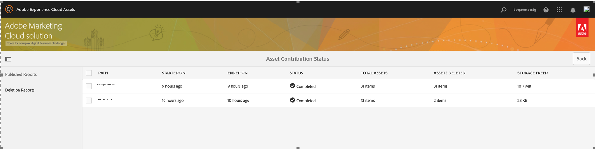
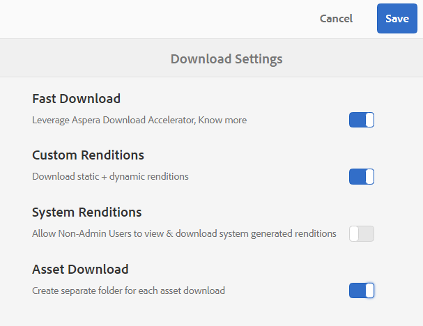
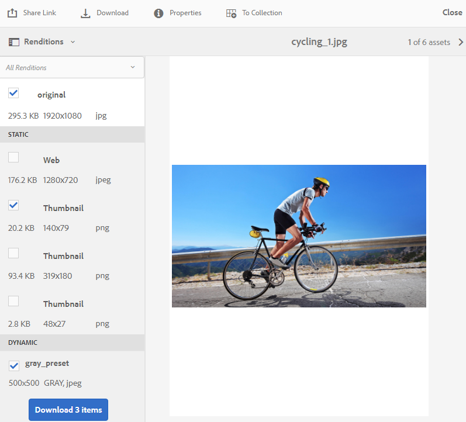
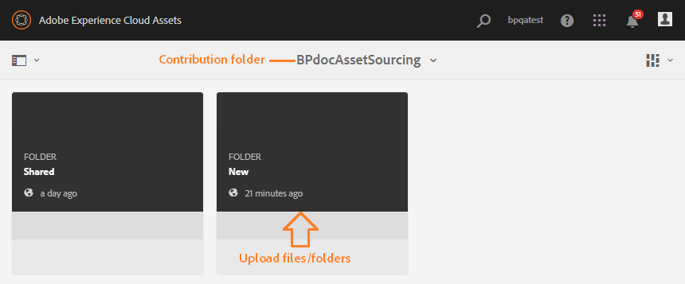
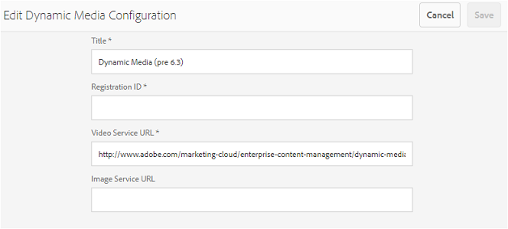
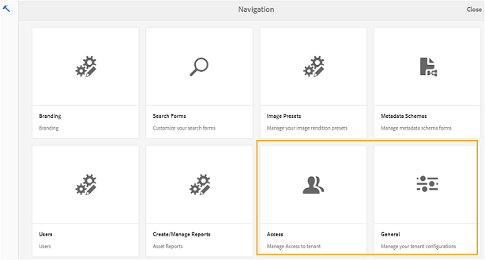
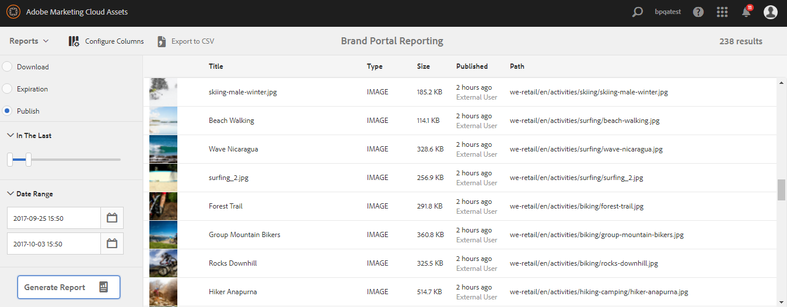

# Experience Manager Assets Brand Portal의 새로운 기능 {#what-s-new-in-aem-assets-brand-portal}

Adobe Experience Manager Assets Brand Portal을 사용하면 다양한 디바이스에서 승인된 크리에이티브 자산을 손쉽게 확보하고, 제어하고, 외부 당사자와 내부 비즈니스 사용자에게 안전하게 배포할 수 있습니다. 이렇게 하면 자산 공유의 효율성을 높이고, 자산의 시장 출시 기간을 앞당기고, 규정 비준수 및 무단 액세스의 위험을 줄이는 데 도움이 됩니다. Adobe는 전반적인 Brand Portal 경험을 개선하기 위해 노력하고 있습니다. 다음은 새로운 기능 및 개선 사항에 대한 미리보기입니다.

## 2024.10.0에서 변경된 내용 {#what-changed-in-October-2024}

Brand Portal 2024.10.0는 중요한 문제에 대한 수정 사항이 포함된 내부 릴리스입니다. 최신 [Brand Portal 릴리스 정보](brand-portal-release-notes.md)를 참조하십시오.

## 2024.02.0에서 변경된 내용 {#what-changed-in-February-2024}

Brand Portal 2024.02.0는 중요한 문제에 대한 수정 사항이 포함된 내부 릴리스입니다. 최신 [Brand Portal 릴리스 정보](brand-portal-release-notes.md)를 참조하십시오.

## 2023.10.0에서 변경된 내용 {#what-changed-in-October-2023}

Brand Portal 2023.10.0는 중요한 문제에 대한 수정 사항이 포함된 내부 릴리스입니다. 최신 [Brand Portal 릴리스 정보](brand-portal-release-notes.md)를 참조하십시오.

## 2023.08.0에서 변경된 내용 {#what-changed-in-August-2023}

Brand Portal 2023.08.0는 중요한 문제에 대한 수정 사항이 포함된 내부 릴리스입니다. 최신 [Brand Portal 릴리스 정보](brand-portal-release-notes.md)를 참조하십시오.

## 2023.05.0에서 변경된 내용 {#what-changed-in-May-2023}

Brand Portal 2023.05.0는 중요한 문제에 대한 수정 사항이 포함된 내부 릴리스입니다. 최신 [Brand Portal 릴리스 정보](brand-portal-release-notes.md)를 참조하십시오.

## 2023.02.0에서 변경된 내용 {#what-changed-in-February-2023}

Brand Portal 2023.02.0는 중요한 문제에 대한 수정 사항이 포함된 내부 릴리스입니다. 최신 [Brand Portal 릴리스 정보](brand-portal-release-notes.md)를 참조하십시오.

## 2022.10.0에서 변경된 내용 {#what-changed-in-October-2022}

Brand Portal 2022.10.0는 중요한 문제에 대한 수정 사항이 포함된 내부 릴리스입니다. 최신 [Brand Portal 릴리스 정보](brand-portal-release-notes.md)를 참조하십시오.

## 2022.08.0에서 변경된 내용 {#what-changed-in-August-2022}

Brand Portal 2022.08.0는 중요한 문제에 대한 수정 사항이 포함된 내부 릴리스입니다. 최신 [Brand Portal 릴리스 정보](brand-portal-release-notes.md)를 참조하십시오.

## 2022.05.0에서 변경된 내용 {#what-changed-in-May-2022}

Brand Portal은 이제 12시간마다 자동으로 작업을 실행하여 AEM에 게시된 모든 Brand Portal 자산을 삭제합니다. 따라서 폴더 크기를 임계값 제한 이하로 유지하기 위해 기여도 폴더에 자산을 수동으로 삭제할 필요가 없습니다. Brand Portal의 **[!UICONTROL 도구]** > **[!UICONTROL 자산 기여 상태]** > **[!UICONTROL 삭제 보고서]** 옵션을 사용하여 자동으로 실행되는 삭제 작업의 상태를 모니터링할 수도 있습니다. 작업 보고서는 다음과 같은 세부 정보를 제공합니다.

* 작업 시작 시간
* 작업 종료 시간
* 작업 상태
* 직업에 포함된 총 자산
* 작업에서 정상적으로 삭제된 총 자산
* 작업 실행의 결과로 확보된 총 스토리지

더욱 세부적으로 살펴보면 삭제 작업에 포함된 각 자산의 세부 정보를 확인할 수 있습니다. 보고서에는 자산 제목, 크기, 작성자, 삭제 상태 및 삭제 시간 등의 세부 정보가 포함됩니다.

또한 Brand Portal 2022.05.0에는 중요한 문제에 대한 수정 사항이 포함되어 있습니다. 최신 [Brand Portal 릴리스 정보](brand-portal-release-notes.md)를 참조하십시오.

## 2022.02.0에서 변경된 내용 {#what-changed-in-Feb-2022}

Brand Portal 2022.02.0는 중요한 문제에 대한 수정 사항이 포함된 내부 릴리스입니다. 최신 [Brand Portal 릴리스 정보](brand-portal-release-notes.md)를 참조하십시오.

## 2021.10.0에서 변경된 내용 {#what-changed-in-october-2021}

Brand Portal 2021.10.0는 중요한 문제에 대한 수정 사항이 포함된 내부 릴리스입니다. 최신 [Brand Portal 릴리스 정보](brand-portal-release-notes.md)를 참조하십시오.

## 2021.08.0에서 변경된 내용 {#what-changed-in-august-2021}

Brand Portal 2021.08.0은 자산에 대한 조직의 제어 권한을 강화하기 위해 기업 및 팀 고객의 비즈니스 프로필을 도입한 내부 릴리스입니다. 이제 사용자는 신규 조직과 마이그레이션된 조직에서 조직별 권한을 가지게 됩니다. 마이그레이션 중에 모든 기존 Adobe ID 계정은 Business ID로 마이그레이션됩니다.

* 마이그레이션 후 모든 신규 및 기존 조직에 Business ID가 부여됩니다.
* Business ID에는 도메인 신청이나 SSO 설정 등의 특별한 설정이 필요하지 않습니다.
* gmail.com이나 outlook.com과 같은 공개 이메일 도메인을 포함하여 모든 이메일 주소를 가진 사용자를 추가할 수 있습니다.

**Brand Portal 사용자에게 미치는 영향**

마이그레이션은 기존 데이터 세트, 자산, 사용자 또는 설정에 영향을 미치지 않습니다. 마이그레이션 중에 발생하는 유일한 내부 변경 사항은 기존 조직이 비즈니스 프로필에 대한 권한을 갖게 되는 것입니다.

>[!NOTE]
>
>비즈니스 프로필은 현재 2021년 8월 16일 이후에 생성된 신규 조직에 적용됩니다.
>
>조직이 마이그레이션될 때까지는 Adobe ID, Enterprise ID 또는 Federated ID 유형을 사용하여 조직에 계속 액세스할 수 있습니다.

### 참조 문서 {#reference-articles}

* [Adobe 프로필 소개](https://helpx.adobe.com/kr/enterprise/kb/introducing-adobe-profiles.html)

* [Adobe 프로필 관리](https://helpx.adobe.com/kr/enterprise/using/manage-adobe-profiles.html)

* [사용자 및 관리자의 로그인 경험 업데이트](https://helpx.adobe.com/kr/enterprise/using/storage-for-business.html#new-admin-sign-in-exp)

* [마이그레이션 중 로그인 제한 사항](https://helpx.adobe.com/kr/enterprise/kb/account-temporarily-unavailable.html)

* [Admin Console에서 사용자 관리](https://helpx.adobe.com/kr/enterprise/using/manage-users-individually.html)

* [기업 사용자의 제품 프로필 관리](https://helpx.adobe.com/kr/enterprise/using/manage-product-profiles.html#assign-users)

* [도메인 신뢰](https://helpx.adobe.com/kr/enterprise/admin-guide.html/enterprise/using/set-up-identity.html#directory-trusting)

<!--   
### Add new users to T2E organization   {#add-users-to-T2E-org}

On adding a new user in Admin Console for a new or migrated T2E organization, the user will have to perform an additional step **Join Team** to get entitled to the T2E organization. 

The user is entitled only if the user chooses to **Join Team**, otherwise the user won't get access to the selected T2E organization in Brand Portal. 

>[!NOTE]
>
>The workflow is not applicable to the existing Brand Portal users.

### Additional screen while navigating to Admin Console   {#navigate-to-admin-console}

The administrators will have to perform an additional step of selecting the T2E organization while navigating from Brand Portal to Admin Console. The workflow applies on the new and migrated T2E organizations.   

Selection of the T2E organization is a one-time activity and is not required everytime the administrator navigates from Brand Portal to Admin Console.

1. Log in to a T2E organization in Brand Portal as administrator.
1. Go to **[!UICONTROL Tools]** > **[!UICONTROL Users]** > **[!UICONTROL Management]** and click on the link **[!UICONTROL Launch Admin Console]**. 

   Or, go to **[!UICONTROL Unified Shell]** > **[!UICONTROL Administration]** and click on the link **[!UICONTROL Launch Admin Console]**. 
1. Search the T2E organization to login to Admin Console.

   

### Restriction during migration of an organization   {#login-restriction}

When an organization is undergoing T2E migration, the users of that organization will not be able to login to Brand Portal. The following error message appears on the screen. However, the migration won't impact the active user session until the token expires. 

Once the migration is complete, the users can login to Brand Portal. The users will receive an email notification containing the entitlement changes. If the users are entitled to more than one organization, they will have to select the organization at the time of login. 
-->

<!--
For a new or migrated T2E orgnization, the users will have an organization specific entitlement. A user can have multiple entitlements with the same email id for different T2E organizations. 
-->

## 2021.06.0에서 변경된 내용 {#what-changed-in-june-2021}

Brand Portal 2021.06.0는 중요한 문제에 대한 수정 사항이 포함된 내부 릴리스입니다. 최신 [Brand Portal 릴리스 정보](brand-portal-release-notes.md)를 참조하십시오.

## 2021.02.0에서 변경된 내용 {#what-changed-in-feb-2021}

Brand Portal 2021.02.0에서는 활성화 워크플로 및 자산 아웃소싱 기능을 통해 AEM Assets as a Cloud Service가 개선되었습니다. 여기에는 자산 다운로드 환경이 개선되고 중요한 수정 사항도 포함되어 있습니다. 또한 관리자는 테넌트 수준에서 자산의 폴더, 컬렉션 및 일괄 다운로드에 대한 기본 다운로드 동작을 구성할 수 있습니다. Brand Portal **[!UICONTROL 사용 보고서]**&#x200B;는 활성 Brand Portal 사용자를 반영하도록 수정되었습니다.

>[!IMPORTANT]
>
> * Brand Portal은 현재 유지 관리 중입니다.
> * Cloud Manager을 사용하여 Brand Portal을 활성화하기 위한 사용 사례 및 특정 요구 사항에 대한 자세한 내용은 Adobe 담당자에게 문의할 수 있습니다.
> * Brand Portal은 Assets Prime 또는 Assets Ultimate에서 사용할 수 없습니다. 그러나 이미 Assets에 액세스할 수 있는 기존 Brand Portal Cloud Services 고객은 Assets Ultimate으로 전환할 때 해당 계정을 유지할 수 있습니다.

<!--

### Activate Brand Portal on AEM Assets as a Cloud Service {#bp-automation-on-cloud-service}

AEM Assets as a Cloud Service is now entitled to have a pre-configured Brand Portal instance. The Cloud Manager user can activate Brand Portal on the AEM Assets as a Cloud Service instance.

Earlier, AEM Assets as a Cloud Service was manually configured with Brand Portal using Adobe Developer Console.

The Cloud Manager user triggers the activation workflow that creates the required configurations at the backend and activates Brand Portal on the same IMS org as of the AEM Assets as a Cloud Service instance. 

To activate Brand Portal on your AEM Assets as a Cloud Service instance:

1. Log in to Adobe Cloud Manager and navigate to **[!UICONTROL Environments]**.
1. Select the environments (one by one) from the list. Once you find the environment associated with Brand Portal, click on the **[!UICONTROL Activate Brand Portal]** button to begin the activation workflow. 
1. Once the Brand Portal tenant is activated, the status changes to Activated.

See [activate Brand Portal on AEM Assets as a Cloud Service](https://experienceleague.adobe.com/ko/docs/experience-manager-cloud-service/content/assets/brand-portal/configure-aem-assets-with-brand-portal).

### Asset Sourcing on AEM Assets as a Cloud Service {#asset-sourcing-on-cloud-service}

The Asset Sourcing feature is now available on AEM Assets as a Cloud Service. The feature is by default enabled for all the cloud service users. The permitted Brand Portal users can contribute to Asset Sourcing by uploading new assets to the contribution folders and publish the contribution folder from Brand Portal to AEM Assets as a Cloud Service instance. Administrators can review and approve contributions from Brand Portal users before distributing them to other users.     

Earlier, Asset Sourcing was only available on AEM Assets (on premise and managed service). 

See [Asset Sourcing in Brand Portal](https://experienceleague.adobe.com/ko/docs/experience-manager-brand-portal/using/asset-sourcing-in-brand-portal/brand-portal-asset-sourcing).
-->

### 자산 다운로드 {#asset-download-setting}

기존 **[!UICONTROL 다운로드 설정]** 외에도 Brand Portal 관리자는 이제 **[!UICONTROL 자산 다운로드]** 환경을 구성할 수 있습니다. 이 설정을 사용하면 관리자가 테넌트 수준에서 폴더, 컬렉션 및 자산(20개 이상의 자산) 일괄 다운로드에 대한 기본 다운로드 동작을 제어할 수 있습니다.

<!--
Earlier, all the asset renditions were directly downloaded in a zip folder in case of folder, collection, and bulk download of assets. As the **[!UICONTROL Download]** dialog box is skipped for folders or collections, there was no mechanism to control the downloading behaviour of the assets. Due to this, the users were finding it difficut to search for a particular asset rendition from a folder containing huge bunch of downloaded renditions. 
-->

이전에는 모든 자산 렌디션을 zip 폴더에 직접 다운로드해야 했습니다. 폴더 및 컬렉션에 대해서는 **[!UICONTROL 다운로드]** 대화 상자가 생략되었습니다. 또한 자산 다운로드 동작을 제어하는 방법이 없어 여러 다운로드 중에서 특정 렌디션을 검색하기 어려웠습니다.

이제 **[!UICONTROL 자산 다운로드]** 설정에서는 폴더, 컬렉션 다운로드 또는 자산 대량 다운로드 시 각 자산에 대해 별도의 폴더를 만들 수 있습니다.

**[!UICONTROL 자산 다운로드]** 설정이 비활성화되면 공유 링크를 사용하는 자산을 다운로드하는 경우를 제외하고 폴더 또는 컬렉션이 동일한 폴더에 있는 모든 자산 렌디션을 포함하는 zip 폴더로 다운로드됩니다.

관리자로 Brand Portal 테넌트에 로그인하고 **[!UICONTROL 도구]** > **[!UICONTROL 다운로드]**&#x200B;로 이동합니다. 관리자는 폴더, 컬렉션 다운로드 및 자산 일괄 다운로드 시 각 자산에 대해 별도의 폴더를 만들도록 **[!UICONTROL 자산 다운로드]** 설정을 활성화할 수 있습니다.

[Brand Portal에서 자산 다운로드](https://experienceleague.adobe.com/ko/docs/experience-manager-brand-portal/using/download/brand-portal-download-assets)를 참조하십시오.
<!--
### Download using Share link {#download-using-share-link}

The default behavior of downloading the assets using share link is now independent of the **[!UICONTROL Download Settings]**. A separate folder is created for each asset while downloading the assets using share link. 
-->

### 사용 보고서 {#usage-report}

Brand Portal **[!UICONTROL 사용 보고서]**&#x200B;가 활성 Brand Portal 사용자만 반영하도록 수정되었습니다. Admin Console에서 어떤 제품 프로필에도 할당되지 않은 Brand Portal 사용자는 비활성 사용자로 간주되며 **[!UICONTROL 사용 보고서]**&#x200B;에 반영되지 않습니다.

이전에는 사용 보고서에 활성 사용자와 비활성 사용자가 모두 표시되었습니다.

## 2020.10.0에서 변경된 내용 {#what-changed-in-oct-2020}

Brand Portal 2020.10.0은 자산 다운로드 경험을 간소화하는 데 중점을 둔 향상 릴리스로, 주요 수정 사항을 포함하고 있습니다. 이 개선 사항을 통해 자산 다운로드를 위한 새롭고 개선된 워크플로가 도입되었으며, **[!UICONTROL 렌디션]** 패널에서 렌디션 제외 및 직접 다운로드 옵션이 제공됩니다. 또한 특정 사용자 그룹의 액세스 및 다운로드 권한을 구성할 수 있으며, 모든 Brand Portal 페이지에서 파일, 컬렉션 및 공유 링크로 쉽게 이동할 수 있습니다. [Brand Portal 릴리스 정보](brand-portal-release-notes.md)를 참조하십시오.

### 간소화된 다운로드 경험 {#download-dialog}

이전에는 **[!UICONTROL 다운로드]** 대화 상자에서 각 자산별 별도 폴더 생성, 자산 이메일 보내기, 원본 자산 선택 등 여러 옵션이 제공되었습니다. 이러한 옵션은 특히 여러 자산이나 폴더를 다운로드할 때 기술 전문가가 아닌 사용자나 신규 사용자에게 혼란을 주었습니다. 또한 사용자는 모든 자산 렌디션을 확인할 수 없었고 특정 사용자 정의 렌디션 또는 동적 렌디션을 제외할 수도 없었습니다.

새로운 **[!UICONTROL 다운로드]** 대화 상자는 자산 선택 및 필터링 프로세스를 일반화하여 Brand Portal 사용자가 자산 렌디션을 다운로드하는 동안 효율적인 결정을 내리도록 도와줍니다. 여기에는 [**[!UICONTROL 다운로드]**](brand-portal-download-assets.md) 구성 및 **[!UICONTROL 다운로드]** 설정에 따라 선택한 모든 자산과 해당 렌디션이 나열됩니다.

>[!NOTE]
>
>이제 모든 사용자는 기본적으로 **[!UICONTROL 빠른 다운로드]** 기능을 사용할 수 있으며, Brand Portal에서 자산을 다운로드하기 전에 IBM® [Aspera Connect 3.9.9](https://www.ibm.com/support/fixcentral/swg/selectFixes?parent=ibm~Other%20software&amp;product=ibm/Other+software/IBM+Aspera+Connect&amp;release=3.9.9&amp;platform=All&amp;function=all)가 브라우저 확장 기능으로 설치되어 있어야 합니다.

<!--
If any of the **[!UICONTROL Custom Rendition]** or **[!UICONTROL System Rendition]** is enabled in the [**[!UICONTROL Download]**](brand-portal-download-assets.md) configuration and **[!UICONTROL Download]** settings are enabled for the group users, the new **[!UICONTROL Download]** dialog box appears with all the renditions of the selected assets or folders containing assets in a List View. 
-->

**[!UICONTROL 다운로드]** 대화 상자에서 사용자는 다음을 수행할 수 있습니다.

* 다운로드 목록에 있는 모든 자산의 사용 가능한 렌디션을 볼 수 있습니다.
* 다운로드에 필요하지 않은 자산의 렌디션을 제외할 수 있습니다.
* 한 번의 클릭으로 모든 유사한 자산 유형에 동일한 렌디션 세트를 적용할 수 있습니다.
* 다양한 자산 유형에 대해 다른 렌디션 세트를 적용할 수 있습니다.
* 각 자산에 대해 별도의 폴더를 만들 수 있습니다.
* 선택한 자산과 해당 렌디션을 다운로드할 수 있습니다.

다운로드 워크플로는 독립 실행형 자산, 여러 자산, 자산이 포함된 폴더, 라이선스가 부여되었거나 부여되지 않은 자산, 공유 링크를 통해 자산을 다운로드하는 경우에 모두 일관되게 적용됩니다. [Brand Portal에서 자산을 다운로드하는 단계](https://experienceleague.adobe.com/ko/docs/experience-manager-brand-portal/using/download/brand-portal-download-assets)를 참조하십시오.

### 빠른 탐색 {#quick-navigation}

이전에는 **[!UICONTROL 파일]**, **[!UICONTROL 컬렉션]** 및 **[!UICONTROL 공유 링크]** 보기 옵션이 숨겨져 있어 사용자가 다른 보기 모드로 전환할 때마다 여러 번 클릭해야 했습니다.

Brand Portal 2020.10.0에서는 사용자가 빠른 탐색 링크를 사용하여 Brand Portal 페이지에서 한 번의 클릭으로 **[!UICONTROL 파일]**, **[!UICONTROL 컬렉션]** 및 **[!UICONTROL 공유 링크]**&#x200B;로 이동할 수 있습니다.

### 향상된 렌디션 패널 {#rendition-panel}

이전에는 사용자가 **[!UICONTROL 사용자 정의 렌디션]** 또는 **[!UICONTROL 시스템 렌디션]** 중 하나가 **[!UICONTROL 다운로드]** 구성에서 활성화된 경우에만 **[!UICONTROL 렌디션]** 패널에서 원본 자산과 해당 렌디션을 볼 수 있었습니다. 또한 사용자는 필요하지 않은 특정 사용자 정의 렌디션 또는 동적 렌디션을 제외할 필터가 없어서 모든 자산 렌디션을 다운로드해야 했습니다.

<!--
Earlier, if any of the custom or system renditions was enabled in the **[!UICONTROL Download]** settings, an additional **[!UICONTROL Download]** dialog box appeared on clicking the **[!UICONTROL Download]** button wherein the user had to manually select the set of renditions (original asset, custom renditions, dynamic renditions) to download.
There was no filter to exclude specific custom or dynamic renditions which were not required for download.
-->

Brand Portal 2020.10.0에서는 사용자가 **[!UICONTROL 다운로드]** 대화 상자를 열 필요 없이 특정 렌디션을 제외하고 자산 세부 정보 페이지에서 [렌디션 패널에서 선택한 렌디션을 다운로드](brand-portal-download-assets.md#download-assets-from-asset-details-page)할 수 있습니다.

<!-- 
In Brand Portal 2020.10.0, direct download and exclude renditions features are introduced in the **[!UICONTROL Renditions]** panel on the asset details page. All the renditions (original asset, custom renditions, dynamic renditions) under the rendition panel are now associated with a check box and are enabled by default. 

The user can clear the check boxes to exclude the renditions which are not required for download. And can click on the **[!UICONTROL Download]** button in the **[!UICONTROL Renditions]** panel to directly download the selected set of renditions in a zip folder without having to open the **[!UICONTROL Download]** dialog box.
-->

### 다운로드 설정 구성 {#download-permissions}

이제 Brand Portal 관리자는 기존 **[!UICONTROL 다운로드]** 구성 외에도 자산 세부 정보 페이지에서 사용자 그룹이 원본 자산 및 렌디션, 또는 둘 다를 보거나 다운로드할 수 있도록 설정을 구성할 수 있습니다.

관리자로 Brand Portal 테넌트에 로그인하고 **[!UICONTROL 도구]** > **[!UICONTROL 사용자]**&#x200B;로 이동합니다.

**[!UICONTROL 사용자 역할]** 페이지에서 **[!UICONTROL 그룹]** 탭으로 이동하여 사용자 그룹에 대한 보기 및(또는) 다운로드 설정을 구성합니다.

이전에는 그룹 사용자가 원본 자산을 다운로드하지 못하도록 제한하는 설정만 사용할 수 있었습니다.

**[!UICONTROL 사용자 역할]** 페이지의 **[!UICONTROL 그룹]** 탭을 사용하면 관리자가 보기 및 다운로드 설정을 구성할 수 있습니다.

* **[!UICONTROL 원본 다운로드]**&#x200B;와 **[!UICONTROL 렌디션 다운로드]** 설정이 모두 켜져 있는 경우, 선택한 그룹의 사용자는 원본 자산과 해당 렌디션을 보고 다운로드할 수 있습니다.
* 두 설정을 모두 끄면 사용자는 원본 자산만 볼 수 있습니다. 자산 세부 정보 페이지에서 렌디션은 표시되지 않습니다.
* **[!UICONTROL 원본 다운로드]** 설정만 켜져 있는 경우, 사용자는 자산 세부 정보 페이지에서 원본 자산만 보고 다운로드할 수 있습니다.
* **[!UICONTROL 렌디션 다운로드]** 설정만 켜져 있는 경우, 사용자는 원본 자산을 볼 수 있지만 다운로드할 수는 없습니다. 대신 자산 렌디션은 보고 다운로드할 수 있습니다.

[자산 다운로드 구성](https://experienceleague.adobe.com/ko/docs/experience-manager-brand-portal/using/download/brand-portal-download-assets#configure-download-permissions)을 참조하십시오.

>[!NOTE]
>
>사용자가 여러 그룹에 추가되고 해당 그룹 중 하나에 제한이 있는 경우, 해당 제한은 사용자에게 적용됩니다.

<!--
>Restrictions to access the original asset and their renditions do not apply to administrators even if they are members of restricted groups.
 >
 >The users can always download assets and their renditions from the repository using a `curl` request even if the download configurations are turned-off.
 >
-->

## 6.4.7에서 변경된 내용 {#what-changed-in-647}

Brand Portal 6.4.7 릴리스에는 문서 뷰어가 추가되고, 자산 다운로드 경험이 향상되었으며, 중요한 수정 사항이 포함되었습니다. 최신 [Brand Portal 릴리스 정보](brand-portal-release-notes.md)를 참조하십시오.

<!--
Brand Portal 6.4.7 release brings in the Document Viewer, leverages the Brand Portal administrators to configure asset download, and centers top customer requests. See latest [Brand Portal Release Notes](brand-portal-release-notes.md).
-->

### 문서 뷰어 {#doc-viewer}

문서 뷰어는 향상된 PDF 보기 환경을 제공합니다. Brand Portal에서 PDF 파일을 볼 때 Adobe Document Cloud와 유사한 경험을 제공합니다.

이전에는 PDF 파일을 볼 수 있는 옵션이 제한적이었습니다.

Brand Portal 사용자는 문서 뷰어를 사용하여 페이지와 책갈피를 보고, 텍스트를 검색하고, 확대/축소하고, 페이지를 탐색할 수 있습니다. 특정 페이지로 전환하거나, 창 또는 화면에 맞추거나, 도구 모음 가시성을 토글할 수 있습니다.

>[!NOTE]
>
>다른 문서 형식의 보기 환경은 변경되지 않습니다.

### 다운로드 경험 {#download-configurations}

[Brand Portal에서 자산을 다운로드](brand-portal-download-assets.md)할 때 사용자 경험을 간소화하도록 자산 다운로드 프로세스가 개선되었습니다.

Brand Portal에서 자산을 다운로드할 때 기존 워크플로에서는 여러 다운로드 옵션을 선택할 있는 **[!UICONTROL 다운로드]** 대화 상자가 반드시 나타납니다.

Brand Portal 6.4.7에서는 Brand Portal 관리자가 자산 **[!UICONTROL 다운로드]** 설정을 구성할 수 있습니다. 사용 가능한 구성은 다음과 같습니다.

* **[!UICONTROL 빠른 다운로드]**
* **[!UICONTROL 사용자 정의 렌디션]**
* **[!UICONTROL 시스템 렌디션]**

Brand Portal 관리자는 모든 조합을 활성화하여 자산 다운로드를 구성할 수 있습니다.

<!--In Brand Portal 6.4.7, fast download, custom renditions, and system renditions are the three configurations available.-->

* **[!UICONTROL 사용자 정의 렌디션]** 및 **[!UICONTROL 시스템 렌디션]** 구성이 모두 꺼진 경우, 자산의 원본 렌디션이 추가 대화 상자 없이 다운로드되므로 Brand Portal 사용자의 다운로드 경험이 간소화됩니다.

* **[!UICONTROL 사용자 정의 렌디션]** 또는 **[!UICONTROL 시스템 렌디션]** 중 하나라도 활성화되어 있는 경우에는 **[!UICONTROL 다운로드]** 대화 상자가 나타나고 원본 자산이 자산 렌디션과 함께 다운로드됩니다. **[!UICONTROL 빠른 다운로드]** 구성을 활성화하면 다운로드 프로세스가 빨라집니다.

구성에 따라 다운로드 워크플로는 독립 실행형 자산, 여러 자산 및 자산이 포함된 폴더에 대해서도 일관되게 유지됩니다. 여기에는 라이선스가 부여되었거나 부여되지 않은 자산과 공유 링크를 사용하여 자산을 다운로드하는 경우도 포함됩니다.

## 6.4.6에서 변경된 내용 {#what-changed-in-646}

Brand Portal 6.4.6에서는 AEM Assets 및 Brand Portal 간 인증 채널이 변경되었습니다. 이제 Brand Portal은 AEM Assets as a Cloud Service, AEM Assets 6.3 이상에서 지원됩니다. AEM Assets 6.3 이상 버전에서 Brand Portal은 처음에 기존 OAuth 게이트웨이를 사용하여 클래식 UI로 구성되었습니다. 이 게이트웨이는 JWT 토큰 교환을 통해 인증을 위해 IMS 액세스 토큰을 받습니다. 이제 AEM Assets는 Adobe Developer Console을 통해 Brand Portal로 구성되며, Brand Portal은 Brand Portal 테넌트의 인증을 위해 IMS 토큰을 받습니다.

<!-- The steps to configure integration are different depending on your AEM version, and whether you are configuring for the first-time, or upgrading the existing integration:
-->

<!--
  
   | **AEM Version** |**New Integration** |**Upgrade Integration** |
|---|---|---|
| **AEM 6.5** |[Create new integration](../using/brand-portal-configure-integration-65.md) |[Upgrade existing integration](../using/brand-portal-configure-integration-65.md#upgrade-integration-65) | 
| **AEM 6.4** |[Create new integration](../using/brand-portal-configure-integration-64.md) |[Upgrade existing integration](../using/brand-portal-configure-integration-64.md#upgrade-integration-64) | 
| **AEM 6.3** |[Create new integration](../using/brand-portal-configure-integration-63.md) |[Upgrade existing integration](../using/brand-portal-configure-integration-63.md#upgrade-integration-63) | 
| **AEM 6.2** | | 

   -->

Brand Portal에서 AEM Assets를 구성하는 단계는 AEM 버전과 처음 구성하는 것인지 아니면 기존 구성을 업그레이드하는 것인지에 따라 다릅니다.

<!--| **AEM Version** |**New Configuration** |**Upgrade Configuration** |
|---|---|---|
| **AEM 6.5 (6.5.4.0 and above)** |[Create configuration](../using/brand-portal-configure-integration-65.md) |[Upgrade configuration](../using/brand-portal-configure-integration-65.md#upgrade-integration-65) | 
| **AEM 6.4 (6.4.8.0 and above)** |[Create configuration](../using/brand-portal-configure-integration-64.md) |[Upgrade configuration](../using/brand-portal-configure-integration-64.md#upgrade-integration-64) | 
| **AEM 6.3 (6.3.3.8 and above)** |[Create configuration](../using/brand-portal-configure-integration-63.md) |[Upgrade configuration](../using/brand-portal-configure-integration-63.md#upgrade-integration-63) | 

-->

<!-- AEM Assets configuration with Brand Portal on Adobe I/O is supported on:
* AEM 6.5.4.0 and above
* AEM 6.4.8.0 and above
* AEM 6.3.3.8 and above -->

| **AEM 버전** | **새 구성** | **구성 업그레이드** |
|---|---|---|
| **AEM Assets as a Cloud Service** | [구성 만들기](https://experienceleague.adobe.com/ko/docs/experience-manager-cloud-service/content/assets/brand-portal/configure-aem-assets-with-brand-portal) | - |
| **AEM 6.5(6.5.4.0 이상)** | [구성 만들기](https://experienceleague.adobe.com/ko/docs/experience-manager-65/content/assets/brandportal/configure-aem-assets-with-brand-portal) | [구성 업그레이드](https://experienceleague.adobe.com/ko/docs/experience-manager-65/content/assets/brandportal/configure-aem-assets-with-brand-portal#upgrade-integration-65) |

>[!NOTE]
>
>AEM 인스턴스를 업데이트하여 최신 서비스 팩을 사용하는 것이 좋습니다.

[Brand Portal 릴리스 정보](brand-portal-release-notes.md)를 참조하십시오.

[Brand Portal FAQ](brand-portal-faqs.md)를 참조하십시오.

## 6.4.5에서 변경된 내용 {#what-changed-in-645}

Brand Portal 6.4.5를 사용하면 외부 기관과 팀이 작성자 환경에 액세스하지 않고도 Brand Portal에 콘텐츠를 업로드하고 AEM Assets에 게시할 수 있습니다. 이 기능은 **[Brand Portal의 자산 소싱](brand-portal-asset-sourcing.md)**&#x200B;이라고 하며, 사용자가 전역적으로 분산된 다른 Brand Portal 사용자들과 자산을 기여하고 공유할 수 있는 양방향 메커니즘을 제공함으로써 고객 경험을 향상시킵니다.

### Brand Portal의 자산 소싱 {#asset-sourcing-in-bp}

자산 소싱을 사용하면 AEM 사용자(관리자/관리자가 아닌 사용자)가 추가 **자산 기여** 속성이 추가된 폴더를 만들고, Brand Portal 사용자들이 자산을 제출할 수 있도록 폴더를 열어 놓을 수 있습니다. 이렇게 하면 새로 생성된 **기여** 폴더 내에 “신규”와 “공유됨”이라는 두 개의 추가 하위 폴더를 만드는 워크플로가 자동으로 트리거됩니다.

AEM 사용자는 **공유됨** 폴더에 간략한 기준 자산을 업로드합니다. 이들은 기여 폴더에 필요한 자산의 유형을 정의하여 Brand Portal 사용자가 필요한 참조 정보를 갖출 수 있도록 합니다. 그런 다음 관리자는 새로 생성된 **기여** 폴더를 Brand Portal에 게시하기 전에 기여 폴더에 활성 Brand Portal 사용자 액세스 권한을 부여할 수 있습니다.

사용자가 콘텐츠 추가를 완료하면 **신규** 폴더를 통해 기여 폴더를 AEM 작성자 환경으로 다시 게시할 수 있습니다. 새로 게시된 콘텐츠를 AEM Assets에 가져오고 반영하는 데에는 몇 분 정도 걸릴 수 있습니다.

또한 모든 기존 기능은 변경되지 않습니다. Brand Portal 사용자는 기여 폴더 및 다른 허용되는 폴더에서 자산을 보고, 검색하고, 다운로드할 수 있습니다. 관리자는 추가적으로 기여 폴더를 공유하고, 속성을 수정하고, 컬렉션에 자산을 추가할 수 있습니다.

>[!NOTE]
>
>Brand Portal의 자산 소싱은 AEM 6.5.2.0 이상에서 지원됩니다.
>
>이 기능은 이전 버전인 AEM 6.3 및 AEM 6.4에서는 지원되지 않습니다.

### 기여 폴더에 자산 업로드 {#upload-assets-in-bp}

적절한 권한을 보유한 Brand Portal 사용자는 개별 자산 또는 여러 자산이 포함된 폴더(.zip 파일)를 기여 폴더에 업로드할 수 있습니다. 사용자는 여러 자산을 자산 기여 폴더에 업로드할 수 있습니다. 단, 한 번에 하나의 폴더만 만들 수 있습니다.

Brand Portal 사용자는 **신규** 하위 폴더에만 자산을 업로드할 수 있습니다. **공유됨** 폴더는 요구 사항과 기준 자산을 배포하는 데 사용됩니다.

### AEM Assets에 기여 폴더 게시 {#publish-assets-to-aem}

**신규** 폴더에 업로드가 완료되면 Brand Portal 사용자는 기여 폴더를 AEM에 다시 게시할 수 있습니다. AEM Assets에 게시된 콘텐츠/자산을 가져와서 반영하는 데에는 몇 분 정도 걸릴 수 있습니다. [AEM Assets에 기여 폴더 게시](brand-portal-publish-contribution-folder-to-aem-assets.md)를 참조하십시오.

## 6.4.4에서 변경된 내용 {#what-changed-in-644}

Brand Portal 6.4.4 릴리스는 텍스트 검색 향상 및 상위 고객 요청 사항에 중점을 둡니다. 최신 [Brand Portal 릴리스 정보](brand-portal-release-notes.md)를 참조하십시오.

### 검색 개선 사항

Brand Portal 6.4.4 이상에서는 필터링 창에서 속성 설명의 부분 텍스트 검색을 지원합니다. 부분 텍스트 검색을 허용하려면 검색 양식의 속성 설명에서 **부분 검색**&#x200B;을 활성화합니다.

부분 텍스트 검색과 와일드카드 검색에 대해 자세히 알아보십시오.

#### 부분 구문 검색 {#partial-phrase-search}

이제 필터링 창에서 검색한 문구의 일부, 즉 단어 하나 또는 두 개만 지정하여 자산을 검색할 수 있습니다.

**사용 사례**
부분 구문 검색은 검색 구문에서 정확한 단어 조합이 확실하지 않을 때 유용합니다.

예를 들어 Brand Portal의 검색 양식에서 자산 제목에 대한 부분 검색을 위해 속성 설명을 사용하는 경우 **camp**&#x200B;라는 단어를 지정하면 제목 구문에 camp라는 단어가 포함된 모든 자산이 반환됩니다.

#### 와일드카드 검색 {#wildcard-search}

Brand Portal에서는 검색 쿼리에 단어의 일부에 별표(&#42;)를 사용할 수 있습니다.

검색 구문에 포함된 정확한 단어를 잘 모르는 경우, 와일드카드 검색을 사용하여 검색 쿼리의 빈 부분을 채울 수 있습니다.

예를 들어 Brand Portal의 검색 양식에서 자산 제목에 대한 부분 검색을 위해 속성 설명을 사용하는 경우, **climb&#42;**&#x200B;을 지정하면 제목 구문에 **climb**&#x200B;이라는 문자로 시작하는 단어가 포함된 모든 자산이 반환됩니다.

마찬가지로,

* **&#42;climb**&#x200B;을 지정하면 제목 구문에 **climb**&#x200B;이라는 문자로 끝나는 단어가 포함된 모든 자산이 반환됩니다.

* **&#42;climb&#42;**&#x200B;을 지정하면 제목 구문에 **climb**&#x200B;이라는 문자를 포함하는 단어가 있는 모든 자산이 반환됩니다.

>[!NOTE]
>
>**부분 검색** 확인란을 선택하면 기본적으로 **대소문자 무시**&#x200B;가 선택됩니다.

## 6.4.3에서 변경된 내용 {#what-changed-in}

Brand Portal 6.4.3에서는 액세스 URL에 대한 대체 별칭, 새로운 폴더 계층 구조 및 비디오 지원 개선 사항이 도입되었습니다. 또한 AEM 작성자에서 Brand Portal로의 예약된 게시 기능, 운영 개선 사항 및 고객 요청 처리 기능도 도입되었습니다.

### 관리자가 아닌 사용자를 위한 폴더 계층 탐색

이제 관리자는 로그인 시 관리자가 아닌 사용자(편집자, 뷰어 및 게스트 사용자)에게 폴더가 표시되는 방식을 구성할 수 있습니다. 관리 도구 패널의 **일반 설정**&#x200B;에 [폴더 계층 구조 활성화 구성](../using/brand-portal-general-configuration.md)이 추가되었습니다. 구성 상태에 대한 설명은 다음과 같습니다.

* 구성이 **활성화된 경우**, 루트 폴더부터 시작하는 폴더 트리가 관리자가 아닌 사용자에게도 표시됩니다. 따라서 관리자와 유사한 탐색 환경이 제공됩니다.
* 구성이 **비활성화**&#x200B;된 경우, 공유 폴더만 랜딩 페이지에 표시됩니다.

[폴더 계층 구조 활성화](../using/brand-portal-general-configuration.md) 기능은 서로 다른 계층 구조에서 공유되는 동일한 이름의 폴더를 구별하는 데 도움이 됩니다. 이제 관리자가 아닌 사용자도 로그인하면 공유 폴더의 가상 상위 폴더를 볼 수 있습니다.

공유 폴더는 가상 폴더의 해당 디렉터리 내에 구성됩니다. 이들 가상 폴더는 잠금 아이콘으로 식별할 수 있습니다.

가상 폴더의 기본 썸네일은 첫 번째 공유 폴더의 썸네일 이미지입니다.

### 특정 폴더 계층 또는 경로에서 검색

**경로 브라우저** 설명이 검색 양식에 도입되어 특정 디렉터리 내 자산 검색이 가능해졌습니다. 경로 브라우저의 검색 설명의 기본 검색 경로는 `/content/dam/mac/<tenant-id>/`이며, 기본 검색 양식을 편집하여 구성할 수 있습니다.

* 관리자는 경로 브라우저를 사용하여 Brand Portal의 모든 폴더 디렉터리로 이동할 수 있습니다.
* 관리자가 아닌 사용자는 경로 브라우저를 사용하여 자신과 공유된 폴더로만 이동할 수 있으며, 상위 폴더로 돌아갈 수도 있습니다.

  관리자가 아닌 사용자와 공유되는 `/content/dam/mac/<tenant-id>/folderA/folderB/folderC`라는 폴더로 예를 들어보겠습니다. 사용자는 경로 브라우저를 사용하여 폴더C 내에서 자산을 검색할 수 있습니다. 이 사용자는 자신과 공유된 폴더C의 상위 폴더인 폴더B와 폴더A로도 이동할 수 있습니다.

이제 루트 폴더에서 검색을 시작하는 대신, 찾아본 특정 폴더 내로 자산 검색을 제한할 수 있습니다.

이들 폴더에서 검색할 경우, 사용자에게 공유된 자산에서만 결과만 반환됩니다.

### Dynamic Media 비디오 렌디션 지원

AEM 작성자 인스턴스가 Dynamic Media 하이브리드 모드에 있는 사용자는 원본 비디오 파일 외에도 Dynamic Media 렌디션을 미리 보고 다운로드할 수 있습니다.

특정 테넌트 계정에서 Dynamic Media 렌디션의 미리 보기 및 다운로드를 활성화하려면 관리자가 **Dynamic Media 구성**&#x200B;을 지정해야 합니다. 이 단계에는 관리 도구 패널의 **비디오** 구성의 비디오 서비스 URL 및 등록 ID가 포함됩니다.

Dynamic Media 비디오를 미리 볼 수 있는 위치는 다음과 같습니다.

* 자산 세부 정보 페이지
* 자산 카드 보기
* 링크 공유 미리보기 페이지

Dynamic Media 비디오 인코딩을 다운로드할 수 있는 위치는 다음과 같습니다.

* Brand Portal
* 공유 링크

### Brand Portal에 예약된 게시

AEM 6.4.2.0 작성자 인스턴스에서 Brand Portal로의 자산(및 폴더) 게시 워크플로는 나중의 날짜 및 시간으로 예약할 수 있습니다.

마찬가지로, “Brand Portal에서 게시 취소” 워크플로를 예약하여 나중에 포털에서 게시된 자산을 제거할 수 있습니다.

### URL에서 구성 가능한 테넌트 별칭

조직에서는 URL에 대체 접두사를 추가하여 포털 URL을 사용자 지정할 수 있습니다. 기존 포털 URL에서 테넌트 이름에 대한 별칭을 사용하려면 조직은 고객 지원 센터에 문의해야 합니다.

Brand Portal URL의 접두사만 사용자 지정이 가능하며, 전체 URL은 변경할 수 없습니다.\
예를 들어 기존 도메인이 **geomettrix.brand-portal.adobe.com**&#x200B;인 조직은 요청을 통해 **geomettrixinc.brand-portal.adobe.com**&#x200B;과 같은 도메인을 만들 수 있습니다.

단, AEM 작성자 인스턴스는 테넌트 별칭(대체) URL이 아닌 테넌트 ID URL로만 [구성](https://experienceleague.adobe.com/ko/docs/experience-manager-65/content/assets/brandportal/configure-aem-assets-with-brand-portal)할 수 있습니다.

조직은 Adobe에서 제공한 URL을 그대로 사용하는 대신 포털 URL을 사용자 지정하여 브랜딩 요구를 충족할 수 있습니다.

### 다운로드 경험 개선 사항

이번 릴리스에서는 다음 상황에서 클릭 수와 경고 수를 줄여 간소화된 다운로드 경험을 제공합니다.

* 원본 자산이 아닌 렌디션만 다운로드하는 경우
* 원본 렌디션에 대한 액세스가 제한된 상태에서 자산을 다운로드하는 경우

## 6.4.2에서 변경된 내용 {#what-changed-in-1}

Brand Portal 6.4.2는 조직의 자산 배포 요구를 충족하기 위한 기능을 도입하여, 게스트 액세스를 통한 글로벌 도달 범위 확대와 더 빠른 다운로드를 가능하게 합니다. 여기에는 새로운 관리자 구성을 통한 향상된 제어 기능, 추가 보고서 및 고객 요청 처리 기능이 포함됩니다.

### 게스트 액세스

AEM Brand Portal을 사용하면 게스트가 포털에 액세스할 수 있습니다. 게스트 사용자는 자격 증명 없이 포털에 접속할 수 있으며, 모든 공개 폴더 및 컬렉션에 액세스하여 다운로드할 수 있습니다. 게스트 사용자는 라이트박스(비공개 컬렉션)에 자산을 추가하고 해당 자산을 다운로드할 수 있습니다. 또한 관리자가 설정한 스마트 태그 검색과 검색 조건을 볼 수도 있습니다. 게스트 세션에서는 사용자가 컬렉션과 저장된 검색을 만들거나 이를 추가로 공유할 수 없으며, 폴더 및 컬렉션 설정에 액세스하거나 자산을 링크로 공유할 수 없습니다.

조직 내에서는 여러 개의 동시 게스트 세션이 허용되며, 이는 조직당 전체 사용자 할당량의 10%로 제한됩니다.

게스트 세션은 2시간 동안 활성화됩니다. 따라서 라이트박스의 상태도 세션 시작 시간으로부터 2시간까지 유지됩니다. 게스트 세션은 2시간 후에 재시작되며, 이로 인해 라이트박스 상태가 초기화됩니다.

### 가속화된 다운로드

Brand Portal 사용자는 IBM® Aspera Connect 기반의 빠른 다운로드를 적용하여 최대 25배 빠른 속도를 경험할 수 있으며, 전 세계 어디서든 원활한 다운로드 환경을 즐길 수 있습니다. Brand Portal이나 공유 링크에서 자산을 더 빠르게 다운로드하려면 사용자가 다운로드 대화 상자에서 **다운로드 가속화 활성화** 옵션을 선택해야 하는데, 단 조직에서 다운로드 가속화 기능이 활성화되어 있어야 합니다.

조직에서 IBM® Aspera 기반 가속화된 다운로드를 활성화하려면 관리자가 관리 도구 패널의 [일반 설정](brand-portal-general-configuration.md#allow-download-acceleration)에서 **다운로드 가속화 활성화** 옵션(기본적으로 비활성화되어 있음)을 선택해야 합니다.

Brand Portal 및 공유 링크에서 자산 파일을 더욱 빠르게 다운로드하기 위한 사전 요구 사항 및 문제 해결 단계는 [Brand Portal에서 다운로드를 가속화하기 위한 안내서](../using/accelerated-download.md#main-pars-header)를 참조하십시오.

### 사용자 로그인 보고서

사용자 로그인을 추적하기 위한 새로운 보고서가 도입되었습니다. **사용자 로그인** 보고서는 조직이 Brand Portal의 위임된 관리자 및 기타 사용자를 감사하고 관리하는 데 중요한 역할을 합니다.

보고서는 Brand Portal 6.4.2 배포부터 보고서 생성 시점까지 각 사용자의 표시 이름, 이메일 ID, 페르소나(관리자, 뷰어, 편집자, 게스트), 그룹, 마지막 로그인, 활동 상태 및 로그인 횟수를 기록합니다. 관리자는 보고서를 .csv 형식으로 내보낼 수 있습니다. 다른 보고서들과 함께 사용자 로그인 보고서는 조직이 승인된 브랜드 리소스에 대한 사용자 상호 작용을 면밀히 모니터링하여 기업의 규정 준수 기준을 충족하도록 지원합니다.

### 원본 렌디션에 대한 액세스

관리자는 원본 이미지 파일에 대한 액세스를 제한하고 Brand Portal이나 공유 링크에서 다운로드할 수 있도록 저해상도 렌디션에 대한 액세스를 제공할 수 있습니다. 이 액세스 권한은 사용자 역할 페이지의 그룹 탭에서 사용자 그룹 수준에서 제어할 수 있습니다.

* 기본적으로 원본에 대한 액세스는 모든 사용자에게 활성화되어 있으므로, 모든 사용자가 원본 렌디션을 다운로드할 수 있습니다.
* 관리자는 특정 사용자 그룹이 원본 렌디션에 액세스하는 것을 방지하려면 해당 확인란을 선택 해제해야 합니다.
* 사용자가 여러 그룹의 멤버라도 그중 한 그룹에 제한이 설정되어 있는 경우에는 해당 제한이 사용자에게 적용됩니다.
* 관리자는 제한 그룹의 멤버일지라도 이러한 제한이 적용되지 않습니다.
* 자산을 링크로 공유하는 사용자의 권한은 공유 링크를 사용하여 자산을 다운로드하는 사용자에게 적용됩니다.

### 카드 및 목록 보기의 폴더 계층 경로

카드 보기의 폴더 카드에는 이제 관리자가 아닌 사용자(편집자, 뷰어 및 게스트 사용자)에게 폴더 계층 정보가 표시됩니다. 이 기능을 사용하면 사용자는 상위 계층 구조를 기준으로 액세스하는 폴더의 위치를 파악할 수 있습니다.

폴더 계층 정보는 특히 폴더를 구분하는 데 유용합니다. 즉, 서로 다른 폴더 계층에서 공유된 유사한 이름의 폴더들을 식별할 수 있게 해줍니다. 관리자가 아닌 사용자가 자신과 공유된 자산의 폴더 구조를 모르는 경우, 유사한 이름을 가진 자산/폴더는 혼란을 줄 수 있습니다.

* 각 카드에 표시되는 경로는 카드 크기에 맞게 잘려서 표시됩니다. 그러나 사용자는 잘린 경로 위에 마우스를 가져다 대어 도구 설명으로 전체 경로를 확인할 수 있습니다.

목록 보기는 Brand Portal의 모든 사용자에게 자산의 폴더 경로를 열로 표시합니다.

### 자산 속성을 확인할 수 있는 개요 옵션

Brand Portal은 관리자가 아닌 사용자(편집자, 뷰어, 게스트 사용자)에게 선택한 자산/폴더의 자산 속성을 볼 수 있는 개요 옵션을 제공합니다. 개요 옵션은 다음 위치에서 확인할 수 있습니다.

1. 자산/폴더 선택 시 상단 도구 모음에 표시됩니다.
2. 레일 선택기 선택 시 드롭다운에 표시됩니다.

자산 또는 폴더를 선택한 상태에서 개요 옵션을 선택하면 사용자는 해당 자산의 제목, 경로 및 생성 시각을 확인할 수 있습니다. 자산 세부 정보 페이지에서 개요 옵션을 선택하면 사용자는 자산의 메타데이터를 볼 수 있습니다.

## 새 구성

관리자가 특정 테넌트에 대해 다음 기능을 활성화하거나 비활성화할 수 있도록 6가지 새로운 구성이 추가되었습니다.

* 게스트 액세스 허용
* 사용자가 Brand Portal에 대한 액세스 권한을 요청하도록 허용
* 관리자가 Brand Portal에서 자산을 삭제할 수 있도록 허용
* 공개 컬렉션 생성 허용
* 공개 스마트 컬렉션 생성 허용
* 다운로드 가속화 허용

위 구성은 관리 도구 패널의 액세스 및 일반 설정에서 사용할 수 있습니다.

### OAuth 통합을 구성하기 위한 `Adobe I/O` UI

Brand Portal 6.4.2 이상에서는 Legacy OAuth(`https://legacy-oauth.cloud.adobe.io/`) 인터페이스를 사용하여 JWT 애플리케이션을 생성하며, 이를 통해 AEM Assets와 Brand Portal 간의 OAuth 통합 구성이 가능합니다. 이전에는 OAuth 통합 구성 UI가 `https://marketing.adobe.com/developer/`에 호스팅되었습니다. 자산과 컬렉션을 Brand Portal에 게시하기 위한 AEM Assets 및 Brand Portal 통합에 대한 자세한 내용은 [Brand Portal 및 AEM Assets 통합 구성을 참조하십시오](https://experienceleague.adobe.com/ko/docs/experience-manager-65/content/assets/brandportal/configure-aem-assets-with-brand-portal).

## 검색 개선 사항

관리자는 업데이트된 속성 설명을 사용하여 “속성 무시”를 체크 표시함으로써 속성 설명에서 대소문자를 구분하지 않도록 설정할 수 있습니다. 이 옵션은 속성 설명 및 다중 값 속성 설명에 사용할 수 있습니다.\
그러나 대소문자를 구분하지 않는 검색은 기본 속성 설명 검색보다 상대적으로 느립니다. 검색 필터에 대소문자를 구분하지 않는 설명이 너무 많으면 검색 속도가 느려질 수 있습니다. 따라서 대소문자를 구분하지 않는 검색을 신중하게 사용하는 것이 좋습니다.

## 6.4.1에서 변경된 내용 {#what-changed-in-2}

Brand Portal 6.4.1은 플랫폼 업그레이드 릴리스입니다. 여기에는 탐색, 검색 및 성능 향상 등 여러 가지 새로운 기능과 중요한 개선 사항이 도입되었습니다.

### 향상된 기능 탐색

* 새로운 콘텐츠 트리 레일을 통해 사용자는 자산 계층 구조를 빠르게 탐색할 수 있습니다.

* 새로운 키보드 단축키가 추가되었습니다. 예를 들어 _(p)_&#x200B;는 속성 페이지로 이동, _(e)_&#x200B;는 편집, _(Ctrl + C)_&#x200B;는 복사 작업에 사용됩니다.
* 대량의 자산을 탐색할 때 카드 및 목록 보기에서 스크롤링과 지연 로딩이 개선되었습니다.
* 카드 보기가 보기 설정에 따라 다양한 크기의 카드를 지원하도록 개선되었습니다.

* 이제 카드 보기에서 날짜 레이블 위에 마우스를 가져다 대면 날짜/시간 스탬프가 표시됩니다.

* 자산 스냅샷 아래에 **세부 정보 더 보기**&#x200B;가 추가된 향상된 열 보기를 통해 자산의 세부 정보 페이지로 이동할 수 있습니다.

* 이제 목록 보기에서 기본적으로 자산의 파일 이름이 첫 번째 열에 표시됩니다. 또한 로케일, 자산 유형, 차원, 크기, 등급 및 게시 정보도 표시됩니다. 새로운 **보기 설정**&#x200B;을 사용하여 목록 보기에 표시할 세부 정보의 양을 구성할 수 있습니다.

* 새로운 탐색 버튼을 통해 자산 간 앞뒤로 이동하고 자산 수를 확인할 수 있도록 자산 세부 정보 환경이 개선되었습니다.

* AEM에서 업로드한 오디오 파일을 자산의 세부 정보 페이지에서 미리 볼 수 있는 새로운 기능이 추가되었습니다.
* 자산 속성에서 새로운 관련 자산 기능이 제공됩니다. AEM에서 Brand Portal로 게시된 관련 자산은 이제 그 관계를 유지하며, 이러한 관련 자산에 대한 링크는 속성 페이지에서 확인할 수 있습니다.
* 관리자가 아닌 사용자가 공개 컬렉션을 생성하지 못하도록 제한하는 새로운 구성이 도입되었습니다. 조직은 고객 지원 팀과 협력하여 특정 계정에서 이 기능을 구성할 수 있습니다.

### 검색 개선 사항

* 검색 항목으로 이동한 후에도 검색 쿼리를 다시 실행하지 않고 기존 검색 결과 위치로 돌아올 수 있는 기능이 도입되었습니다.
* 검색 결과 개수를 표시하는 새로운 기능이 추가되어, 검색된 항목의 총 수를 확인할 수 있습니다.
* 이제 향상된 파일 유형 검색 필터를 사용하면 이미지, 문서 및 멀티미디어와 같은 광범위한 범주뿐 아니라 .jpg, .png 및 .psd와 같은 특정 MIME 유형으로 검색 결과를 필터링할 수 있습니다.
* 이전의 시간 슬라이더 기능 대신 정확한 타임스탬프 기반의 필터링을 사용하도록 컬렉션 검색 필터가 개선되었습니다.
* 컬렉션의 공개 여부(공개 또는 비공개)에 따라 검색할 수 있는 새로운 액세스 유형 필터가 도입되었습니다.

### 다운로드 최적화

* 단일 대용량 파일은 zip 파일로 압축되지 않고 직접 다운로드되며, 이로 인해 다운로드 속도와 처리량이 향상됩니다.
* 링크 공유 기능의 파일 크기당 다운로드 제한은 **1** GB입니다.

* 이제 사용자는 Brand Portal이나 공유 링크 기능을 통해 자산을 다운로드할 때 기본 제공 렌디션은 제외하고 사용자 정의 렌디션과 원본 파일만 선택하여 다운로드할 수 있습니다.

### 성능 향상

* 자산 다운로드 속도가 최대 100% 향상되었습니다.
* 자산 검색 응답이 최대 40% 향상되었습니다.
* 탐색 성능이 최대 40% 향상되었습니다.

**참고**: 상기 향상 수치는 랩 테스트 결과를 기준으로 합니다.

### 향상된 보고 기능

**링크 공유 보고서 도입**
공유 링크에 대한 정보를 제공하는 새로운 보고서가 도입되었습니다. 링크 공유 보고서에는 내부 및 외부 사용자와 공유된 자산의 모든 URL이 나열됩니다. 이 보고서는 지정된 시간대 동안 조직 전체의 사용자에 대한 보고를 제공합니다. 링크가 언제 공유되었는지, 누가 공유했는지, 그리고 언제 만료되는지에 대해서도 알려줍니다.

**사용 보고서에 액세스하기 위한 진입점 수정**
이제 사용 보고서는 다른 보고서와 통합되어 자산 보고서 콘솔에서 볼 수 있습니다. 자산 보고서 콘솔에 도달하려면 관리 도구 패널에서 **보고서 만들기/관리**&#x200B;로 이동하십시오.

**사용자 보고 경험 향상**
Brand Portal의 보고 인터페이스가 더욱 직관적으로 개선되어 조직의 제어를 강화합니다. 다양한 보고서를 만드는 것 외에도 관리자는 생성된 보고서를 다시 열람하고 다운로드하거나 삭제할 수 있습니다. 이들 보고서는 Brand Portal에 저장됩니다.

생성되는 각 보고서는 기본 열을 추가하거나 제거하여 사용자 지정할 수 있습니다. 또한 다운로드, 만료 및 게시 보고서에 사용자 정의 열을 추가하여 보고서의 세부 수준을 조절할 수 있습니다.

### 개선된 관리 도구

메타데이터, 검색 및 보고서를 위한 관리 도구의 속성 선택기가 개선되었으며, 포함된 자동 완성 기능과 탐색 기능을 통해 관리 경험이 간소화되었습니다.

### 기타 개선 사항

* 이제 AEM Assets Brand Portal 복제 대화 상자에서 공개 폴더 게시 대화 상자를 선택하여 AEM 6.3.2.1 및 6.4에서 Brand Portal에 게시된 자산을 공개적으로 사용할 수 있습니다.

* 누군가가 Brand Portal에 대한 액세스 권한을 요청한 경우 관리자는 Brand Portal 알림 영역의 알림 외에도 액세스 권한 요청 이메일을 통해 알림을 받게 됩니다.

## 6.3.2에서 변경된 내용 {#what-changed-in-3}

Brand Portal 6.3.2에는 상위 고객 요청과 전반적인 성능 향상을 목표로 한 새로운 기능 및 향상된 기능이 포함되어 있습니다.

### Brand Portal에 대한 액세스 권한 요청 {#request-access-to-brand-portal}

이제 사용자는 Brand Portal 로그인 화면에서 새로운 **액세스 권한 필요** 기능을 사용하여 Brand Portal에 대한 액세스 권한을 요청할 수 있습니다.

사용자가 Adobe ID를 보유하고 있는지 또는 새로 만들어야 하는지에 따라, 사용자는 적절한 워크플로를 따라 요청을 제출할 수 있습니다. Brand Portal 제품 관리자는 알림 영역에서 이러한 요청을 수신하고 Adobe Admin Console을 통해 액세스 권한을 부여합니다.

자세한 내용은 [Brand Portal에 대한 액세스 권한 요청](../using/brand-portal.md#requestaccesstobrandportal)을 참조하십시오.

### 자산 다운로드 보고서의 개선 사항 {#enhancement-in-the-assets-downloaded-report}

이제 자산 다운로드 보고서에 지정된 날짜 및 시간 범위 내의 사용자별 자산 다운로드 수가 포함됩니다. 사용자는 이 보고서를 .csv 형식으로 다운로드하여 라이선스가 부여된 자산에 대한 총 다운로드 수와 같은 데이터를 컴파일할 수 있습니다.

자세한 내용은 [추가 보고서 만들기 및 관리](../using/brand-portal-reports.md#createandmanageadditionalreports)의 3단계와 6단계를 참조하십시오.

### Brand Portal 유지 관리 알림 {#brand-portal-maintenance-notification}

이제 Brand Portal에서는 예정된 유지 관리 활동이 시작되기 며칠 전에 알림 배너가 표시됩니다. 샘플 알림은 다음과 같습니다.

자세한 내용은 [Brand Portal 유지 관리 알림](https://experienceleague.adobe.com/ko/docs/experience-manager-brand-portal/using/introduction/brand-portal)을 참조하십시오.

### 링크 공유 기능을 사용하여 공유된 라이선스가 부여된 자산에 대한 개선 사항 {#enhancement-for-licensed-assets-shared-using-the-link-share-feature}

링크 공유 기능을 사용하여 라이선스가 부여된 자산을 다운로드할 때, 해당 자산에 대한 라이선스 계약에 동의하라는 메시지가 표시됩니다.

자세한 내용은 [링크로 자산 공유](../using/brand-portal-link-share.md#shareassetsasalink)의 12단계를 참조하십시오.

### 사용자 선택기 향상 {#user-picker-enhancement}

이제 사용자 선택기 성능이 향상되어 대규모 사용자 기반을 보유한 고객의 요구를 충족할 수 있게 되었습니다.

### Experience Cloud 브랜딩 변경 사항 {#experience-cloud-branding-changes}

이제 Brand Portal은 새로운 Adobe Experience Cloud 브랜딩을 준수합니다.

## 6.3.1에서 변경된 내용 {#what-changed-in-4}

Brand Portal 6.3.1에는 Brand Portal을 AEM과 일치시키는 데 초점을 맞춘 새로운 기능 및 향상된 기능이 포함되어 있습니다.

### 업그레이드된 사용자 인터페이스 {#upgraded-user-interface}

Brand Portal 사용자 경험을 AEM에 맞추기 위해 Adobe는 Coral 3 사용자 인터페이스로 전환하고 있습니다. 이러한 변경을 통해 탐색 및 외관을 포함한 전반적인 사용성이 향상됩니다.

#### 향상된 탐색 경험 {#enhanced-navigational-experience}

* 새로운 Adobe 로고를 통해 관리 도구에 바로 가기:

* 오버레이를 통한 제품 탐색:

* 상위 폴더로의 빠른 탐색:

* 필요한 콘텐츠와 도구로의 빠른 검색 및 탐색:

### 향상된 탐색 경험 {#enhanced-browsing-experience}

* 중첩된 폴더를 탐색할 수 있는 새로운 열 보기:

 

* 폴더의 자산 목록에서는 가장 최근에 업로드된 자산이 맨 위에 나타납니다.

### 향상된 검색 경험 {#enhanced-search-experience}

* 새로운 Omni 검색 기능을 이용하면 검색 키워드를 입력할 때 자동 제안을 통해 관련 콘텐츠, 기능 또는 태그에 대한 바로 가기가 활성화됩니다. Omni 검색은 모든 검색 기능에서 사용할 수 있습니다.

* 또한 Omni 검색에 검색 필터를 추가하여 검색 범위를 더욱 좁히고 검색 속도를 높일 수 있습니다.

* 새로운 자산 등급 기반 검색을 사용하면 AEM Assets에서 게시된 자산 중 등급이 부여된 자산을 검색할 수 있습니다.
* 새로운 다중 값 검색 기능은 AND 연산자를 사용하여 여러 키워드를 허용하여 자산을 더 빠르게 검색할 수 있습니다.
* 새로운 검색 강화 기능을 사용하면 검색 관련성을 높여 특정 자산이 검색 결과 맨 위에 표시되도록 할 수 있습니다.
* 새로운 경로 기반 검색 기능을 사용하면 제공되는 중첩된 폴더의 경로로 해당 폴더의 자산을 검색할 수 있습니다.

#### 새로운 스마트 태그 기반 검색 {#new-smart-tags-based-search}

스마트 태그가 포함된 이미지가 AEM Assets에서 Brand Portal에 게시되는 경우, 스마트 태그 이름을 검색 키워드로 사용하여 Brand Portal에서 이러한 이미지를 검색할 수 있습니다. 이 기능은 파일에만 사용할 수 있습니다.

### 향상된 다운로드 경험 {#enhanced-downloading-experience}

중첩된 폴더를 다운로드한 후 원래 폴더 계층 구조를 보존할 수 있습니다. 중첩된 폴더 내의 자산은 각각의 폴더가 아닌 단일 폴더로 묶여 다운로드할 수 있습니다.

### 향상된 성능 {#improved-performance}

탐색, 검색 및 다운로드 기능이 개선되어 Brand Portal 성능이 크게 향상되었습니다.

### 새로운 자산용 Digital Rights Management {#new-digital-rights-management-for-assets}

관리자는 자산을 공유하기 전에 해당 자산의 만료 날짜와 시간을 설정할 수 있습니다. 자산이 만료되면 뷰어와 편집자에게 표시되지만 다운로드할 수는 없습니다. 자산이 만료되면 관리자는 알림을 받습니다.

### 향상된 자산 정렬 {#enhanced-asset-sorting}

이제 목록 보기에서 폴더 내 자산 정렬은 더 이상 첫 페이지에 표시되는 자산 수에만 제한되지 않습니다. 폴더 내 모든 자산이 첫 페이지에 나열되어 있는지 여부와 관계없이 전체 자산을 기준으로 정렬됩니다.

### 향상된 보고 {#reporting-capabilities}

관리자는 다운로드된 자산, 만료된 자산 및 게시된 자산, 이상 세 가지 유형의 보고서를 만들고 관리할 수 있습니다. 보고서의 열을 구성하고, 보고서를 CSV 형식으로 내보내는 기능도 제공됩니다.

### 추가 메타데이터 {#additional-metadata}

Brand Portal 6.3.1에서는 AEM Assets 6.3과 동등한 수준의 추가 메타데이터가 도입되었습니다. 스키마 편집기 양식을 사용하여 자산 속성 페이지에 표시될 메타데이터를 제어할 수 있습니다. 외부 링크 공유 사용자는 링크 공유 URL을 통해 자산을 미리 보고 다운로드할 수 있으나, 자산 메타데이터는 확인할 수 없습니다.

### 관리자를 위한 추가 기능 {#additional-capabilities-for-administrators}

* 관리자는 로그인 화면 배경 무늬에 대한 사용자 지정을 마무리하기 전에 변경 사항을 미리 볼 수 있습니다.

* 관리자가 새 사용자를 추가하면 초대된 사용자는 초대를 수락할 필요 없이 자동으로 Brand Portal에 포함됩니다.

### AEM Assets 6.3의 새로운 게시 기능 {#new-publishing-capabilities-in-aem-assets}

* AEM 관리자는 2017년 4분기에 출시된 AEM 6.3 SP 1-CFP 1(6.3.1.1)을 사용하여 AEM Assets의 메타데이터 스키마를 Brand Portal에 게시할 수 있습니다.

* AEM 관리자는 AEM 6.2 SP1-CFP7 및 AEM 6.3 SP 1-CFP 1(6.3.1.1)을 사용하여 AEM Assets의 모든 태그를 Brand Portal에 게시할 수 있습니다.

* AEM Assets에서는 스마트 태그를 포함하여 태그가 있는 자산과 컬렉션을 게시할 수 있습니다. 그런 다음 Brand Portal에서 이들 태그를 검색 키워드로 사용하여 이러한 자산이나 컬렉션을 검색할 수 있습니다.
