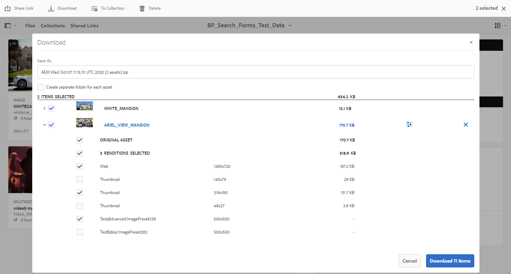
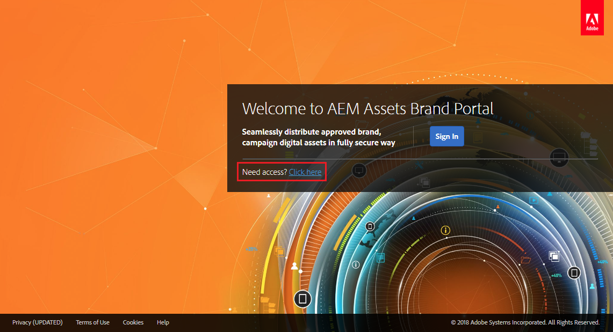

# AEM Assets Brand Portal의 새로운 기능 {#what-s-new-in-aem-assets-brand-portal}

Adobe Experience Manager Assets Brand Portal을 사용하면 승인된 크리에이티브 자산을 외부 사용자와 내부 비즈니스 사용자가 간편하게 구매하고 제어하며 장치 간에 안전하게 분배할 수 있습니다. 자산 공유의 효율성을 향상시키고, 자산 출시 시간을 단축하며, 규정 준수 및 무단 액세스의 위험을 줄일 수 있습니다. Adobe은 전체 Brand Portal 경험을 개선하기 위해 노력하고 있습니다. 다음은 새로운 기능 및 향상된 기능을 잠깐 살펴보십시오.

## 2021.08.0 변경 사항 {#what-changed-in-august-2021}

Brand Portal 2021.08.0은 기업 및 팀 고객을 위한 비즈니스 프로필을 도입하여 조직에 자산을 보다 잘 제어할 수 있는 내부 릴리스입니다. 이제 사용자는 신규 및 마이그레이션된 조직에 대해 조직별 권한을 갖습니다. 마이그레이션 중에 기존 Adobe ID 계정이 모두 비즈니스 ID로 마이그레이션됩니다.

* 마이그레이션되면 모든 신규 및 기존 조직에 비즈니스 ID를 전달합니다.
* 비즈니스 ID에는 도메인 청구 또는 SSO 설정 등 특정 설정이 필요하지 않습니다.
* gmail.com 또는 outlook.com과 같은 공개 전자 메일 도메인을 포함하여 전자 메일 주소를 사용하는 사용자를 추가할 수 있습니다.

**Brand Portal 사용자에게 미치는 영향**

마이그레이션은 기존 데이터 세트, 자산, 사용자 또는 설정에 영향을 주지 않습니다. 마이그레이션 중에 발생하는 유일한 내부 변경 사항은 기존 조직의 비즈니스 프로필에 대한 권한 부여입니다.

>[!NOTE]
>
>비즈니스 프로필은 현재 2021년 8월 16일 이후에 생성된 새 조직에 적용할 수 있습니다.
>
>조직이 마이그레이션될 때까지 Adobe ID, Enterprise ID 또는 Federated ID 유형을 사용하여 조직에 계속 액세스할 수 있습니다.

### 참조 문서 {#reference-articles}

* [Adobe 프로필 소개](https://helpx.adobe.com/enterprise/kb/introducing-adobe-profiles.html)

* [Adobe 프로필 관리](https://helpx.adobe.com/enterprise/using/manage-adobe-profiles.html)

* [사용자 및 관리자를 위한 로그인 환경으로 업데이트](https://helpx.adobe.com/enterprise/using/storage-for-business.html#new-admin-sign-in-exp)

* [마이그레이션 중 로그인 제한](https://helpx.adobe.com/enterprise/kb/account-temporarily-unavailable.html)

* [Admin Console에서 사용자 관리](https://helpx.adobe.com/enterprise/using/manage-users-individually.html)

* [엔터프라이즈 사용자를 위한 제품 프로필 관리](https://helpx.adobe.com/enterprise/using/manage-product-profiles.html#assign-users)

* [도메인 트러스트](https://helpx.adobe.com/enterprise/admin-guide.html/enterprise/using/set-up-identity.ug.html#directory-trusting)

<!--   
### Add new users to T2E organization   {#add-users-to-T2E-org}

On adding a new user in Admin Console for a new or migrated T2E organization, the user will have to perform an additional step **Join Team** to get entitled to the T2E organization. 

The user is entitled only if the user chooses to **Join Team**, otherwise the user won't get access to the selected T2E organization in Brand Portal. 

>[!NOTE]
>
>The workflow is not applicable to the existing Brand Portal users.

### Additional screen while navigating to Admin Console   {#navigate-to-admin-console}

The administrators will have to perform an additional step of selecting the T2E organization while navigating from Brand Portal to Admin Console. The workflow applies on the new and migrated T2E organizations.   

Selection of the T2E organization is a one-time activity and is not required everytime the administrator navigates from Brand Portal to Admin Console.

1. Log in to a T2E organization in Brand Portal as administrator.
1. Go to **[!UICONTROL Tools]** > **[!UICONTROL Users]** > **[!UICONTROL Management]** and click on the link **[!UICONTROL Launch Admin Console]**. 

   Or, go to **[!UICONTROL Unified Shell]** > **[!UICONTROL Administration]** and click on the link **[!UICONTROL Launch Admin Console]**. 
1. Search the T2E organization to login to Admin Console.

   

### Restriction during migration of an organization   {#login-restriction}

When an organization is undergoing T2E migration, the users of that organization will not be able to login to Brand Portal. The following error message appears on the screen. However, the migration won't impact the active user session until the token expires. 

Once the migration is complete, the users can login to Brand Portal. The users will receive an email notification containing the entitlement changes. If the users are entitled to more than one organization, they will have to select the organization at the time of login. 
-->

<!--
For a new or migrated T2E orgnization, the users will have an organization specific entitlement. A user can have multiple entitlements with the same email id for different T2E organizations. 
-->

## 2021.06.0 변경 사항 {#what-changed-in-june-2021}

Brand Portal 2021.06.0은 중요한 문제에 대한 수정 사항이 포함된 내부 릴리스입니다. 최신 [Brand Portal 릴리스 노트](brand-portal-release-notes.md)를 참조하십시오.

## 2021.02.0 변경 사항 {#what-changed-in-feb-2021}

Brand Portal 2021.02.0은 AEM Assets as a Cloud Service으로 Brand Portal 활성화 워크플로우를 가져오고, AEM Assets의 Cloud Service 자산 소싱 기능을 쉽게 하고, 자산 다운로드 경험의 개선 사항을 포함하고 있는 개선 사항 릴리스입니다. 또한 관리자는 임차인 수준에서 폴더, 컬렉션 및 자산의 벌크 다운로드의 기본 다운로드 동작을 구성할 수 있습니다. Brand Portal **[!UICONTROL 사용 보고서]**&#x200B;도 활성 Brand Portal 사용자를 반영하도록 수정되었습니다.

### AEM Assets에서 Cloud Service으로 Brand Portal 활성화 {#bp-automation-on-cloud-service}

이제 Cloud Service으로 AEM Assets에 사전 구성된 Brand Portal 인스턴스가 있을 수 있습니다. Cloud Manager 사용자는 AEM Assets에서 Brand Portal을 Cloud Service 인스턴스로 활성화할 수 있습니다.

이전에는 AEM Assets as a Cloud Service을 Adobe 개발자 콘솔을 사용하여 Brand Portal으로 수동으로 구성했습니다.

Cloud Manager 사용자는 백엔드에서 필수 구성을 만들고 Cloud Service 인스턴스로 AEM Assets과 동일한 IMS 조직에서 Brand Portal을 활성화하는 활성화 워크플로우를 트리거합니다.

AEM Assets에서 Cloud Service 인스턴스로 Brand Portal을 활성화하려면

1. Cloud Manager에 로그인하고 **[!UICONTROL 환경]**&#x200B;으로 이동합니다.
1. 목록에서 환경(하나씩)을 선택합니다. Brand Portal과 연관된 환경이 발견되면 **[!UICONTROL Brand Portal 활성화]** 단추를 클릭하여 활성화 워크플로우를 시작합니다.
1. Brand Portal 테넌트가 활성화되면 상태가 활성화됨으로 변경됩니다.

[AEM Assets에서 Cloud Service](https://experienceleague.adobe.com/docs/experience-manager-cloud-service/assets/brand-portal/configure-aem-assets-with-brand-portal.html)로 Brand Portal 활성화 을 참조하십시오.

### AEM Assets as a Cloud Service의 자산 소싱 {#asset-sourcing-on-cloud-service}

이제 AEM Assets에서 Cloud Service으로 자산 소싱 기능을 사용할 수 있습니다. 이 기능은 모든 클라우드 서비스 사용자에 대해 기본적으로 활성화되어 있습니다. 허용된 Brand Portal 사용자는 기여도 폴더에 새 자산을 업로드하고 기여도 폴더를 Cloud Service 인스턴스로 Brand Portal에서 AEM Assets으로 게시하여 자산 소싱에 기여할 수 있습니다. 관리자는 Brand Portal 사용자의 기여도를 검토하고 승인하여 다른 Brand Portal 사용자에게 추가로 배포할 수 있습니다.

이전에는 AEM Assets(온-프레미스 및 관리 서비스)에서만 자산 소싱을 사용할 수 있었습니다.

Brand Portal](https://experienceleague.adobe.com/docs/experience-manager-brand-portal/using/asset-sourcing-in-brand-portal/brand-portal-asset-sourcing.html)의 [자산 소싱 을 참조하십시오.

### 에셋 다운로드 {#asset-download-setting}

기존 **[!UICONTROL 다운로드 설정]** 외에 Brand Portal 관리자는 이제 **[!UICONTROL 자산 다운로드]** 설정을 구성할 수 있습니다. 이 설정을 사용하면 관리자는 임차인 수준에서 폴더, 컬렉션 및 자산(20개 이상의 자산)의 벌크 다운로드의 기본 다운로드 동작을 제어할 수 있습니다.

<!--
Earlier, all the asset renditions were directly downloaded in a zip folder in case of folder, collection, and bulk download of assets. As the **[!UICONTROL Download]** dialog is skipped for folders or collections, there was no mechanism to control the downloading behaviour of the assets. Due to this, the users were finding it difficut to search for a particular asset rendition from a folder containing huge bunch of downloaded renditions. 
-->

이전에는 모든 자산 표현물이 zip 폴더에서 직접 다운로드되었습니다. 폴더 및 컬렉션에 대해 **[!UICONTROL 다운로드]** 대화 상자를 건너뛰었으며, 자산의 다운로드 동작을 제어할 방법이 없으므로 여러 다운로드에서 특정 렌디션을 검색하기가 어렵습니다.

**[!UICONTROL 이제]** 자산 다운로드 설정에서는 폴더의 폴더, 컬렉션 또는 자산의 벌크 다운로드를 다운로드하는 동안 각 자산에 대해 별도의 폴더를 만드는 옵션을 제공합니다.

**[!UICONTROL 자산 다운로드]** 설정이 비활성화되어 있으면 공유 링크를 사용하여 자산을 다운로드하는 것을 제외하고, 동일한 폴더에 있는 모든 자산 표현물이 들어 있는 zip 폴더에서 폴더나 컬렉션이 다운로드됩니다.

관리자로 Brand Portal 테넌트에 로그인하고 **[!UICONTROL 도구]** > **[!UICONTROL 다운로드]**&#x200B;로 이동합니다. 관리자는 자산의 폴더, 컬렉션 및 벌크 다운로드를 다운로드하는 동안 각 자산에 대해 별도의 폴더를 만들도록 **[!UICONTROL 자산 다운로드]** 설정을 활성화할 수 있습니다.

[Brand Portal](https://experienceleague.adobe.com/docs/experience-manager-brand-portal/using/download/brand-portal-download-assets.html)에서 자산 다운로드를 참조하십시오.
<!--
### Download using Share link {#download-using-share-link}

The default behavior of downloading the assets using share link is now independent of the **[!UICONTROL Download Settings]**. A separate folder is created for each asset while downloading the assets using share link. 
-->

### 사용량 보고서 {#usage-report}

Brand Portal **[!UICONTROL 사용 보고서]**&#x200B;가 활성 Brand Portal 사용자만 반영하도록 수정되었습니다. Admin Console에서 제품 프로필에 할당되지 않은 Brand Portal 사용자는 비활성 사용자로 간주되며 **[!UICONTROL 사용량 보고서]**&#x200B;에 반영되지 않습니다.

이전에는 활성 사용자와 비활성 사용자 모두 사용량 보고서에 표시되었습니다.

## 2020.10.0 변경 사항 {#what-changed-in-oct-2020}

Brand Portal 2020.10.0은 자산 다운로드 환경을 단순화하는 데 중점을 둔 개선 릴리스이며 중요한 수정 사항이 포함되어 있습니다. 개선된 기능에는 자산 다운로드에 대한 새롭고 향상된 워크플로우, 렌디션을 제외하는 추가 옵션, **[!UICONTROL 렌디션]** 패널에서 직접 다운로드, 특정 사용자 그룹에 대한 액세스 및 다운로드 권한을 허용하는 구성, 모든 Brand Portal 페이지에서 파일, 컬렉션 및 공유 링크를 쉽게 탐색할 수 있습니다. 최신 [Brand Portal 릴리스 노트](brand-portal-release-notes.md)를 참조하십시오.

### 간소화된 다운로드 환경 {#download-dialog}

이전에는, 다운로드&#x200B;**[!UICONTROL 다운로드]** 대화 상자에 각 자산에 대한 별도의 폴더 만들기, 이메일 자산, 원본 자산 선택, 사용자 지정 표현물, 동적 표현물 제외, 시스템 표현물 제외, 다운로드 가속화 활성화 등의 여러 옵션이 표시되었지만, 다운로드하기 위해 여러 개의 자산이나 폴더를 선택했을 때 특별히 비기술 또는 새 사용자에게 모호한 옵션이 있었습니다. 또한 사용자가 모든 자산 표현물을 볼 수 없거나 특정 사용자 지정 표현물 또는 동적 표현물을 제외하지 못했습니다.

새 **[!UICONTROL 다운로드]** 대화 상자는 자산 선택 및 필터링 프로세스를 일반화하여 Brand Portal 사용자가 자산 표현물을 다운로드하는 동안 효과적인 결정을 쉽게 내릴 수 있도록 합니다. 이 목록에는 [**[!UICONTROL 다운로드]**](brand-portal-download-assets.md) 구성 및 **[!UICONTROL 다운로드]** 설정에 따라 선택한 모든 자산과 해당 표현물이 표시됩니다.

>[!NOTE]
>
>이제 모든 사용자는 기본적으로 **[!UICONTROL 빠른 다운로드]**&#x200B;를 사용할 수 있으며, Brand Portal에서 자산을 다운로드하기 전에 브라우저의 확장에 IBM Aspera Connect 3.9(`https://www.ibm.com/docs/en/aspera-connect/3.9.9`)가 설치되어 있어야 합니다.

<!--
If any of the **[!UICONTROL Custom Rendition]** or **[!UICONTROL System Rendition]** is enabled in the [**[!UICONTROL Download]**](brand-portal-download-assets.md) configuration and **[!UICONTROL Download]** settings are enabled for the group users, the new **[!UICONTROL Download]** dialog appears with all the renditions of the selected assets or folders containing assets in a list view. 
-->

**[!UICONTROL 다운로드]** 대화 상자에서 사용자는 다음을 수행할 수 있습니다.

* 다운로드 목록에서 자산의 사용 가능한 모든 표현물을 봅니다.
* 다운로드할 필요가 없는 자산의 렌디션을 제외합니다.
* 한 번의 클릭으로 모든 유사한 자산 유형에 동일한 표현물 세트를 적용합니다.
* 다양한 자산 유형에 대해 다양한 표현물 세트를 적용합니다.
* 각 자산에 대해 별도의 폴더 만들기.
* 선택한 자산 및 해당 표현물을 다운로드합니다.

다운로드 워크플로우는 독립형 자산, 여러 자산, 자산이 들어 있는 폴더, 라이선스가 있는 또는 라이선스가 없는 자산, 공유 링크를 사용하여 자산 다운로드에 대해 일정하게 유지됩니다. Brand Portal](https://experienceleague.adobe.com/docs/experience-manager-brand-portal/using/download/brand-portal-download-assets.html)에서 자산을 다운로드하려면 [단계를 참조하십시오.

### 빠른 탐색  {#quick-navigation}

이전에는 **[!UICONTROL 파일]**, **[!UICONTROL 컬렉션]** 및 **[!UICONTROL 공유 링크]**&#x200B;를 보는 옵션이 숨겨져 사용자가 다른 보기로 전환하려고 할 때마다 여러 번 클릭해야 했습니다.

Brand Portal 2020.10.0에서 사용자는 빠른 탐색 링크를 사용하여 한 번의 클릭으로 모든 Brand Portal 페이지에서 **[!UICONTROL 파일]**, **[!UICONTROL 컬렉션]** 및 **[!UICONTROL 공유 링크]**&#x200B;로 이동할 수 있습니다.

### 향상된 표현물 패널 {#rendition-panel}

이전에는 **[!UICONTROL Download]** 구성에서 **[!UICONTROL 사용자 지정 표현물]** 또는 **[!UICONTROL 시스템 표현물]**&#x200B;이 활성화되어 있을 경우에만 사용자가 **[!UICONTROL 표현물]** 패널에서만 원래 자산과 해당 표현물을 볼 수 있었습니다. 또한 필요하지 않은 특정 사용자 지정 또는 동적 표현물을 제외하는 필터가 없으므로 사용자는 모든 자산 표현물을 다운로드해야 했습니다.

<!--
Earlier, if any of the custom or system renditions was enabled in the **[!UICONTROL Download]** settings, an additional **[!UICONTROL Download]** dialog appeared on clicking the **[!UICONTROL Download]** button wherein the user had to manually select the set of renditions (original asset, custom renditions, dynamic renditions) to download.
There was no filter to exclude specific custom or dynamic renditions which were not required for download.
-->

Brand Portal 2020.10.0에서 사용자는 **[!UICONTROL 다운로드]** 대화 상자를 열지 않고 자산 세부 사항 페이지의 표현물 패널](brand-portal-download-assets.md#download-assets-from-asset-details-page)에서 특정 표현물을 제외 및 직접 [다운로드할 수 있습니다.

<!-- 
In Brand Portal 2020.10.0, direct download and exclude renditions features are introduced in the **[!UICONTROL Renditions]** panel on the asset details page. All the renditions (original asset, custom renditions, dynamic renditions) under the rendition panel are now associated with a check box and are enabled by default. 

The user can clear the check boxes to exclude the renditions which are not required for download. And can click on the **[!UICONTROL Download]** button in the **[!UICONTROL Renditions]** panel to directly download the selected set of renditions in a zip folder without having to open the **[!UICONTROL Download]** dialog.
-->

### 다운로드 설정 구성 {#download-permissions}

기존 **[!UICONTROL 다운로드]** 구성 외에, Brand Portal 관리자는 자산 세부 사항 페이지에서 원본 자산과 해당 표현물을 보고 다운로드하도록 다른 사용자 그룹에 대한 설정을 구성할 수도 있습니다.

관리자로 Brand Portal 테넌트에 로그인하고 **[!UICONTROL 도구]** > **[!UICONTROL 사용자]**&#x200B;로 이동합니다.

**[!UICONTROL 사용자 역할]** 페이지에서 **[!UICONTROL 그룹]** 탭으로 이동하여 사용자 그룹의 보기 및 (또는) 다운로드 설정을 구성합니다.

이전에는 그룹 사용자가 원래 자산을 다운로드하지 못하도록 제한하는 데에만 설정을 사용할 수 있었습니다.

관리자는 **[!UICONTROL 사용자 역할]** 페이지의 **[!UICONTROL 그룹]** 탭을 사용하여 보기 및 다운로드 설정을 구성할 수 있습니다.

* **[!UICONTROL 원본 다운로드]** 및 **[!UICONTROL 표현물 다운로드]** 설정이 모두 켜져 있으면 선택한 그룹의 사용자가 원본 자산과 해당 표현물을 보고 다운로드할 수 있습니다.
* 두 설정이 모두 꺼져 있으면 원래 자산만 볼 수 있습니다. 자산 표현물은 자산 세부 사항 페이지의 사용자에게 표시되지 않습니다.
* **[!UICONTROL 원본 다운로드]** 설정만 켜져 있으면 사용자는 자산 세부 사항 페이지에서 원래 자산만 보고 다운로드할 수 있습니다.
* **[!UICONTROL 표현물 다운로드]** 설정만 켜져 있으면 사용자는 원래 자산을 볼 수 있지만 다운로드할 수 없습니다. 그러나 사용자는 자산 표현물을 보고 다운로드할 수 있습니다.

[자산 다운로드 구성](https://experienceleague.adobe.com/docs/experience-manager-brand-portal/using/download/brand-portal-download-assets.html#configure-download-permissions)을 참조하십시오.

>[!NOTE]
>
>사용자가 여러 그룹에 추가되고 해당 그룹 중 하나에 제한이 있는 경우 해당 제한이 사용자에게 적용됩니다.

<!--
>Restrictions to access the original asset and their renditions do not apply to administrators even if they are members of restricted groups.
 >
 >The users can always download assets and their renditions from the repository using a `curl` request even if the download configurations are turned-off.
 >
-->

## 6.4.7의 변경 사항 {#what-changed-in-647}

Brand Portal 6.4.7 릴리스는 문서 뷰어를 가져오고, 자산 다운로드 환경을 개선하며, 중요한 수정 사항을 포함합니다. 최신 [Brand Portal 릴리스 노트](brand-portal-release-notes.md)를 참조하십시오.

<!--
Brand Portal 6.4.7 release brings in the Document Viewer, leverages the Brand Portal administrators to configure asset download, and centers top customer requests. See latest [Brand Portal Release Notes](brand-portal-release-notes.md).
-->

### 문서 뷰어 {#doc-viewer}

문서 뷰어는 PDF 보기 환경을 향상시킵니다. Brand Portal에서 PDF 파일을 보는 동안 Adobe Document Cloud과 유사한 경험을 제공합니다.

이전에는 PDF 파일을 볼 수 있는 제한된 옵션을 사용할 수 있었습니다.

Document Viewer를 사용하면 Brand Portal 사용자는 이제 페이지를 보고, 책갈피를 보고, 페이지 내 텍스트 검색, 확대, 축소, 이전 및 다음 페이지로 이동하고, 페이지로 전환하거나, 창에 맞추고, 화면에 표시하고, 도구 모음을 숨기거나 숨길 수 있는 옵션을 사용할 수 있습니다.

>[!NOTE]
>
>다른 문서 형식에 대한 보기 환경은 변경되지 않고 그대로 유지됩니다.

### 경험 다운로드 {#download-configurations}

자산 다운로드 프로세스가 개선되어 [Brand Portal](brand-portal-download-assets.md)에서 자산을 다운로드하는 동안 단순한 사용자 경험을 제공합니다.

Brand Portal에서 자산을 다운로드하는 기존 워크플로우에는 선택할 수 있는 여러 다운로드 옵션이 있는 **[!UICONTROL 다운로드]** 대화 상자가 나타날 수 있습니다.

Brand Portal 6.4.7에서 Brand Portal 관리자는 자산 **[!UICONTROL 다운로드]** 설정을 구성할 수 있습니다. 사용 가능한 구성은 다음과 같습니다.

* **[!UICONTROL 빠른 다운로드]**
* **[!UICONTROL 사용자 지정 표현물]**
* **[!UICONTROL 시스템 표현물]**

Brand Portal 관리자는 모든 조합을 사용하여 자산 다운로드를 구성할 수 있습니다.

<!--In Brand Portal 6.4.7, fast download, custom renditions, and system renditions are the three configurations available.-->

* **[!UICONTROL 사용자 지정 표현물]** 및 **[!UICONTROL 시스템 표현물]** 구성이 모두 꺼져 있는 경우, Brand Portal 사용자의 다운로드 경험을 간소화하는 추가 대화 상자 없이 자산의 원래 표현물이 다운로드됩니다.

* **[!UICONTROL 사용자 지정 표현물]** 또는 **[!UICONTROL 시스템 표현물]** 중 어느 하나가 활성화되어 있으면 **[!UICONTROL 다운로드]** 대화 상자가 나타나고 자산 표현물과 함께 원본 자산이 다운로드됩니다. **[!UICONTROL 빠른 다운로드]** 구성을 활성화하면 다운로드 프로세스가 가속화됩니다.

구성에 따라 다운로드 워크플로우는 독립형 자산, 여러 자산, 자산이 들어 있는 폴더, 라이선스가 있는 자산 또는 라이선스가 없는 자산을 포함하는 폴더, 공유 링크를 사용하여 자산 다운로드에 대해 일정하게 유지됩니다.

## 6.4.6의 변경 사항 {#what-changed-in-646}

Brand Portal 6.4.6에서 AEM Assets과 Brand Portal 간의 인증 채널이 변경되었습니다. Brand Portal은 이제 AEM Assets as a Cloud Service, AEM Assets 6.3 이상에서 지원됩니다. AEM Assets 6.3 이상에서 Brand Portal은 이전에 기존 OAuth 게이트웨이를 통해 클래식 UI에 구성되었으며, 이 게이트웨이는 인증을 위해 IMS 액세스 토큰을 가져오는 데 JWT 토큰 교환을 사용합니다. 이제 AEM Assets은 Brand Portal 테넌트의 인증을 위해 IMS 토큰을 전달하는 Adobe 개발자 콘솔을 통해 Brand Portal으로 구성됩니다.

<!-- The steps to configure integration are different depending on your AEM version, and whether you are configuring for the first-time, or upgrading the existing integration:
-->

<!--
  
   | **AEM Version** |**New Integration** |**Upgrade Integration** |
|---|---|---|
| **AEM 6.5** |[Create new integration](../using/brand-portal-configure-integration-65.md) |[Upgrade existing integration](../using/brand-portal-configure-integration-65.md#upgrade-integration-65) | 
| **AEM 6.4** |[Create new integration](../using/brand-portal-configure-integration-64.md) |[Upgrade existing integration](../using/brand-portal-configure-integration-64.md#upgrade-integration-64) | 
| **AEM 6.3** |[Create new integration](../using/brand-portal-configure-integration-63.md) |[Upgrade existing integration](../using/brand-portal-configure-integration-63.md#upgrade-integration-63) | 
| **AEM 6.2** |Contact Support |Contact Support | 

   -->

Brand Portal으로 AEM Assets을 구성하는 단계는 AEM 버전과 처음 구성하는 것인지 아니면 기존 구성을 업그레이드하는 것인지에 따라 다릅니다.

<!--| **AEM Version** |**New Configuration** |**Upgrade Configuration** |
|---|---|---|
| **AEM 6.5 (6.5.4.0 and above)** |[Create configuration](../using/brand-portal-configure-integration-65.md) |[Upgrade configuration](../using/brand-portal-configure-integration-65.md#upgrade-integration-65) | 
| **AEM 6.4 (6.4.8.0 and above)** |[Create configuration](../using/brand-portal-configure-integration-64.md) |[Upgrade configuration](../using/brand-portal-configure-integration-64.md#upgrade-integration-64) | 
| **AEM 6.3 (6.3.3.8 and above)** |[Create configuration](../using/brand-portal-configure-integration-63.md) |[Upgrade configuration](../using/brand-portal-configure-integration-63.md#upgrade-integration-63) | 
| **AEM 6.2** |Contact Support |Contact Support | 
-->

<!-- AEM Assets configuration with Brand Portal on Adobe I/O is supported on:
* AEM 6.5.4.0 and above
* AEM 6.4.8.0 and above
* AEM 6.3.3.8 and above -->

| **AEM 버전** | **새 구성** | **구성 업그레이드** |
|---|---|---|
| **AEM Assets as a Cloud Service** | [구성 만들기](https://experienceleague.adobe.com/docs/experience-manager-cloud-service/assets/brand-portal/configure-aem-assets-with-brand-portal.html) | - |
| **AEM 6.5(6.5.4.0 이상)** | [구성 만들기](https://experienceleague.adobe.com/docs/experience-manager-65/assets/brandportal/configure-aem-assets-with-brand-portal.html) | [구성 업그레이드](https://experienceleague.adobe.com/docs/experience-manager-65/assets/brandportal/configure-aem-assets-with-brand-portal.html#upgrade-integration-65) |
| **AEM 6.4(6.4.8.0 이상)** | [구성 만들기](https://experienceleague.adobe.com/docs/experience-manager-64/assets/brandportal/configure-aem-assets-with-brand-portal.html) | [구성 업그레이드](https://experienceleague.adobe.com/docs/experience-manager-64/assets/brandportal/configure-aem-assets-with-brand-portal.html#upgrade-integration-64) |
| **AEM 6.3 (6.3.3.8 이상)** | [구성 만들기](https://helpx.adobe.com/kr/experience-manager/6-3/assets/using/brand-portal-configuring-integration.html) | [구성 업그레이드](https://helpx.adobe.com/kr/experience-manager/6-3/assets/using/brand-portal-configuring-integration.html#Upgradeconfiguration) |
| **AEM 6.2** | 지원 문의 | 지원 문의 |

>[!NOTE]
>
>AEM 인스턴스를 최신 서비스 팩으로 업데이트하는 것이 좋습니다.

최신 [Brand Portal 릴리스 노트](brand-portal-release-notes.md)를 참조하십시오.

[Brand Portal FAQ](brand-portal-faqs.md)를 참조하십시오.

## 6.4.5에서 변경된 사항 {#what-changed-in-645}

Brand Portal 6.4.5는 작성자 환경에 액세스하지 않아도 컨텐츠를 Brand Portal에 업로드하고 AEM Assets에 게시할 수 있는 기능을 Brand Portal 사용자(외부 에이전시/팀)에게 제공하는 데 중점을 둔 기능 릴리스입니다. 이 기능은 Brand Portal ](brand-portal-asset-sourcing.md)**에서**[&#x200B;자산 소싱이라고 하며, 사용자가 자산을 제공하고 전 세계에 배포된 다른 Brand Portal 사용자와 공유할 수 있는 양방향 메커니즘을 제공하여 고객 경험을 향상시켜 줍니다.

### Brand Portal의 자산 소싱 {#asset-sourcing-in-bp}

AEM 사용자(관리자/관리자가 아닌 사용자)는 자산 소싱을 통해 추가 **자산 기여도** 속성이 있는 폴더를 만들 수 있으므로 Brand Portal 사용자가 자산 제출을 위해 만든 새 폴더를 만들 수 있습니다. 새로 만든 **기여도** 폴더 내에서 NEW 및 SHARED라는 두 개의 추가 하위 폴더를 만드는 워크플로우를 자동으로 트리거합니다.

그런 다음 AEM 사용자는 기여도 폴더에 추가해야 하는 자산 유형에 대한 요약을 업로드하고 기준 자산을 **SHARED** 폴더에 업로드하여 Brand Portal 사용자에게 필요한 참조 정보가 있는지 확인함으로써 요구 사항을 정의합니다. 그런 다음 관리자는 새로 만든 **기여도** 폴더를 Brand Portal에 게시하기 전에 활성 Brand Portal 사용자에게 기여도 폴더에 대한 액세스 권한을 부여할 수 있습니다.

사용자가 **NEW** 폴더에서 컨텐츠를 추가했으면 기여 폴더를 다시 AEM 작성 환경에 게시할 수 있습니다. 가져오기를 완료하고 AEM Assets 내에 새로 게시된 콘텐츠를 반영하는 데 몇 분이 걸릴 수 있습니다.

또한 기존의 모든 기능은 변경되지 않고 그대로 유지됩니다. Brand Portal 사용자는 기여 폴더 및 허용된 다른 폴더에서 자산을 보고 검색하고 다운로드할 수 있습니다. 또한 관리자는 기여도 폴더를 추가로 공유하고, 속성을 수정하고, 컬렉션에 자산을 추가할 수 있습니다.

>[!NOTE]
>
>Brand Portal의 자산 소싱은 AEM 6.5.2.0 이상에서 지원됩니다.
>
>이 기능은 이전 버전(AEM 6.3 및 AEM 6.4)에서 지원되지 않습니다.

### 기여도 폴더에 자산 업로드 {#upload-assets-in-bp}

적절한 권한이 있는 Brand Portal 사용자는 자산 요구 사항을 다운로드하여 기여의 필요성을 이해하고 여러 자산이 들어 있는 여러 자산 또는 폴더를 기여도 폴더에 업로드할 수 있습니다. 그러나 Brand Portal 사용자는 **NEW** 하위 폴더에만 자산을 업로드할 수 있습니다. **SHARED** 폴더는 요구 사항 및 기준 자산 배포를 위한 것입니다.

### AEM Assets에 기여도 폴더 게시 {#publish-assets-to-aem}

업로드가 **NEW** 폴더에 완료되면 Brand Portal 사용자는 기여도 폴더를 다시 AEM에 게시할 수 있습니다. AEM Assets에서 게시된 콘텐츠/자산을 가져오고 반영하는 데 몇 분이 걸릴 수 있습니다. [AEM Assets에 기여도 폴더 게시](brand-portal-publish-contribution-folder-to-aem-assets.md)를 참조하십시오.

## 6.4.4에서 변경된 사항 {#what-changed-in-644}

Brand Portal 6.4.4 릴리스는 텍스트 검색 향상 및 상위 고객 요청 사항에 중점을 둡니다. 최신 [Brand Portal 릴리스 노트](brand-portal-release-notes.md)를 참조하십시오.

### 검색 개선 사항

Brand Portal 6.4.4 이상에서 필터링 창에서 속성 조건부에서 부분 텍스트 검색을 지원합니다. 부분 텍스트 검색을 허용하려면 검색 양식의 속성 조건자에서 **부분 검색**&#x200B;을 활성화해야 합니다.

부분 텍스트 검색 및 와일드카드 검색에 대해 자세히 알아보려면 계속 읽어보십시오.

#### 부분 구문 검색 {#partial-phrase-search}

이제 필터링 창에서 검색한 구문의 부분인 단어 또는 두 개만 지정하여 자산을 검색할 수 있습니다.

**사용**
사례부분 구문 검색은 검색한 구문에서 발생하는 단어의 정확한 조합을 잘 모르는 경우 유용합니다.

예를 들어 Brand Portal의 검색 양식에서 자산 제목에서 부분 검색에 속성 설명을 사용하는 경우 **camp** 용어를 지정하면 제목 구문에 camp 라는 단어가 포함된 모든 자산을 반환합니다.

#### 와일드카드 검색 {#wildcard-search}

Brand Portal에서는 검색 쿼리의 별표(*)를 검색한 구문에 있는 단어의 일부와 함께 사용할 수 있습니다.

**사용 사례. 검색한 구문에서 발생하는 정확한 단어를 모를 경우 와일드카드 검색을 사용하여 검색 쿼리의 간격을 채울 수 있습니다.

예를 들어 **climb***&#x200B;을 지정하면 Brand Portal의 검색 양식에서 자산 제목에서 부분 검색에 속성 설명을 사용하는 경우 제목 구문에 **climb**&#x200B;으로 시작하는 단어가 포함된 모든 자산을 반환합니다.

마찬가지로, 다음을 지정합니다.

* ***** 캐릭터로 끝나는 단어가 포함된 모든 자산은  **** 제목 문구를 낮춰줍니다.

* ***climb*** 은 제목 구를 나타내는 문자를 포함하는 단어가  **** 있는 모든 자산을 반환합니다.

>[!NOTE]
>
>**부분 검색** 확인란을 선택하면 기본적으로 **대/소문자 무시**&#x200B;가 선택됩니다.

## 6.4.3의 변경 사항 {#what-changed-in}

Brand Portal 6.4.3 릴리스는 Brand Portal 액세스 URL에서 테넌트 ID 외에도 대체 별칭을 조직에 제공, 새 폴더 계층 구성, 비디오 지원 개선 사항, AEM 작성자 인스턴스에서 Brand Portal으로 예약된 게시, 운영 개선 사항 및 고객 요청을 처리하는 데 중점을 둡니다.

### 관리자가 아닌 사용자의 폴더 계층 구조 탐색

이제 관리자는 로그인 시 관리자가 아닌 사용자(편집기, 뷰어 및 게스트 사용자)에게 폴더가 표시되는 방식을 구성할 수 있습니다. [폴더 계층 ](../using/brand-portal-general-configuration.md) 구성 활성화 가 관리 도구 패널의  **일반 설정**&#x200B;에 추가됩니다. 구성이 다음과 같은 경우:

* ****&#x200B;이 활성화되면 관리자가 아닌 사용자가 루트 폴더에서 시작하는 폴더 트리를 볼 수 있습니다. 따라서 관리자와 유사한 탐색 경험을 제공할 수 있습니다.
* ****&#x200B;이 비활성화되어 있으면 공유 폴더만 랜딩 페이지에 표시됩니다.

[폴더 계층 활성화](../using/brand-portal-general-configuration.md) 기능(활성화된 경우)을 사용하면 다른 계층 구조에서 공유되는 동일한 이름의 폴더를 구분할 수 있습니다. 로그인 시 이제 관리자가 아닌 사용자에게 공유 폴더의 가상 상위(및 상위) 폴더가 표시됩니다.

공유 폴더는 가상 폴더의 각 디렉토리 내에 구성됩니다. 잠금 아이콘을 사용하여 이러한 가상 폴더를 인식할 수 있습니다.

가상 폴더의 기본 축소판은 첫 번째 공유 폴더의 축소판 이미지입니다.

### 특정 폴더 계층 구조 또는 경로에서 검색

**경로** 브라우저 설명이 특정 디렉터리에서 자산을 검색할 수 있도록 검색 양식에 도입되었습니다. 경로 브라우저에 대한 검색 조건자의 기본 검색 경로는 `/content/dam/mac/<tenant-id>/`입니다. 이 경로는 기본 검색 양식을 편집하여 구성할 수 있습니다.

* 관리 사용자는 경로 브라우저 를 사용하여 Brand Portal의 모든 폴더 디렉토리로 이동할 수 있습니다.
* 관리자가 아닌 사용자는 경로 브라우저 를 사용하여 공유된 폴더만 탐색(그리고 상위 폴더로 다시 이동)할 수 있습니다.

   예를 들어 `/content/dam/mac/<tenant-id>/folderA/folderB/folderC`은 관리자가 아닌 사용자와 공유됩니다. 사용자는 경로 브라우저를 사용하여 폴더C 내에서 자산을 검색할 수 있습니다. 이 사용자는 folderB 및 folderA로 이동할 수도 있습니다(사용자와 공유되는 folderC의 상위 멤버이므로).

이제 루트 폴더에서 시작하지 않고 검색한 특정 폴더 내에서 자산 검색을 제한할 수 있습니다.

이러한 폴더에서 검색하면 사용자와 공유된 자산에서만 결과가 반환됩니다.

### Dynamic Media 비디오 표현물 지원

AEM 작성자 인스턴스가 Dynamic Media 하이브리드 모드에 있는 사용자는 원본 비디오 파일 외에 Dynamic Media 렌디션을 미리 보고 다운로드할 수 있습니다.

특정 테넌트 계정에서 Dynamic Media 렌디션의 미리 보기 및 다운로드를 허용하려면 관리자는 관리 도구 패널의 **비디오** 구성에서 **Dynamic Media 구성**(비디오 서비스 URL(DM-게이트웨이 URL) 및 등록 ID를 지정하여 다이내믹 비디오를 가져오십시오).

Dynamic Media 비디오를 미리 볼 수 있는 시점:

* 자산 세부 사항 페이지
* 자산의 카드 보기
* 링크 공유 미리 보기 페이지

Dynamic Media 비디오 인코딩은 다음 위치에서 다운로드할 수 있습니다.

* Brand Portal
* 공유 링크

### Brand Portal에 게시 예약됨

[AEM(6.4.2.0)](https://helpx.adobe.com/experience-manager/6-4/release-notes/sp-release-notes.html#main-pars_header_9658011) 작성자 인스턴스를 Brand Portal에 게시하는 자산(및 폴더) 게시 워크플로우는 나중 날짜, 시간 동안 예약할 수 있습니다.

마찬가지로, 게시된 자산은 Brand Portal에서 게시 취소 워크플로우를 예약하여 나중에 포털에서 제거할 수 있습니다.

### URL에서 구성 가능한 테넌트 별칭

조직은 URL에 대체 접두사를 포함하여 포털 URL을 사용자 지정할 수 있습니다. 기존 포털 URL에서 테넌트 이름에 대한 별칭을 가져오려면 조직이 Adobe 지원에 문의해야 합니다.

Brand Portal URL의 접두사만 사용자 지정할 수 있으며 전체 URL은 사용자 지정할 수 없습니다.\
예를 들어 기존 도메인 **geometritrix.brand-portal.adobe.com**&#x200B;이 있는 조직은 요청 시 **geometrixx.brand-portal.adobe.com**&#x200B;을 만들 수 있습니다.

그러나 AEM 작성자 인스턴스는 테넌트 ID가 없고 임차인 별칭(대체) URL이 없는 [구성된](https://helpx.adobe.com/kr/experience-manager/6-5/assets/using/brand-portal-configuring-integration.html)일 수 있습니다.

조직은 Adobe에서 제공한 URL에 의존하는 대신 포털 URL을 사용자 지정하여 브랜딩 요구 사항을 충족할 수 있습니다.

### 다운로드 환경 개선 사항

이 릴리스는 클릭 및 경고 수를 줄여 간소화된 다운로드 경험을 제공합니다.

* 표현물만 다운로드하도록 선택(원본 자산이 아님).
* 원본 표현물에 액세스할 때 자산 다운로드가 제한됩니다.

## 6.4.2의 변경 사항 {#what-changed-in-1}

Brand Portal 6.4.2 릴리스는 조직의 자산 배분 요구사항을 처리하는 다양한 기능을 도입하였고 게스트 액세스를 통해 전세계에 분포한 많은 사용자에게 빨라진 다운로드로 최적의 경험을 제공할 수 있도록 지원합니다. 또한 Brand Portal은 관리자를 위한 새로운 구성, 새로 추가된 보고서, 고객 요청을 통해 조직을 더욱 강력하게 제어할 수 있습니다.

### 게스트 액세스

AEM Brand Portal에서는 게스트가 포털에 액세스할 수 있습니다. 게스트 사용자는 포털에 들어가는 자격 증명이 필요하지 않으며 모든 공용 폴더 및 컬렉션에 액세스하고 다운로드할 수 있습니다. 게스트 사용자는 자신의 Lightbox(개인 컬렉션)에 자산을 추가하고 이를 다운로드할 수 있습니다. 또한 관리자가 설정한 스마트 태그 검색 및 검색 조건자를 볼 수 있습니다. 게스트 세션에서는 사용자가 컬렉션을 만들고 저장된 검색을 만들거나 추가 검색을 공유하며 폴더 및 컬렉션 설정에 액세스하고 자산을 링크로 공유할 수 없습니다.

조직에서는 여러 개의 동시 게스트 세션이 허용되며, 이는 조직당 총 사용자 할당량 중 10%로 제한됩니다.

게스트 세션은 2시간 동안 활성 상태로 유지됩니다. 따라서 Lightbox의 상태도 세션 시작 시간으로부터 2시간까지 유지됩니다. 2시간 후에 게스트 세션을 다시 시작해야 하므로 Lightbox 상태가 손실됩니다.

### 가속화된 다운로드

Brand Portal 사용자는 IBM Aspera Connect 기반의 빠른 다운로드를 적용하여 최대 25배 더 빠르게 속도를 낼 수 있으며 전 세계 위치에 관계없이 완벽한 다운로드 경험을 제공할 수 있습니다. Brand Portal 또는 공유 링크에서 자산을 더 빨리 다운로드하려면 조직에서 다운로드 가속화가 활성화되어 있을 경우 다운로드 대화 상자에서 **다운로드 가속 사용** 옵션을 선택해야 합니다.

조직에 대해 IBM Aspera 기반 가속 다운로드를 활성화하려면 관리 도구 패널에서 [일반 설정](brand-portal-general-configuration.md#allow-download-acceleration)에서 관리자 **다운로드 가속 사용** 옵션(기본적으로 비활성화됨)을 활성화합니다. Brand Portal 및 공유 링크에서 자산 파일을 더 빨리 다운로드하기 위한 사전 요구 사항 및 문제 해결 단계에 대해 자세히 알려면 [가이드를 참조하여 Brand Portal](../using/accelerated-download.md#main-pars-header)에서 다운로드를 가속화합니다.

### 사용자 로그인 보고서

사용자 로그인을 추적하는 새 보고서가 도입되었습니다. **사용자 로그인** 보고서는 조직이 위임된 관리자 및 Brand Portal의 다른 사용자를 감사하고 유지할 수 있도록 하는 데 도움이 될 수 있습니다.

보고서 로그는 보고서 생성 시까지 Brand Portal 6.4.2 배포에서 각 사용자의 이름, 이메일 ID, 가상(관리자, 뷰어, 편집기, 게스트), 그룹, 마지막 로그인, 활동 상태 및 로그인 수를 표시합니다. 관리자는 보고서를 .csv 로 내보낼 수 있습니다. 다른 보고서와 함께 사용자 로그인 보고서를 사용하면 조직에서 승인된 브랜드 리소스와의 사용자 상호 작용을 보다 면밀하게 모니터링하여 기업 규정 준수 사무소가 준수되도록 할 수 있습니다.

### 원본 표현물에 대한 액세스

관리자는 원본 이미지 파일(.jpeg, .tiff, .png, .bmp, .gif, .pjpeg, x-portable-anymap, x-portable-graymap, x-portable-graymap, x-portable-pixmap, x-rgb, x-xpixmap, x-icon, image/photoshop, image/x-photoshop, .psd, image/vnd.adobe.photoshop)에 대한 사용자 액세스를 제한할 수 있으며, Brand Portal 또는 공유 링크에서 다운로드할 수 있는 저해상도 표현물에 대한 액세스를 제공할 수 있습니다. 이 액세스는 관리 도구 패널의 사용자 역할 페이지의 그룹 탭에서 사용자 그룹 수준에서 제어할 수 있습니다.

* 기본적으로 원본에 대한 액세스 가 모든 사용자에 대해 활성화되어 있으므로 모든 사용자는 원본 변환을 다운로드할 수 있습니다.
* 관리자는 사용자 그룹이 원래 표현물에 액세스하지 못하게 하려면 각 확인란을 선택 취소해야 합니다.
* 사용자가 여러 그룹의 구성원이지만 그룹 중 하나에만 제한이 있는 경우 해당 사용자에 제한이 적용됩니다.
* 관리자는 제한된 그룹의 구성원이지만 제한이 적용되지 않습니다.
* 링크로 자산을 공유하는 사용자의 권한은 공유 링크를 사용하여 자산을 다운로드하는 사용자에게 적용됩니다.

### 카드 및 목록 보기의 폴더 계층 구조 경로

이제 카드 보기에서 관리자가 아닌 사용자에게 폴더 계층 구조 정보를 표시합니다(편집기, 뷰어 및 게스트 사용자). 이 기능을 사용하면 상위 계층 구조와 관련하여 사용자가 액세스하는 폴더의 위치를 알 수 있습니다.

폴더 계층 정보는 다른 폴더 계층 구조와 공유된 다른 폴더와 유사한 이름을 가진 폴더를 구분할 때 특히 유용합니다. 관리자가 아닌 사용자가 공유된 자산의 폴더 구조를 모를 경우 이름이 비슷한 자산/폴더가 혼동되는 것 같습니다.

* 각 카드에 표시된 경로는 카드 크기에 맞게 잘립니다. 그러나 사용자는 전체 경로를 잘린 경로 위로 마우스를 가져가면 도구 팁으로 볼 수 있습니다.

목록 보기에는 Brand Portal의 모든 사용자에게 속하는 열에 있는 자산의 폴더 경로가 표시됩니다.

### 자산 속성을 보는 개요 옵션

Brand Portal은 선택한 자산/폴더의 자산 속성을 보기 위한 관리자가 아닌 사용자(편집자, 뷰어, 게스트 사용자)에게 개요 옵션을 제공합니다. 개요 옵션이 표시됩니다.

1. 자산/폴더 선택 시 맨 위의 도구 모음에서 를 클릭합니다.
2. 드롭다운에서 레일 선택기 를 선택합니다.

자산/폴더를 선택하는 동안 개요 옵션을 선택하면 사용자가 자산을 만든 제목, 경로 및 시간을 볼 수 있습니다. 반면에, 자산 세부 사항 페이지에서 개요 옵션을 선택하면 자산의 메타데이터를 볼 수 있습니다.

## 새 구성

관리자가 특정 테넌트에서 다음 기능을 활성화/비활성화하도록 6개의 새 구성이 추가되었습니다.

* 게스트 액세스 허용
* 사용자가 Brand Portal에 대한 액세스를 요청할 수 있도록 허용
* 관리자가 Brand Portal에서 자산을 삭제할 수 있도록 허용
* 공개 컬렉션 만들기 허용
* 공개 스마트 컬렉션 만들기 허용
* 다운로드 가속 허용

위의 구성은 관리 도구 패널의 액세스 및 일반 설정에서 사용할 수 있습니다.

### oAuth 통합을 구성하기 위한 Adobe I/O UI

Brand Portal 6.4.2 이상에서는 이전 OAuth(`https://legacy-oauth.cloud.adobe.io/`) 인터페이스를 사용하여 JWT 애플리케이션을 만듭니다. 이 인터페이스를 통해 Brand Portal과 AEM Assets을 통합할 수 있습니다. 이전에는 OAuth 통합 구성을 위한 UI가 `https://marketing.adobe.com/developer/`에 호스팅되었습니다. Brand Portal에 자산 및 컬렉션을 게시하기 위해 AEM Assets과 Brand Portal을 통합하는 방법에 대한 자세한 내용은 [Brand Portal과 AEM Assets 통합 구성](https://experienceleague.adobe.com/docs/experience-manager-64/assets/brandportal/configure-aem-assets-with-brand-portal.html)을 참조하십시오.

## 검색 개선 사항

관리자는 대/소문자 무시에 대한 확인이 있는 업데이트된 속성 설명을 사용하여 속성을 대/소문자를 구분하지 않게 지정할 수 있습니다. 이 옵션은 속성 설명과 다중 값 속성 조건자에 사용할 수 있습니다.\
그러나 대소문자를 구분하지 않는 검색은 속성 조건자에 대한 기본 검색보다 비교적 느립니다. 검색 필터에 대/소문자를 구분하지 않는 조건자가 너무 많으면 검색이 느려질 수 있습니다. 따라서 대/소문자를 구분하지 않는 검색을 신중하게 사용하는 것이 좋습니다.

## 6.4.1의 변경 사항 {#what-changed-in-2}

Brand Portal 6.4.1은 고객 경험을 향상하기 위해 브라우징, 검색, 성능 개선 사항과 같은 몇 가지 새로운 기능과 중요한 개선 사항을 제공하는 플랫폼 업그레이드 릴리스입니다.

### 향상된 검색 기능

* 자산 계층 구조를 빠르게 탐색하는 새 컨텐츠 트리 레일.

* 속성 페이지를 탐색하는 경우 _(p)_, 편집의 경우 _(e)_, 복사 작업의 경우 _(ctrl+c)_&#x200B;와 같은 새로운 키보드 단축키가 도입되었습니다.
* 많은 수의 자산을 탐색하기 위해 카드 및 목록 보기에서 스크롤, 지연 로드 경험이 개선되었습니다.
* 보기 설정에 따라 다른 크기의 카드를 지원하는 카드 보기가 개선되었습니다.

* 이제 카드 보기에서 날짜 레이블 위로 마우스를 가져가면 날짜/타임스탬프가 표시됩니다.

* 자산 스냅샷 아래에 **더 자세히**&#x200B;가 있는 열 보기가 개선되어 자산의 세부 사항 페이지로 이동할 수 있습니다.

* 이제 목록 보기에는 로케일, 자산 유형, 차원, 크기, 등급 및 게시 정보 외에 기본적으로 첫 번째 열에 자산의 파일 이름이 표시됩니다. 새 **보기 설정**&#x200B;을 사용하여 목록 보기에 표시할 세부 사항의 양을 구성할 수 있습니다.

* 새 탐색 단추를 사용하여 자산 간을 앞뒤로 탐색하고 자산 수를 보는 기능이 포함된 자산 세부 사항 경험이 개선되었습니다.

* 자산의 세부 사항 페이지에서 AEM에서 업로드된 오디오 파일을 미리 보는 새로운 기능입니다.
* 자산 속성에 제공된 새 관련 자산 기능. AEM의 다른 소스/파생 자산과 관련되어 있고 Brand Portal에 게시된 자산은 이제 Brand Portal에서 관계를 유지하며, 속성 페이지의 관련 자산에 대한 링크가 있습니다.
* 관리자가 아닌 사용자가 공개 컬렉션을 만들지 못하도록 제한하는 새로운 구성이 도입되었습니다. 조직은 Adobe 지원 팀과 협력하여 특정 계정에서 이 기능을 구성할 수 있습니다.

### 검색 개선 사항

* 검색 쿼리를 다시 실행하지 않고 검색 항목으로 이동한 후 검색 결과에서 동일한 위치로 돌아가는 기능이 도입되었습니다.
* 검색 결과 수를 표시하는 새 검색 결과 카운트입니다.
* 이전 이미지, 문서, 멀티미디어 옵션과 비교하여 .jpg, .png 및 .psd와 같은 세밀한 MIME 유형을 기준으로 검색 결과를 필터링할 수 있도록 파일 유형 검색 필터 를 개선했습니다.
* 이전 시간 슬라이더 기능 대신 정확한 타임스탬프를 사용하여 컬렉션에 대한 검색 필터가 개선되었습니다.
* 공개 또는 비공개 컬렉션을 검색하기 위해 새 액세스 유형 필터가 도입되었습니다.

### 다운로드 최적화

* zip 파일을 만들지 않고 하나의 대용량 파일을 직접 다운로드하므로 속도와 처리량이 향상됩니다.
* 링크 공유 기능에 대한 파일 크기당 다운로드 제한은 **1** GB입니다.

* 이제 사용자는 Brand Portal에서 또는 공유 링크 기능을 통해 자산을 다운로드하는 동안 사용자 지정 파일과 원본 파일만 다운로드하도록 선택하고 기본 제공 렌디션을 방지할 수 있습니다.

### 향상된 성능

* 자산 다운로드 속도가 최대 100% 향상되었습니다.
* 자산에 대한 검색 응답에서 최대 40% 개선.
* 검색 성능이 최대 40% 향상되었습니다.

**참고**: 인용된 개선 사항은 연구실에서 수행된 테스트에 따라 입니다.

### 향상된 보고 기능

**링크 공유**
보고서 도입공유 링크에 대한 정보를 제공하는 새 보고서가 도입되었습니다. 링크 공유 보고서에는 지정된 기간 동안 조직 내의 내부 및 외부 사용자와 공유된 자산에 대한 모든 URL이 나열됩니다. 또한 링크가 공유된 시기, 누가, 언제 만료되는지 알려줍니다.

**사용 보고서에 액세스할 수 있는**
시작점을 수정했습니다. 사용 보고서는 이제 다른 보고서와 통합되어 이제 자산 보고서 콘솔에서 볼 수 있습니다. 자산 보고서 콘솔에 도달하려면 관리 도구 패널에서 **보고서 만들기/관리**&#x200B;로 이동합니다.

**Brand Portal의**
reportingReporting 인터페이스를 통해 사용자 경험이 개선되었으며, 조직의 제어를 강화하는 데 도움이 되었습니다. 다양한 보고서를 만들 수 있을 뿐만 아니라 관리자는 이제 생성된 보고서를 다시 방문하여 Brand Portal에 저장되므로 다운로드하거나 삭제할 수 있습니다.

기본 열을 추가하거나 제거하여 만들 각 보고서를 사용자 지정할 수 있습니다. 또한 사용자 지정 열을 다운로드, 만료 및 게시 보고서에 추가하여 세부기간을 제어할 수 있습니다.

### 향상된 관리 도구

관리자 도구에서 메타데이터, 검색 및 보고서에 대한 속성 선택기를 개선하여 자동 완성 및 검색 기능이 있어 관리자 경험을 단순화할 수 있습니다.

### 기타 개선 사항

* 이제 AEM Assets Brand Portal 복제 대화 상자에서 공용 폴더 게시 확인란을 선택하여 AEM 6.3.2.1 및 6.4에서 Brand Portal에 게시된 자산을 Brand Portal의 일반 사용자가 공개적으로 사용할 수 있습니다.

* 관리자가 Brand Portal 액세스를 요청한 경우 Brand Portal 알림 영역의 알림과 별도로 액세스 요청 이메일을 통해 알림을 받습니다.

## 6.3.2의 변경 사항 {#what-changed-in-3}

Brand Portal 6.3.2에는 주요 고객 요청 및 일반 성능 향상을 위한 새로운 기능과 향상된 기능이 포함되어 있습니다.

### Brand Portal에 대한 액세스 요청 {#request-access-to-brand-portal}

이제 사용자는 Brand Portal의 로그인 화면에서 사용할 수 있는 새 **액세스** 기능이 필요하여 Brand Portal에 대한 액세스를 요청할 수 있습니다.

사용자에게 Adobe ID이 있는지 또는 Adobe ID을 만들어야 하는지에 따라 사용자는 적절한 워크플로우를 따라 요청을 제출할 수 있습니다. Brand Portal 제품 관리자는 알림 영역에서 이러한 요청을 받고 Adobe Admin Console을 통해 액세스 권한을 부여합니다.

자세한 내용은 [Brand Portal에 대한 액세스 요청](../using/brand-portal.md#requestaccesstobrandportal)을 참조하십시오.

### 다운로드한 자산 보고서의 개선 사항 {#enhancement-in-the-assets-downloaded-report}

이제 다운로드된 자산 보고서에 지정된 날짜 및 시간 범위 내의 사용자당 자산 다운로드 카운트가 포함됩니다. 사용자는 이 보고서를 .csv 형식으로 다운로드하고 라이선스가 있는 자산에 대한 총 다운로드 수와 같은 데이터를 컴파일할 수 있습니다.

자세한 내용은 [추가 보고서 만들기 및 관리](../using/brand-portal-reports.md#createandmanageadditionalreports)에서 3단계 및 6단계를 참조하십시오.

### Brand Portal 유지 관리 알림 {#brand-portal-maintenance-notification}

이제 Brand Portal에 예정된 유지 관리 활동 며칠 전에 알림 배너가 표시됩니다. 샘플 알림:

자세한 내용은 [Brand Portal 유지 관리 알림](https://helpx.adobe.com/experience-manager/brand-portal/using/brand-portal.html#BrandPortalmaintenancenotification)을 참조하십시오.

### 링크 공유 기능을 사용하여 공유되는 라이선스가 있는 자산에 대한 개선 사항 {#enhancement-for-licensed-assets-shared-using-the-link-share-feature}

링크 공유 기능을 사용하여 라이선스가 있는 자산을 다운로드하는 동안 해당 자산에 대한 사용권 계약에 동의하라는 메시지가 표시됩니다.

자세한 내용은 [링크로 자산 공유](../using/brand-portal-link-share.md#shareassetsasalink)의 12단계를 참조하십시오.

### 사용자 선택기 개선 사항 {#user-picker-enhancement}

이제 큰 사용자 기반의 고객의 요구 사항을 충족하도록 사용자 선택기 성능이 향상되었습니다.

### Experience Cloud 브랜딩 변경 사항 {#experience-cloud-branding-changes}

이제 Brand Portal이 새로운 Adobe Experience Cloud 브랜딩을 준수합니다.

## 6.3.1에서 변경된 사항 {#what-changed-in-4}

Brand Portal 6.3.1에는 Brand Portal과 AEM을 연계하는 데 필요한 새롭고 향상된 기능이 포함되어 있습니다.

### 업그레이드된 사용자 인터페이스 {#upgraded-user-interface}

Brand Portal 사용자 경험을 AEM과 연계하기 위해 Adobe이 Coral 3 사용자 인터페이스로 전환되고 있습니다. 이러한 변경 사항으로 탐색 및 모양을 비롯한 전반적인 사용 편의성이 향상됩니다.

#### 향상된 탐색 경험 {#enhanced-navigational-experience}

* 새로운 Adobe 로고를 통해 관리 도구에 빠르게 액세스:

* 오버레이를 통한 제품 탐색:

* 상위 폴더에 대한 빠른 탐색:

* 필요한 컨텐츠 및 도구에 대한 빠른 검색 및 탐색:

### 향상된 탐색 환경 {#enhanced-browsing-experience}

* 중첩된 폴더를 검색할 수 있는 새 열 보기:

 

* 폴더의 자산 목록에서 업로드된 최신 자산이 맨 위에 표시됩니다.

### 향상된 검색 환경 {#enhanced-search-experience}

* 새로운 옴니 검색 기능을 사용하면 검색 키워드를 입력할 때 자동 제안을 통해 관련 콘텐츠, 기능 또는 태그에 빠르게 액세스할 수 있습니다. 옴니 검색은 모든 검색 기능에서 사용할 수 있습니다.

* 검색 필터를 옴니 검색에 추가하여 검색 범위를 좁히고 검색 속도를 빠르게 할 수도 있습니다.

* 새로운 자산 등급 기반 검색을 사용하면 AEM Assets에서 게시된 경우 등급이 있는 자산을 검색할 수 있습니다.
* 새로운 다중 값 검색 기능을 사용하면 AND 연산자와 함께 여러 키워드를 사용하여 자산을 더 빨리 검색할 수 있습니다.
* 새로운 검색 증가 기능을 사용하면 특정 자산이 검색 결과 맨 위에 표시되도록 검색 관련성을 향상시킬 수 있습니다.
* 새로운 경로 기반 검색 기능을 사용하면 중첩된 폴더에 대한 경로를 제공하여 해당 폴더에서 자산을 검색할 수 있도록 할 수 있습니다.

#### 새로운 스마트 태그 기반 검색 {#new-smart-tags-based-search}

스마트 태그가 있는 이미지가 AEM Assets에서 Brand Portal으로 게시되는 경우 스마트 태그 이름을 검색 키워드로 사용하여 Brand Portal에서 이러한 이미지를 검색할 수 있습니다. 이 기능은 파일만 사용할 수 있습니다.

### 다운로드 환경 개선 {#enhanced-downloading-experience}

중첩된 폴더를 다운로드한 후 원래 폴더 계층 구조를 유지할 수 있습니다. 중첩된 폴더 내의 자산은 별도의 폴더와 대조적으로 단일 폴더에서 다운로드할 수 있습니다.

### 향상된 성능 {#improved-performance}

검색, 검색 및 다운로드 기능의 개선 사항은 Brand Portal 성능을 크게 향상시킵니다.

### 자산에 대한 새로운 디지털 권한 관리 {#new-digital-rights-management-for-assets}

관리자는 자산을 공유하기 전에 자산의 만료 날짜 및 시간을 설정할 수 있습니다. 자산이 만료되면 뷰어 및 편집자는 볼 수 있지만 다운로드할 수 없습니다. 자산이 만료되면 관리자는 알림을 받습니다.

### 향상된 자산 정렬 {#enhanced-asset-sorting}

목록 보기의 폴더에 있는 자산 정렬은 더 이상 첫 페이지에 표시되는 자산 수로 제한되지 않습니다. 첫 번째 페이지에 모든 자산이 나열되는지 여부에 관계없이 폴더의 모든 자산이 정렬됩니다.

### 향상된 보고 {#reporting-capabilities}

관리자는 다운로드, 만료 및 게시된 자산의 세 가지 유형의 보고서를 만들고 관리할 수 있습니다. 보고서에서 열을 구성하고 보고서를 CSV 형식으로 내보내는 기능도 사용할 수 있습니다.

### 추가 메타데이터 {#additional-metadata}

Brand Portal 6.3.1에서는 AEM Assets 6.3과 유사한 추가 메타데이터를 도입합니다. 스키마 편집기 양식을 사용하여 자산 속성 페이지에 표시되어야 하는 메타데이터를 제어할 수 있습니다. 자산 메타데이터는 링크 공유 URL을 사용해야만 자산을 미리 보고 다운로드할 수 있는 외부 링크 공유 사용자에게 표시되지 않습니다.

### 관리자를 위한 추가 기능 {#additional-capabilities-for-administrators}

* 로그인 화면 배경 무늬에 대한 사용자 지정을 완료하기 전에 관리자가 변경 사항을 미리 볼 수 있습니다.

* 관리자가 새 사용자를 추가하면 해당 사용자는 Brand Portal에 추가될 초대장을 수락하지 않아도 자동으로 추가됩니다.

### AEM Assets 6.3의 새로운 게시 기능 {#new-publishing-capabilities-in-aem-assets}

* AEM 관리자는 AEM 6.3 SP 1-CFP 1(6.3.1.1)을 사용하여 AEM Assets에서 Brand Portal으로 메타데이터 스키마를 게시할 수 있으며, 이 스키마는 2017년 4분기에 제공될 예정입니다.

* AEM 관리자는 AEM 6.2 SP1-CFP7 및 AEM 6.3 SP 1-CFP 1(6.3.1.1)을 사용하여 AEM Assets의 모든 태그를 Brand Portal에 게시할 수 있습니다.

* AEM Assets에서 스마트 태그를 비롯한 태그가 있는 자산 및 컬렉션을 게시할 수 있습니다. 그런 다음 Brand Portal에서 이러한 태그를 검색 키워드로 사용하여 이러한 자산이나 컬렉션을 검색할 수 있습니다.
